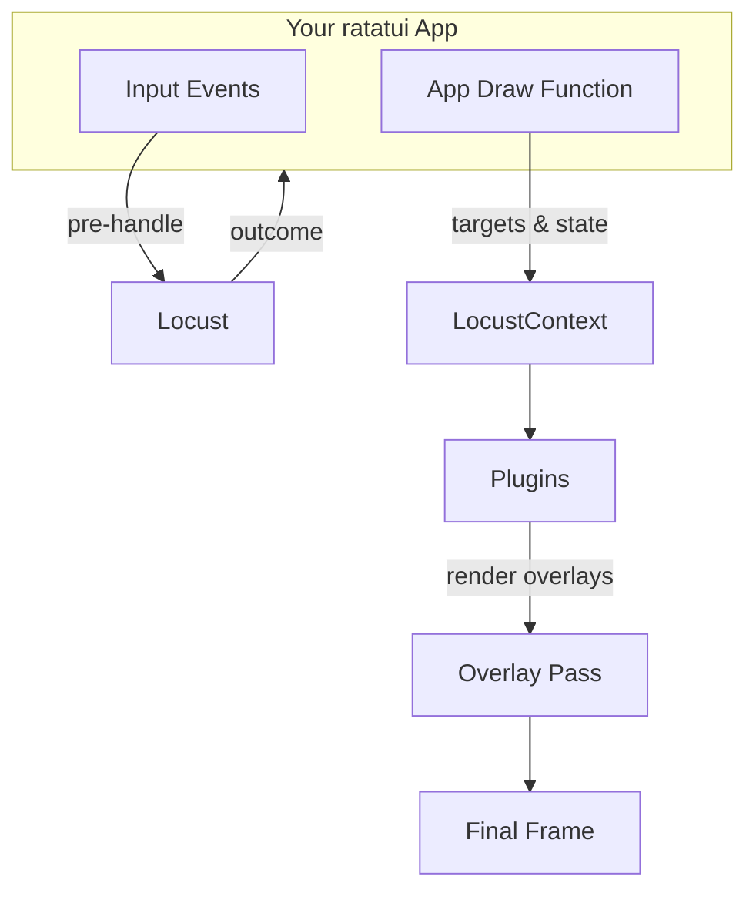

# Locust Architecture

Locust is a plugin-based overlay framework for ratatui. It is designed so that
any existing ratatui application can:

- **Pre-handle input events** through Locust's plugin pipeline.
- **Render overlays** (navigation hints, omnibar, tooltips, etc.) in a final,
  post-application draw pass.

## Core Concepts

- `Locust<B>`: central orchestrator that owns:
  - `LocustContext`: shared cross-plugin state (targets, overlay flags).
  - A list of `LocustPlugin<B>` implementations.
- `LocustPlugin<B>`:
  - Receives input events.
  - Optionally consumes them.
  - Renders overlay content on top of the current frame.
- `TargetRegistry`:
  - Simple collection of `NavTarget`s discovered during a frame.
- `OverlayState`:
  - Bookkeeping for overlay usage (and eventually z-layers).

## Integration Points

In a ratatui app, Locust is used at two choke points:

1. **Event loop** — pre-handle events:
   ```rust
   let outcome = locust.on_event(&event);
   if !outcome.consumed {
       // pass to your app's own state machine
   }
   ```

2. **Draw loop** — post-render overlay pass:
   ```rust
   locust.begin_frame();
   terminal.draw(|f| {
       // your usual UI
       app.draw(f);

       // locust overlays
       locust.render_overlay(f);
   })?;
   ```

## Mermaid: High-level Data Flow



## Plugin Architecture

The plugin system is intentionally small:

- Plugins are plain Rust types implementing `LocustPlugin<B>`.
- They are registered explicitly via `locust.register_plugin(...)`.
- Order matters: the first plugin to consume an event stops further propagation.

This keeps Locust flexible while avoiding a heavy "runtime" or macro system.
