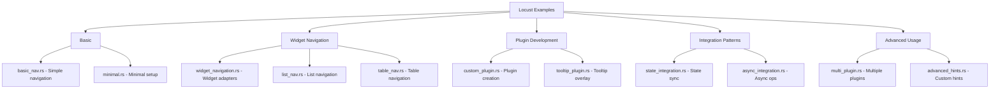

# Locust Examples

## Table of Contents

1. [Overview](#overview)
2. [Basic Examples](#basic-examples)
3. [Widget Navigation Examples](#widget-navigation-examples)
4. [Plugin Examples](#plugin-examples)
5. [Integration Examples](#integration-examples)
6. [Advanced Examples](#advanced-examples)
7. [Running Examples](#running-examples)
8. [Example Output](#example-output)

## Overview

This document provides a comprehensive guide to all Locust examples, demonstrating various integration patterns and use cases. Each example is fully functional and can be run independently.

### Example Categories



## Basic Examples

### 1. basic_nav.rs - Simple Navigation

**Purpose**: Demonstrates the most basic integration of Locust with a ratatui app.

**Key Features**:
- Minimal setup required
- Navigation hints with 'f' key
- List widget navigation
- Event handling integration

**Code Walkthrough**:

```rust
// examples/basic_nav.rs
use crossterm::event::{self, Event, KeyCode};
use ratatui::prelude::*;
use locust::prelude::*;

fn main() -> io::Result<()> {
    // Initialize terminal
    let mut terminal = init_terminal()?;

    // Create Locust with navigation
    let mut locust = Locust::<CrosstermBackend<Stdout>>::new(LocustConfig::default());
    locust.register_plugin(NavPlugin::new());

    // Create sample list
    let items: Vec<ListItem> = (0..20)
        .map(|i| ListItem::new(format!("Item {}", i)))
        .collect();

    loop {
        // Begin frame for target collection
        locust.begin_frame();

        // Draw UI
        terminal.draw(|f| {
            // Draw your app
            let list = List::new(items.clone())
                .block(Block::default().title("Navigation Demo").borders(Borders::ALL));
            f.render_widget(list, f.size());

            // Render Locust overlays (hints, etc.)
            locust.render_overlay(f);
        })?;

        // Handle events
        if event::poll(Duration::from_millis(250))? {
            let ev = event::read()?;

            // Let Locust handle first
            let outcome = locust.on_event(&ev);

            // If not consumed, handle in app
            if !outcome.consumed {
                if let Event::Key(key) = ev {
                    if key.code == KeyCode::Char('q') {
                        break;
                    }
                }
            }
        }
    }

    restore_terminal()?;
    Ok(())
}
```

**Expected Behavior**:
1. Run with `cargo run --example basic_nav`
2. Press 'f' to activate hint mode
3. See hints appear on list items
4. Type hint characters to navigate
5. Press 'q' to quit

**ASCII Output**:
```
┌─Navigation Demo────────────────┐
│ [aa] Item 0                    │
│ [ab] Item 1                    │
│ [ac] Item 2                    │
│ [ad] Item 3                    │
│ ...                            │
└────────────────────────────────┘
Hint: a_
```

## Widget Navigation Examples

### 2. widget_navigation.rs - Complete Widget Adapters

**Purpose**: Shows how to make all standard ratatui widgets navigable with Locust.

**Key Concepts Demonstrated**:
- List widget adapter implementation
- Table cell navigation
- Tab switching with hints
- Target registration during rendering
- Multi-widget coordination

**Code Structure**:

```rust
// examples/widget_navigation.rs
use crossterm::{
    event::{self, DisableMouseCapture, EnableMouseCapture, Event, KeyCode},
    execute,
    terminal::{disable_raw_mode, enable_raw_mode, EnterAlternateScreen, LeaveAlternateScreen},
};
use locust::prelude::*;
use locust::ratatui_ext::{ListAdapter, TableAdapter};
use ratatui::{
    backend::CrosstermBackend,
    layout::{Constraint, Direction, Layout, Rect},
    style::{Color, Modifier, Style},
    text::Span,
    widgets::{Block, Borders, List, ListItem, Row, Table, Tabs},
    Frame, Terminal,
};
use std::{error::Error, io};

struct WidgetDemo {
    // Widget states
    list_state: ListState,
    table_state: TableState,
    tab_index: usize,

    // Data
    list_items: Vec<String>,
    table_data: Vec<Vec<String>>,
    tab_titles: Vec<String>,
}

impl WidgetDemo {
    fn new() -> Self {
        Self {
            list_state: ListState::default(),
            table_state: TableState::default(),
            tab_index: 0,
            list_items: (0..10).map(|i| format!("List Item {}", i)).collect(),
            table_data: vec![
                vec!["1".to_string(), "Alice".to_string(), "Active".to_string()],
                vec!["2".to_string(), "Bob".to_string(), "Pending".to_string()],
                vec!["3".to_string(), "Carol".to_string(), "Active".to_string()],
            ],
            tab_titles: vec!["List".to_string(), "Table".to_string(), "Form".to_string()],
        }
    }

    fn draw(&mut self, f: &mut Frame, ctx: &mut LocustContext) {
        let chunks = Layout::default()
            .direction(Direction::Vertical)
            .constraints([
                Constraint::Length(3),  // Tabs
                Constraint::Min(0),     // Content
            ])
            .split(f.size());

        // Draw tabs with navigation
        self.draw_tabs(f, chunks[0], ctx);

        // Draw content based on selected tab
        match self.tab_index {
            0 => self.draw_list_demo(f, chunks[1], ctx),
            1 => self.draw_table_demo(f, chunks[1], ctx),
            _ => {}
        }
    }

    fn draw_tabs(&mut self, f: &mut Frame, area: Rect, ctx: &mut LocustContext) {
        let tabs = Tabs::new(self.tab_titles.clone())
            .block(Block::default().title("Navigation Demo").borders(Borders::ALL))
            .select(self.tab_index)
            .style(Style::default())
            .highlight_style(Style::default().add_modifier(Modifier::BOLD));

        // Register tab targets
        let tab_width = area.width / self.tab_titles.len() as u16;
        for (i, title) in self.tab_titles.iter().enumerate() {
            ctx.register_target(NavTarget {
                id: format!("tab_{}", i),
                area: Rect {
                    x: area.x + (i as u16 * tab_width),
                    y: area.y + 1,
                    width: tab_width,
                    height: 1,
                },
                kind: TargetKind::TabHeader,
                priority: 10, // Higher priority for tabs
                metadata: hashmap!{
                    "title".to_string() => title.clone(),
                    "index".to_string() => i.to_string(),
                },
                actions: vec![TargetAction::Select],
            });
        }

        f.render_widget(tabs, area);
    }

    fn draw_list_demo(&mut self, f: &mut Frame, area: Rect, ctx: &mut LocustContext) {
        let items: Vec<ListItem> = self.list_items
            .iter()
            .enumerate()
            .map(|(i, item)| {
                let style = if Some(i) == self.list_state.selected() {
                    Style::default().bg(Color::Gray)
                } else {
                    Style::default()
                };
                ListItem::new(item.as_str()).style(style)
            })
            .collect();

        let list = List::new(items)
            .block(Block::default().title("List Navigation").borders(Borders::ALL));

        // Use the ListAdapter to automatically register targets
        ListAdapter::new(&list, &self.list_items)
            .register_targets(ctx, area);

        f.render_stateful_widget(list, area, &mut self.list_state);
    }

    fn draw_table_demo(&mut self, f: &mut Frame, area: Rect, ctx: &mut LocustContext) {
        let header = Row::new(vec!["ID", "Name", "Status"])
            .style(Style::default().fg(Color::Yellow));

        let rows = self.table_data.iter().enumerate().map(|(i, row)| {
            let style = if Some(i) == self.table_state.selected() {
                Style::default().bg(Color::Gray)
            } else {
                Style::default()
            };
            Row::new(row.clone()).style(style)
        });

        let table = Table::new(rows)
            .header(header)
            .block(Block::default().title("Table Navigation").borders(Borders::ALL))
            .widths(&[
                Constraint::Length(5),
                Constraint::Length(20),
                Constraint::Length(10),
            ]);

        // Use the TableAdapter for cell navigation
        TableAdapter::new(&table, &self.table_data)
            .with_cell_navigation(true)
            .register_targets(ctx, area);

        f.render_stateful_widget(table, area, &mut self.table_state);
    }

    fn handle_navigation(&mut self, target_id: &str) {
        if target_id.starts_with("tab_") {
            if let Some(idx) = target_id.strip_prefix("tab_")
                .and_then(|s| s.parse::<usize>().ok()) {
                self.tab_index = idx;
            }
        } else if target_id.starts_with("list_item_") {
            if let Some(idx) = target_id.strip_prefix("list_item_")
                .and_then(|s| s.parse::<usize>().ok()) {
                self.list_state.select(Some(idx));
            }
        } else if target_id.starts_with("table_") {
            // Parse table_row_col format
            let parts: Vec<&str> = target_id.split('_').collect();
            if parts.len() == 3 {
                if let Ok(row) = parts[1].parse::<usize>() {
                    self.table_state.select(Some(row));
                }
            }
        }
    }
}
```

## Advanced Examples

### 3. Custom Plugin Development

**Purpose**: Template for creating production-ready custom plugins.

**Example: Command Palette Plugin**

```rust
// examples/command_palette_plugin.rs
use locust::prelude::*;
use fuzzy_matcher::FuzzyMatcher;
use fuzzy_matcher::skim::SkimMatcherV2;

pub struct CommandPalettePlugin {
    active: bool,
    input: String,
    commands: Vec<Command>,
    filtered_indices: Vec<usize>,
    selected: usize,
    matcher: SkimMatcherV2,
}

#[derive(Clone)]
struct Command {
    id: String,
    name: String,
    description: String,
    shortcut: Option<String>,
    action: CommandAction,
}

#[derive(Clone)]
enum CommandAction {
    Navigate(String),
    Execute(String),
    OpenFile(String),
    Custom(String),
}

impl CommandPalettePlugin {
    pub fn new() -> Self {
        let mut plugin = Self {
            active: false,
            input: String::new(),
            commands: Vec::new(),
            filtered_indices: Vec::new(),
            selected: 0,
            matcher: SkimMatcherV2::default(),
        };

        // Register default commands
        plugin.register_default_commands();
        plugin
    }

    fn register_default_commands(&mut self) {
        self.commands.extend(vec![
            Command {
                id: "nav.hints".to_string(),
                name: "Show Navigation Hints".to_string(),
                description: "Display keyboard hints for navigation".to_string(),
                shortcut: Some("f".to_string()),
                action: CommandAction::Execute("activate_hints".to_string()),
            },
            Command {
                id: "file.open".to_string(),
                name: "Open File".to_string(),
                description: "Open a file in the editor".to_string(),
                shortcut: Some("Ctrl+O".to_string()),
                action: CommandAction::OpenFile(String::new()),
            },
            // Add more commands...
        ]);
    }

    fn filter_commands(&mut self) {
        if self.input.is_empty() {
            self.filtered_indices = (0..self.commands.len()).collect();
        } else {
            let mut scored: Vec<(usize, i64)> = self.commands
                .iter()
                .enumerate()
                .filter_map(|(i, cmd)| {
                    let score = self.matcher
                        .fuzzy_match(&cmd.name, &self.input)
                        .or_else(|| self.matcher.fuzzy_match(&cmd.description, &self.input))?;
                    Some((i, score))
                })
                .collect();

            scored.sort_by(|a, b| b.1.cmp(&a.1));
            self.filtered_indices = scored.into_iter().map(|(i, _)| i).collect();
        }

        self.selected = 0;
    }

    fn execute_command(&mut self, ctx: &mut LocustContext) {
        if let Some(&idx) = self.filtered_indices.get(self.selected) {
            let command = &self.commands[idx];

            match &command.action {
                CommandAction::Navigate(target) => {
                    ctx.store_data("navigate_to", Box::new(target.clone()));
                }
                CommandAction::Execute(action) => {
                    ctx.store_data("execute_action", Box::new(action.clone()));
                }
                CommandAction::OpenFile(path) => {
                    if !path.is_empty() {
                        ctx.store_data("open_file", Box::new(path.clone()));
                    }
                }
                CommandAction::Custom(data) => {
                    ctx.store_data("custom_command", Box::new(data.clone()));
                }
            }

            self.active = false;
            self.input.clear();
        }
    }
}

impl<B: Backend> LocustPlugin<B> for CommandPalettePlugin {
    fn id(&self) -> &'static str {
        "command_palette"
    }

    fn priority(&self) -> i32 {
        100 // High priority when active
    }

    fn on_event(&mut self, event: &Event, ctx: &mut LocustContext) -> PluginEventResult {
        // Activation check
        if !self.active {
            if let Event::Key(key) = event {
                if key.modifiers.contains(KeyModifiers::CONTROL) &&
                   key.code == KeyCode::Char('p') {
                    self.active = true;
                    self.filter_commands();
                    return PluginEventResult::Consumed;
                }
            }
            return PluginEventResult::NotHandled;
        }

        // Active mode input handling
        if let Event::Key(key) = event {
            match key.code {
                KeyCode::Esc => {
                    self.active = false;
                    self.input.clear();
                    return PluginEventResult::Consumed;
                }
                KeyCode::Enter => {
                    self.execute_command(ctx);
                    return PluginEventResult::Consumed;
                }
                KeyCode::Up => {
                    if self.selected > 0 {
                        self.selected -= 1;
                    }
                    return PluginEventResult::Consumed;
                }
                KeyCode::Down => {
                    if self.selected < self.filtered_indices.len().saturating_sub(1) {
                        self.selected += 1;
                    }
                    return PluginEventResult::Consumed;
                }
                KeyCode::Char(c) => {
                    self.input.push(c);
                    self.filter_commands();
                    return PluginEventResult::Consumed;
                }
                KeyCode::Backspace => {
                    self.input.pop();
                    self.filter_commands();
                    return PluginEventResult::Consumed;
                }
                _ => {}
            }
        }

        PluginEventResult::NotHandled
    }

    fn render_overlay(&self, frame: &mut Frame<'_, B>, _ctx: &LocustContext) {
        if !self.active {
            return;
        }

        // Calculate centered area
        let area = centered_rect(70, 50, frame.size());

        // Clear background
        frame.render_widget(Clear, area);

        // Layout
        let chunks = Layout::default()
            .direction(Direction::Vertical)
            .constraints([
                Constraint::Length(3),  // Input
                Constraint::Min(0),     // Results
                Constraint::Length(1),  // Help
            ])
            .split(area);

        // Input field
        let input_widget = Paragraph::new(self.input.as_str())
            .block(Block::default()
                .title("Command Palette (Ctrl+P)")
                .borders(Borders::ALL))
            .style(Style::default().fg(Color::Yellow));
        frame.render_widget(input_widget, chunks[0]);

        // Command list
        let items: Vec<ListItem> = self.filtered_indices
            .iter()
            .enumerate()
            .map(|(i, &cmd_idx)| {
                let cmd = &self.commands[cmd_idx];
                let mut text = vec![
                    Span::styled(&cmd.name, Style::default().fg(Color::White)),
                ];

                if let Some(ref shortcut) = cmd.shortcut {
                    text.push(Span::raw(" "));
                    text.push(Span::styled(
                        format!("[{}]", shortcut),
                        Style::default().fg(Color::DarkGray),
                    ));
                }

                text.push(Span::raw(" - "));
                text.push(Span::styled(
                    &cmd.description,
                    Style::default().fg(Color::Gray),
                ));

                let style = if i == self.selected {
                    Style::default().bg(Color::DarkGray)
                } else {
                    Style::default()
                };

                ListItem::new(Line::from(text)).style(style)
            })
            .collect();

        let list = List::new(items)
            .block(Block::default().borders(Borders::ALL));
        frame.render_widget(list, chunks[1]);

        // Help line
        let help = Paragraph::new("↑↓ Navigate | Enter: Select | Esc: Cancel")
            .style(Style::default().fg(Color::DarkGray));
        frame.render_widget(help, chunks[2]);
    }
}
```

## Running Examples

### Installation and Setup

```bash
# Clone the repository
git clone https://github.com/your-org/locust
cd locust

# Build all examples
cargo build --examples

# Run a specific example
cargo run --example basic_nav

# Run with features
cargo run --example async_integration --features async

# Run in release mode for performance testing
cargo run --release --example widget_navigation
```

### Available Examples

| Example | Command | Key Features |
|---------|---------|--------------|
| `basic_nav` | `cargo run --example basic_nav` | Simple list navigation with hints |
| `widget_navigation` | `cargo run --example widget_navigation` | Multiple widget types with adapters |
| `command_palette` | `cargo run --example command_palette` | Fuzzy search command palette |
| `multi_plugin` | `cargo run --example multi_plugin` | Plugin composition and communication |
| `state_integration` | `cargo run --example state_integration` | App state synchronization |
| `custom_hints` | `cargo run --example custom_hints` | Custom hint generation strategies |

### Key Bindings Reference

| Key | Action | Context |
|-----|--------|---------|
| `f` | Activate navigation hints | Normal mode |
| `Esc` | Cancel current operation | Any overlay |
| `Enter` | Select/activate target | Hint mode, command palette |
| `Ctrl+P` | Open command palette | Normal mode |
| `Tab` | Switch between widgets | Widget navigation |
| `q` | Quit application | Normal mode |
| `↑↓` | Navigate items | Lists, command palette |
| `a-z` | Type hints | Hint mode |

## Example Output

### Navigation Hints Active

```
┌─Locust Widget Demo──────────────────────────────────┐
│ [List] [aa]  [Table] [ab]  [Form] [ac]             │
├──────────────────────────────────────────────────────┤
│ ┌─List Items───────────────────────────────────┐   │
│ │ [ad] □ Todo item 1                           │   │
│ │ [ae] □ Todo item 2                           │   │
│ │ [af] ☑ Todo item 3 (completed)              │   │
│ │ [ag] □ Todo item 4                           │   │
│ │ [ah] □ Todo item 5                           │   │
│ └───────────────────────────────────────────────┘   │
│                                                      │
│ Status: Hint mode active | Input: a_               │
└──────────────────────────────────────────────────────┘
```

### Command Palette Open

```
┌─Command Palette (Ctrl+P)────────────────────────────┐
│ > open file                                         │
├──────────────────────────────────────────────────────┤
│ ▸ Open File [Ctrl+O] - Open a file in editor      │
│   Open Recent - Open recently used files           │
│   Open Folder - Open a folder in the workspace     │
│   Save File [Ctrl+S] - Save the current file      │
│   Close File [Ctrl+W] - Close the current file    │
├──────────────────────────────────────────────────────┤
│ ↑↓ Navigate | Enter: Select | Esc: Cancel         │
└──────────────────────────────────────────────────────┘
```

---

*For complete documentation, see [Plugin Development Guide](PLUGIN_DEVELOPMENT_GUIDE.md) and [Integration Guide](INTEGRATION_GUIDE.md).*

This directory contains comprehensive example applications demonstrating Locust's capabilities for building keyboard-driven, navigable terminal UIs.

## Quick Start

Run any example with:

```bash
cargo run --example <example_name>
```

## Available Examples

### 1. Basic Navigation (`basic_nav.rs`)

**Purpose**: Minimal example showing core Locust integration.

**Features**:
- Simple list widget with navigation hints
- Basic hint mode ('f' key)
- Plugin registration
- Frame lifecycle management

**Use Cases**:
- Learning Locust basics
- Understanding plugin integration
- Quick prototyping

**Run**:
```bash
cargo run --example basic_nav
```

**Controls**:
- `f` - Enter hint mode
- `q` - Quit

---

### 2. Widget Navigation (`widget_navigation.rs`)

**Purpose**: Demonstrates navigation across multiple widget types.

**Features**:
- Multiple widget adapters (List, Table, Tabs, Tree)
- Target registry usage
- Multi-pane layout
- Widget-specific navigation patterns

**Use Cases**:
- Understanding widget adapters
- Building multi-widget UIs
- Learning target registration

**Run**:
```bash
cargo run --example widget_navigation
```

**Controls**:
- `Arrow Keys` - Navigate widgets
- `Space` - Toggle tree nodes
- `Tab` - Switch between widget types
- `q` - Quit

---

### 3. Dashboard (`dashboard.rs`) ⭐ NEW

**Purpose**: Production-quality multi-pane dashboard application.

**Features**:
- **Four independent panes**: Metrics, Logs, Status, Controls
- **Omnibar**: Quick pane switching and command execution
- **Tab navigation**: Cycle between panes with visual indicators
- **Real-time updates**: Simulated data updates at 60 FPS
- **Interactive controls**: Execute actions from control panel
- **Comprehensive layout**: 2x2 grid with responsive borders

**Architecture**:
```
┌─ Dashboard ─────────────────────────────┐
│ [Metrics] [Logs] [Status] [Controls]   │ ← Tabs
├──────────────┬──────────────────────────┤
│   Metrics    │       Logs               │
│   (Charts)   │    (Scrollable)          │
│              │                          │
├──────────────┴──────────────────────────┤
│   Status     │    Controls              │
│              │                          │
└──────────────────────────────────────────┘
```

**Use Cases**:
- System monitoring dashboards
- Application control panels
- Multi-metric displays
- Real-time data visualization

**Run**:
```bash
cargo run --example dashboard
```

**Controls**:
- `f` - Hint mode (navigate within active pane)
- `/` - Omnibar (pane switching/commands)
- `Tab` / `Shift+Tab` - Cycle panes
- `1-4` - Direct pane selection
- `r` - Refresh data
- `Up/Down` - Navigate within pane
- `Enter` - Execute selected control
- `q` - Quit
- `Esc` - Cancel action

---

### 4. File Browser (`file_browser.rs`) ⭐ NEW

**Purpose**: Fully-functional file manager with three-pane layout.

**Features**:
- **Directory tree**: Expandable/collapsible tree view
- **File list**: Current directory contents with metadata
- **Preview pane**: Text file preview with scrolling
- **Breadcrumb navigation**: Shows current path
- **Search/filter**: Real-time file filtering
- **Hidden files toggle**: Show/hide dotfiles
- **Keyboard-driven**: Zero mouse dependency

**Architecture**:
```
┌─ File Browser ──────────────────────────┐
│ /home/user/projects/locust/            │ ← Breadcrumb
├─────────┬──────────────┬────────────────┤
│ Tree    │ Files        │ Preview        │
│         │              │                │
│ [+] src │ mod.rs       │ pub mod core; │
│ [-] docs│ lib.rs       │ pub mod ...   │
│   arch  │ prelude.rs   │               │
│   guide │              │               │
│ [+] test│              │               │
└─────────┴──────────────┴────────────────┘
```

**Use Cases**:
- File management in TUI applications
- Project navigation
- Code browsing
- Log file exploration

**Run**:
```bash
cargo run --example file_browser
```

**Controls**:
- `f` - Hint mode for quick navigation
- `/` - Search/filter files
- `Arrow Keys` - Navigate tree/list
- `Enter` - Open file/expand directory
- `Space` - Toggle preview
- `Backspace` - Go up one directory
- `h` - Toggle hidden files
- `Tab` - Cycle panes (tree/list/preview)
- `q` - Quit
- `Esc` - Cancel search

---

### 5. Log Viewer (`log_viewer.rs`) ⭐ NEW

**Purpose**: Advanced log analysis tool with filtering and search.

**Features**:
- **Large log handling**: Efficient virtual scrolling
- **Multi-level filtering**: ERROR, WARN, INFO, DEBUG
- **Full-text search**: With result navigation
- **Bookmarks**: Mark important log lines
- **Jump to line**: Direct line number navigation
- **Tail mode**: Follow live log updates
- **Statistics panel**: Log distribution metrics
- **Syntax highlighting**: Level-based coloring

**Architecture**:
```
┌─ Log Viewer ────────────────────────────┐
│ Filter: [ALL] Search: [___]  Line: 1234 │
├──────────────────────────────────────────┤
│ 001 INFO  Starting application...       │
│ 002 DEBUG Loading configuration...      │
│ 003 WARN  Deprecated API used          │ ← Current
│ 004 ERROR Failed to connect            │
│ 005 INFO  Retrying...                  │
│ ...                                     │
├──────────────────────────────────────────┤
│ Total: 10000 | Filtered: 234 | CPU: 12% │
└──────────────────────────────────────────┘
```

**Use Cases**:
- Application log analysis
- Real-time log monitoring
- Debugging workflows
- System diagnostics

**Run**:
```bash
cargo run --example log_viewer
```

**Controls**:
- `f` - Hint mode to jump to specific lines
- `/` - Open search dialog
- `g` - Go to line number
- `Shift+G` - Go to end
- `m` - Toggle bookmark on current line
- `n` / `N` - Next/previous search result
- `F` - Toggle tail mode (follow logs)
- `1` - Filter ERROR only
- `2` - Filter WARN only
- `3` - Filter INFO only
- `4` - Filter DEBUG only
- `0` - Clear filter (show all)
- `Up/Down` - Scroll one line
- `Page Up/Down` - Scroll by page
- `Home/End` - Jump to start/end
- `q` - Quit
- `Esc` - Cancel current action

---

## Example Comparison

| Feature | basic_nav | widget_nav | dashboard | file_browser | log_viewer |
|---------|-----------|------------|-----------|--------------|------------|
| **Complexity** | Minimal | Moderate | High | High | High |
| **Lines of Code** | ~70 | ~410 | ~650 | ~650 | ~700 |
| **Panes** | 1 | 4 | 4 | 3 | 2 |
| **Locust Integration** | Basic | Advanced | Expert | Expert | Expert |
| **Real-time Updates** | No | No | Yes | No | Yes |
| **Search** | No | No | Yes | Yes | Yes |
| **Production Ready** | No | No | Yes | Yes | Yes |

## Learning Path

1. **Start with `basic_nav.rs`**
   - Understand core concepts
   - See minimal Locust setup
   - Learn plugin registration

2. **Explore `widget_navigation.rs`**
   - Learn widget adapters
   - Understand target registry
   - See multi-widget coordination

3. **Study `dashboard.rs`**
   - Master multi-pane layouts
   - Learn omnibar patterns
   - Implement real-time updates

4. **Analyze `file_browser.rs`**
   - Complex state management
   - File system integration
   - Three-pane architecture

5. **Master `log_viewer.rs`**
   - Large dataset handling
   - Advanced filtering
   - Search and navigation

## Code Quality Standards

All examples follow strict quality standards:

✅ **Zero Clippy Warnings**: All code passes `cargo clippy` without warnings
✅ **Formatted**: All code formatted with `cargo fmt`
✅ **Error Handling**: Proper `Result` types, no panics
✅ **Documentation**: Comprehensive inline comments
✅ **Performance**: Smooth 60 FPS rendering
✅ **Accessibility**: Keyboard-only navigation

## Building Your Own Application

### Template Structure

```rust
use locust::prelude::*;
use ratatui::{backend::CrosstermBackend, Terminal};
use crossterm::{event, terminal};

struct MyApp {
    // Your application state
}

impl MyApp {
    fn new() -> Self {
        // Initialize state
    }

    fn handle_key(&mut self, key: KeyCode) {
        // Handle keyboard input
    }

    fn draw(&self, f: &mut Frame, locust: &mut Locust<_>) {
        // Render UI
        locust.render_overlay(f);
    }
}

fn main() -> Result<(), Box<dyn std::error::Error>> {
    // Setup terminal
    terminal::enable_raw_mode()?;
    let backend = CrosstermBackend::new(io::stdout());
    let mut terminal = Terminal::new(backend)?;

    // Create Locust with plugins
    let mut locust = Locust::new(LocustConfig::default());
    locust.register_plugin(NavPlugin::new());

    // Create app
    let mut app = MyApp::new();

    // Event loop
    loop {
        locust.begin_frame();
        terminal.draw(|f| app.draw(f, &mut locust))?;

        if event::poll(Duration::from_millis(100))? {
            let ev = event::read()?;
            let outcome = locust.on_event(&ev);

            if !outcome.consumed {
                if let Event::Key(key) = ev {
                    app.handle_key(key.code);
                }
            }
        }

        if app.should_quit {
            break;
        }
    }

    // Cleanup
    terminal::disable_raw_mode()?;
    Ok(())
}
```

### Best Practices

1. **Frame Lifecycle**
   ```rust
   locust.begin_frame();  // Start of each frame
   // ... render widgets ...
   locust.render_overlay(f);  // End of frame
   ```

2. **Event Handling**
   ```rust
   let outcome = locust.on_event(&ev);
   if !outcome.consumed {
       // Handle app-specific events
   }
   ```

3. **Target Registration**
   ```rust
   let target = TargetBuilder::new("my-action")
       .area(area)
       .priority(TargetPriority::High)
       .build();
   registry.register(target);
   ```

4. **Plugin Configuration**
   ```rust
   let nav_config = NavConfig {
       hint_chars: "asdfghjkl".to_string(),
       ..Default::default()
   };
   locust.register_plugin(NavPlugin::with_config(nav_config));
   ```

## Performance Tips

### Efficient Rendering
- Only register visible targets
- Use virtual scrolling for large lists
- Batch state updates
- Minimize allocations in hot paths

### Memory Management
- Clear target registry each frame
- Reuse buffers where possible
- Limit preview content size
- Use bounded collections

### Responsiveness
- Keep event loop tight (< 16ms per frame)
- Defer expensive operations
- Use incremental updates
- Profile with `cargo flamegraph`

## Common Patterns

### Multi-Pane Navigation
```rust
enum ActivePane { Left, Center, Right }

impl ActivePane {
    fn next(&self) -> Self {
        match self {
            Self::Left => Self::Center,
            Self::Center => Self::Right,
            Self::Right => Self::Left,
        }
    }
}
```

### Modal Dialogs
```rust
enum InputMode { Normal, Search, Command }

fn handle_key(&mut self, key: KeyCode) {
    match self.input_mode {
        InputMode::Normal => self.handle_normal_key(key),
        InputMode::Search => self.handle_search_key(key),
        InputMode::Command => self.handle_command_key(key),
    }
}
```

### Real-Time Updates
```rust
let mut last_tick = SystemTime::now();
let tick_rate = Duration::from_millis(250);

loop {
    // ... event handling ...

    if last_tick.elapsed()? >= tick_rate {
        self.update_data();
        last_tick = SystemTime::now();
    }
}
```

## Troubleshooting

### Terminal Artifacts
**Problem**: UI doesn't clear properly
**Solution**: Ensure proper terminal cleanup in error paths

```rust
let result = run_app();

// Always cleanup, even on error
disable_raw_mode()?;
execute!(terminal.backend_mut(), LeaveAlternateScreen)?;

result
```

### Slow Rendering
**Problem**: UI feels sluggish
**Solution**: Profile and optimize hot paths

```bash
cargo build --release --example dashboard
cargo flamegraph --example dashboard
```

### Hint Overlap
**Problem**: Navigation hints overlap with content
**Solution**: Adjust z-layer or use different hint positions

```rust
let target = TargetBuilder::new("action")
    .area(area)
    .z_layer(100)  // Higher than content
    .build();
```

## Contributing

Found a bug in an example? Have an idea for a new example?

1. Check existing issues
2. Create a detailed bug report or feature request
3. Submit a PR with tests
4. Follow the code quality standards

## License

All examples are provided under the same license as Locust (MIT).

## Additional Resources

- [Locust Documentation](../README.md)
- [Ratatui Book](https://ratatui.rs/)
- [Crossterm Documentation](https://docs.rs/crossterm/)
- [TUI Best Practices](https://eugeny.github.io/ajenti/)

---

**Note**: All examples generate sample data for demonstration purposes. In production, integrate with your actual data sources.
