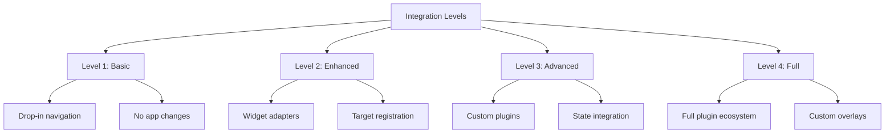

# Locust Integration Guide

## Table of Contents

1. [Introduction](#introduction)
2. [Quick Start Integration](#quick-start-integration)
3. [Integration Patterns](#integration-patterns)
4. [Migration Strategies](#migration-strategies)
5. [Minimal Integration Example](#minimal-integration-example)
6. [Advanced Integration Patterns](#advanced-integration-patterns)
7. [Widget Adapters](#widget-adapters)
8. [Event Handling](#event-handling)
9. [State Management](#state-management)
10. [Troubleshooting](#troubleshooting)
11. [Performance Considerations](#performance-considerations)
12. [Common Pitfalls](#common-pitfalls)

## Introduction

Locust is designed to seamlessly integrate with existing ratatui applications with minimal changes. This guide covers various integration strategies, from basic drop-in navigation to advanced custom plugin development.

### Integration Philosophy

Locust follows these principles for integration:

- **Non-invasive**: Requires minimal changes to existing code
- **Progressive Enhancement**: Add features incrementally
- **Backward Compatible**: Your app continues to work without Locust
- **Zero Runtime Overhead**: Pay only for what you use

### Integration Levels



## Quick Start Integration

### Step 1: Add Locust to Dependencies

```toml
[dependencies]
locust = "0.1"
ratatui = "0.28"
crossterm = "0.28"
```

### Step 2: Minimal Integration

```rust
use locust::prelude::*;
use ratatui::prelude::*;
use crossterm::event::{self, Event};

fn main() -> Result<()> {
    // Initialize terminal
    let mut terminal = init_terminal()?;

    // Create Locust with navigation plugin
    let mut locust = Locust::new(LocustConfig::default());
    locust.register_plugin(NavPlugin::new());

    // Your existing app
    let mut app = MyApp::new();

    loop {
        // Begin Locust frame
        locust.begin_frame();

        // Draw
        terminal.draw(|frame| {
            app.draw(frame);
            locust.render_overlay(frame);  // Add this line
        })?;

        // Handle events
        if let Event::Key(key) = event::read()? {
            // Let Locust handle first
            let outcome = locust.on_event(&Event::Key(key));
            if !outcome.consumed {
                // Then your app
                if !app.handle_key(key) {
                    break;
                }
            }
        }
    }

    restore_terminal()?;
    Ok(())
}
```

That's it! Your app now has Vimium-style navigation with the 'f' key.

## Integration Patterns

### Pattern 1: Wrapper Integration

Wrap your existing app with Locust handling:

```rust
pub struct LocustWrapper<App> {
    locust: Locust<CrosstermBackend<Stdout>>,
    app: App,
}

impl<App: DrawableApp> LocustWrapper<App> {
    pub fn new(app: App) -> Self {
        let mut locust = Locust::new(LocustConfig::default());
        locust.register_plugin(NavPlugin::new());

        Self { locust, app }
    }

    pub fn run(&mut self) -> Result<()> {
        let mut terminal = init_terminal()?;

        loop {
            self.locust.begin_frame();

            terminal.draw(|frame| {
                self.app.draw(frame);
                self.locust.render_overlay(frame);
            })?;

            if !self.handle_events()? {
                break;
            }
        }

        Ok(())
    }

    fn handle_events(&mut self) -> Result<bool> {
        if event::poll(Duration::from_millis(100))? {
            let event = event::read()?;

            let outcome = self.locust.on_event(&event);
            if !outcome.consumed {
                return self.app.handle_event(event);
            }
        }
        Ok(true)
    }
}
```

### Pattern 2: Trait-Based Integration

Define traits for Locust-aware components:

```rust
pub trait LocustAware {
    fn register_targets(&self, ctx: &mut LocustContext, area: Rect);
    fn handle_activation(&mut self, target_id: &str) -> bool;
}

impl LocustAware for List<'_> {
    fn register_targets(&self, ctx: &mut LocustContext, area: Rect) {
        for (i, item) in self.items.iter().enumerate() {
            let item_area = Rect {
                y: area.y + i as u16,
                height: 1,
                ..area
            };

            ctx.register_target(NavTarget {
                id: format!("list_item_{}", i),
                area: item_area,
                kind: TargetKind::ListItem,
                priority: 0,
                metadata: hashmap! {
                    "index".to_string() => i.to_string(),
                    "label".to_string() => item.to_string(),
                },
                ..Default::default()
            });
        }
    }

    fn handle_activation(&mut self, target_id: &str) -> bool {
        if let Some(index) = target_id
            .strip_prefix("list_item_")
            .and_then(|s| s.parse::<usize>().ok())
        {
            self.select(index);
            true
        } else {
            false
        }
    }
}
```

### Pattern 3: Component Composition

Compose Locust-enabled components:

```rust
pub struct NavigableList<'a> {
    inner: List<'a>,
    selected: usize,
    id_prefix: String,
}

impl<'a> NavigableList<'a> {
    pub fn new<T>(items: T) -> Self
    where
        T: Into<Vec<ListItem<'a>>>,
    {
        Self {
            inner: List::new(items),
            selected: 0,
            id_prefix: uuid::Uuid::new_v4().to_string(),
        }
    }
}

impl Widget for NavigableList<'_> {
    fn render(self, area: Rect, buf: &mut Buffer) {
        // Render the list
        self.inner.render(area, buf);

        // Register targets with Locust context if available
        if let Some(ctx) = get_locust_context() {
            for (i, _) in self.inner.items.iter().enumerate() {
                ctx.register_target(NavTarget {
                    id: format!("{}_{}", self.id_prefix, i),
                    area: Rect {
                        y: area.y + i as u16,
                        height: 1,
                        ..area
                    },
                    kind: TargetKind::ListItem,
                    ..Default::default()
                });
            }
        }
    }
}
```

## Migration Strategies

### Strategy 1: Incremental Migration

Start with minimal changes and add features progressively:

```rust
// Phase 1: Add basic navigation
let mut locust = Locust::new(LocustConfig::default());
locust.register_plugin(NavPlugin::new());

// Phase 2: Add widget adapters
locust.register_plugin(WidgetAdapterPlugin::new());

// Phase 3: Add custom overlays
locust.register_plugin(TooltipPlugin::new());
locust.register_plugin(OmnibarPlugin::new());

// Phase 4: Integrate state management
locust.register_plugin(AppIntegrationPlugin::new(app_state.clone()));
```

### Strategy 2: Feature Flag Migration

Use feature flags to toggle Locust integration:

```rust
#[cfg(feature = "locust")]
use locust::prelude::*;

pub struct App {
    #[cfg(feature = "locust")]
    locust: Option<Locust<CrosstermBackend<Stdout>>>,
    // ... rest of your app
}

impl App {
    pub fn new() -> Self {
        Self {
            #[cfg(feature = "locust")]
            locust: if cfg!(feature = "locust") {
                let mut locust = Locust::new(LocustConfig::default());
                locust.register_plugin(NavPlugin::new());
                Some(locust)
            } else {
                None
            },
            // ...
        }
    }

    pub fn handle_event(&mut self, event: Event) -> Result<bool> {
        #[cfg(feature = "locust")]
        if let Some(locust) = &mut self.locust {
            let outcome = locust.on_event(&event);
            if outcome.consumed {
                return Ok(true);
            }
        }

        // Your existing event handling
        self.handle_event_internal(event)
    }
}
```

### Strategy 3: Adapter Layer Migration

Create an adapter layer for existing widgets:

```rust
pub struct WidgetAdapter;

impl WidgetAdapter {
    pub fn adapt_list(list: &List, area: Rect) -> Vec<NavTarget> {
        list.items
            .iter()
            .enumerate()
            .map(|(i, item)| NavTarget {
                id: format!("list_{}", i),
                area: Rect {
                    y: area.y + i as u16,
                    height: 1,
                    ..area
                },
                kind: TargetKind::ListItem,
                ..Default::default()
            })
            .collect()
    }

    pub fn adapt_tabs(tabs: &Tabs, area: Rect) -> Vec<NavTarget> {
        let tab_width = area.width / tabs.titles.len() as u16;

        tabs.titles
            .iter()
            .enumerate()
            .map(|(i, title)| NavTarget {
                id: format!("tab_{}", i),
                area: Rect {
                    x: area.x + (i as u16 * tab_width),
                    y: area.y,
                    width: tab_width,
                    height: 1,
                },
                kind: TargetKind::TabHeader,
                metadata: hashmap! {
                    "title".to_string() => title.to_string(),
                },
                ..Default::default()
            })
            .collect()
    }
}
```

## Minimal Integration Example

Here's a complete minimal example integrating Locust with a todo list app:

```rust
use crossterm::{
    event::{self, DisableMouseCapture, EnableMouseCapture, Event, KeyCode},
    execute,
    terminal::{disable_raw_mode, enable_raw_mode, EnterAlternateScreen, LeaveAlternateScreen},
};
use locust::prelude::*;
use ratatui::{
    backend::CrosstermBackend,
    layout::{Constraint, Direction, Layout},
    style::{Color, Modifier, Style},
    text::{Line, Span},
    widgets::{Block, Borders, List, ListItem, Paragraph},
    Frame, Terminal,
};
use std::{error::Error, io};

#[derive(Default)]
struct TodoApp {
    items: Vec<String>,
    selected: usize,
    input: String,
    input_mode: bool,
}

impl TodoApp {
    fn new() -> Self {
        Self {
            items: vec![
                "Buy groceries".to_string(),
                "Write documentation".to_string(),
                "Review pull requests".to_string(),
            ],
            ..Default::default()
        }
    }

    fn draw(&mut self, frame: &mut Frame, ctx: &mut LocustContext) {
        let chunks = Layout::default()
            .direction(Direction::Vertical)
            .constraints([
                Constraint::Length(3),
                Constraint::Min(1),
                Constraint::Length(3),
            ])
            .split(frame.area());

        // Title
        let title = Paragraph::new("Todo List with Locust Navigation (Press 'f' for hints)")
            .style(Style::default().fg(Color::Cyan))
            .block(Block::default().borders(Borders::ALL));
        frame.render_widget(title, chunks[0]);

        // List items
        let items: Vec<ListItem> = self
            .items
            .iter()
            .enumerate()
            .map(|(i, item)| {
                let style = if i == self.selected {
                    Style::default().fg(Color::Yellow).add_modifier(Modifier::BOLD)
                } else {
                    Style::default()
                };
                ListItem::new(Line::from(vec![
                    Span::raw(format!("{}. ", i + 1)),
                    Span::raw(item),
                ]))
                .style(style)
            })
            .collect();

        let list = List::new(items)
            .block(Block::default().borders(Borders::ALL).title("Items"));

        // Register navigation targets for each item
        for (i, item) in self.items.iter().enumerate() {
            let item_area = Rect {
                x: chunks[1].x + 1,
                y: chunks[1].y + 1 + i as u16,
                width: chunks[1].width - 2,
                height: 1,
            };

            ctx.register_target(NavTarget {
                id: format!("todo_item_{}", i),
                area: item_area,
                kind: TargetKind::ListItem,
                priority: 0,
                metadata: hashmap! {
                    "index".to_string() => i.to_string(),
                    "text".to_string() => item.clone(),
                },
                actions: vec![TargetAction::Select, TargetAction::Click],
            });
        }

        frame.render_widget(list, chunks[1]);

        // Input field
        let input_title = if self.input_mode {
            "New Item (Press Esc to cancel)"
        } else {
            "Press 'a' to add item, 'd' to delete, 'q' to quit"
        };

        let input = Paragraph::new(self.input.as_str())
            .style(if self.input_mode {
                Style::default().fg(Color::Yellow)
            } else {
                Style::default()
            })
            .block(Block::default().borders(Borders::ALL).title(input_title));

        frame.render_widget(input, chunks[2]);
    }

    fn handle_input(&mut self, key: KeyCode) -> bool {
        if self.input_mode {
            match key {
                KeyCode::Esc => {
                    self.input_mode = false;
                    self.input.clear();
                }
                KeyCode::Enter => {
                    if !self.input.is_empty() {
                        self.items.push(self.input.clone());
                        self.input.clear();
                        self.input_mode = false;
                    }
                }
                KeyCode::Backspace => {
                    self.input.pop();
                }
                KeyCode::Char(c) => {
                    self.input.push(c);
                }
                _ => {}
            }
        } else {
            match key {
                KeyCode::Char('q') => return false,
                KeyCode::Char('a') => self.input_mode = true,
                KeyCode::Char('d') => {
                    if !self.items.is_empty() {
                        self.items.remove(self.selected);
                        if self.selected >= self.items.len() && self.selected > 0 {
                            self.selected -= 1;
                        }
                    }
                }
                KeyCode::Up => {
                    if self.selected > 0 {
                        self.selected -= 1;
                    }
                }
                KeyCode::Down => {
                    if self.selected < self.items.len().saturating_sub(1) {
                        self.selected += 1;
                    }
                }
                _ => {}
            }
        }
        true
    }

    fn handle_target_activation(&mut self, target_id: &str) {
        if let Some(index_str) = target_id.strip_prefix("todo_item_") {
            if let Ok(index) = index_str.parse::<usize>() {
                self.selected = index;
            }
        }
    }
}

fn main() -> Result<(), Box<dyn Error>> {
    // Setup terminal
    enable_raw_mode()?;
    let mut stdout = io::stdout();
    execute!(stdout, EnterAlternateScreen, EnableMouseCapture)?;
    let backend = CrosstermBackend::new(stdout);
    let mut terminal = Terminal::new(backend)?;

    // Create app and Locust
    let mut app = TodoApp::new();
    let mut locust = Locust::new(LocustConfig::default());
    locust.register_plugin(NavPlugin::new());

    // Create integration plugin
    let integration_plugin = TodoIntegrationPlugin::new();
    locust.register_plugin(integration_plugin);

    let res = run_app(&mut terminal, &mut app, &mut locust);

    // Restore terminal
    disable_raw_mode()?;
    execute!(
        terminal.backend_mut(),
        LeaveAlternateScreen,
        DisableMouseCapture
    )?;
    terminal.show_cursor()?;

    if let Err(err) = res {
        println!("{:?}", err);
    }

    Ok(())
}

fn run_app(
    terminal: &mut Terminal<CrosstermBackend<io::Stdout>>,
    app: &mut TodoApp,
    locust: &mut Locust<CrosstermBackend<io::Stdout>>,
) -> io::Result<()> {
    loop {
        locust.begin_frame();

        terminal.draw(|frame| {
            let ctx = locust.context_mut();
            app.draw(frame, ctx);
            locust.render_overlay(frame);
        })?;

        if let Event::Key(key) = event::read()? {
            let outcome = locust.on_event(&Event::Key(key));

            // Check if target was activated
            if let Some(target_id) = locust.context().get_data::<String>("activated_target") {
                app.handle_target_activation(&target_id);
                locust.context_mut().remove_data("activated_target");
            }

            if !outcome.consumed {
                if !app.handle_input(key.code) {
                    return Ok(());
                }
            }
        }
    }
}

// Integration plugin to bridge Locust and the app
struct TodoIntegrationPlugin;

impl TodoIntegrationPlugin {
    fn new() -> Self {
        Self
    }
}

impl<B: Backend> LocustPlugin<B> for TodoIntegrationPlugin {
    fn id(&self) -> &'static str {
        "todo_integration"
    }

    fn on_event(&mut self, _event: &Event, ctx: &mut LocustContext) -> PluginEventResult {
        // Check for navigation activation
        if let Some(target_id) = ctx.get_data::<String>("nav_activated") {
            ctx.store_data("activated_target", Box::new(target_id.clone()));
            ctx.remove_data("nav_activated");
        }
        PluginEventResult::NotHandled
    }

    fn render_overlay(&self, _frame: &mut Frame<'_, B>, _ctx: &LocustContext) {
        // No overlay rendering needed
    }
}
```

## Advanced Integration Patterns

### Pattern 1: State Synchronization

Synchronize app state with Locust:

```rust
use std::sync::{Arc, RwLock};

pub struct StateSyncPlugin<S> {
    app_state: Arc<RwLock<S>>,
}

impl<S: AppState> StateSyncPlugin<S> {
    pub fn new(app_state: Arc<RwLock<S>>) -> Self {
        Self { app_state }
    }
}

impl<B: Backend, S: AppState + Send + Sync + 'static> LocustPlugin<B> for StateSyncPlugin<S> {
    fn on_frame_begin(&mut self, ctx: &mut LocustContext) {
        // Sync app state to context
        if let Ok(state) = self.app_state.read() {
            ctx.store_data("app_state", Box::new(state.clone()));
        }
    }

    fn on_event(&mut self, _event: &Event, ctx: &mut LocustContext) -> PluginEventResult {
        // Check for state changes from other plugins
        if let Some(new_state) = ctx.get_data::<S>("new_app_state") {
            if let Ok(mut state) = self.app_state.write() {
                *state = new_state.clone();
            }
            ctx.remove_data("new_app_state");
        }
        PluginEventResult::NotHandled
    }
}
```

### Pattern 2: Command Bridge

Bridge Locust commands to app actions:

```rust
pub enum AppCommand {
    OpenFile(String),
    SaveFile,
    Search(String),
    Navigate(NavigationTarget),
}

pub struct CommandBridgePlugin {
    command_tx: mpsc::Sender<AppCommand>,
}

impl<B: Backend> LocustPlugin<B> for CommandBridgePlugin {
    fn on_event(&mut self, _event: &Event, ctx: &mut LocustContext) -> PluginEventResult {
        // Check for commands from other plugins
        if let Some(cmd_str) = ctx.get_data::<String>("execute_command") {
            if let Some(command) = self.parse_command(&cmd_str) {
                let _ = self.command_tx.try_send(command);
            }
            ctx.remove_data("execute_command");
        }
        PluginEventResult::NotHandled
    }

    fn parse_command(&self, cmd: &str) -> Option<AppCommand> {
        let parts: Vec<&str> = cmd.split_whitespace().collect();
        match parts.first() {
            Some(&"open") => parts.get(1).map(|f| AppCommand::OpenFile(f.to_string())),
            Some(&"save") => Some(AppCommand::SaveFile),
            Some(&"search") => {
                let query = parts[1..].join(" ");
                Some(AppCommand::Search(query))
            }
            _ => None,
        }
    }
}
```

### Pattern 3: Event Recording and Replay

Record and replay user interactions:

```rust
pub struct RecordingPlugin {
    recording: bool,
    events: Vec<(Instant, Event)>,
    start_time: Option<Instant>,
}

impl<B: Backend> LocustPlugin<B> for RecordingPlugin {
    fn on_event(&mut self, event: &Event, ctx: &mut LocustContext) -> PluginEventResult {
        if self.recording {
            if let Some(start) = self.start_time {
                self.events.push((Instant::now() - start, event.clone()));
            }
        }

        // Check for recording commands
        if let Event::Key(key) = event {
            if key.modifiers.contains(KeyModifiers::CONTROL) {
                match key.code {
                    KeyCode::Char('r') if key.modifiers.contains(KeyModifiers::SHIFT) => {
                        // Start/stop recording
                        self.toggle_recording();
                        return PluginEventResult::Consumed;
                    }
                    KeyCode::Char('p') if key.modifiers.contains(KeyModifiers::SHIFT) => {
                        // Replay
                        self.start_replay(ctx);
                        return PluginEventResult::Consumed;
                    }
                    _ => {}
                }
            }
        }

        PluginEventResult::NotHandled
    }

    fn toggle_recording(&mut self) {
        self.recording = !self.recording;
        if self.recording {
            self.events.clear();
            self.start_time = Some(Instant::now());
        } else {
            self.start_time = None;
        }
    }

    fn start_replay(&self, ctx: &mut LocustContext) {
        ctx.store_data("replay_events", Box::new(self.events.clone()));
    }
}
```

## Widget Adapters

### Creating Widget Adapters

```rust
use ratatui::widgets::*;

pub trait WidgetExt: Widget {
    fn with_navigation(self) -> NavigableWidget<Self>
    where
        Self: Sized,
    {
        NavigableWidget::new(self)
    }
}

impl<W: Widget> WidgetExt for W {}

pub struct NavigableWidget<W> {
    inner: W,
    targets: Vec<NavTarget>,
}

impl<W: Widget> NavigableWidget<W> {
    pub fn new(widget: W) -> Self {
        Self {
            inner: widget,
            targets: Vec::new(),
        }
    }

    pub fn add_target(mut self, target: NavTarget) -> Self {
        self.targets.push(target);
        self
    }
}

impl<W: Widget> Widget for NavigableWidget<W> {
    fn render(self, area: Rect, buf: &mut Buffer) {
        // Render inner widget
        self.inner.render(area, buf);

        // Register targets if context available
        if let Some(ctx) = get_locust_context() {
            for target in self.targets {
                ctx.register_target(target);
            }
        }
    }
}
```

### Standard Widget Adapters

```rust
pub struct WidgetAdapters;

impl WidgetAdapters {
    pub fn list_adapter(list: &List, area: Rect) -> impl Widget {
        NavigableWidget::new(list.clone())
            .add_targets(Self::list_targets(list, area))
    }

    pub fn table_adapter(table: &Table, area: Rect) -> impl Widget {
        NavigableWidget::new(table.clone())
            .add_targets(Self::table_targets(table, area))
    }

    pub fn tabs_adapter(tabs: &Tabs, area: Rect) -> impl Widget {
        NavigableWidget::new(tabs.clone())
            .add_targets(Self::tabs_targets(tabs, area))
    }

    fn list_targets(list: &List, area: Rect) -> Vec<NavTarget> {
        list.items
            .iter()
            .enumerate()
            .map(|(i, _)| NavTarget {
                id: format!("list_item_{}", i),
                area: Rect {
                    y: area.y + i as u16,
                    height: 1,
                    ..area
                },
                kind: TargetKind::ListItem,
                ..Default::default()
            })
            .collect()
    }

    fn table_targets(table: &Table, area: Rect) -> Vec<NavTarget> {
        let mut targets = Vec::new();

        // Header targets
        if let Some(header) = &table.header {
            for (col, cell) in header.cells.iter().enumerate() {
                targets.push(NavTarget {
                    id: format!("table_header_{}", col),
                    area: Rect {
                        x: area.x + (col as u16 * 10), // Approximate
                        y: area.y,
                        width: 10,
                        height: 1,
                    },
                    kind: TargetKind::Custom("TableHeader".to_string()),
                    ..Default::default()
                });
            }
        }

        // Row targets
        for (row_idx, row) in table.rows.iter().enumerate() {
            for (col_idx, _) in row.cells.iter().enumerate() {
                targets.push(NavTarget {
                    id: format!("table_cell_{}_{}", row_idx, col_idx),
                    area: Rect {
                        x: area.x + (col_idx as u16 * 10),
                        y: area.y + 1 + row_idx as u16,
                        width: 10,
                        height: 1,
                    },
                    kind: TargetKind::Custom("TableCell".to_string()),
                    metadata: hashmap! {
                        "row".to_string() => row_idx.to_string(),
                        "col".to_string() => col_idx.to_string(),
                    },
                    ..Default::default()
                });
            }
        }

        targets
    }
}
```

## Event Handling

### Event Flow Control

```rust
pub struct EventController {
    handlers: Vec<Box<dyn EventHandler>>,
    filters: Vec<Box<dyn EventFilter>>,
}

trait EventHandler: Send {
    fn can_handle(&self, event: &Event) -> bool;
    fn handle(&mut self, event: &Event, ctx: &mut LocustContext) -> EventResult;
    fn priority(&self) -> i32 { 0 }
}

trait EventFilter: Send {
    fn should_filter(&self, event: &Event) -> bool;
    fn transform(&self, event: Event) -> Option<Event>;
}

impl EventController {
    pub fn process_event(&mut self, event: Event, ctx: &mut LocustContext) -> EventResult {
        // Apply filters
        let filtered_event = self.filters
            .iter()
            .fold(Some(event), |evt, filter| {
                evt.and_then(|e| {
                    if filter.should_filter(&e) {
                        filter.transform(e)
                    } else {
                        Some(e)
                    }
                })
            });

        if let Some(event) = filtered_event {
            // Sort handlers by priority
            self.handlers.sort_by_key(|h| -h.priority());

            // Process through handlers
            for handler in &mut self.handlers {
                if handler.can_handle(&event) {
                    match handler.handle(&event, ctx) {
                        EventResult::Consumed => return EventResult::Consumed,
                        EventResult::Continue => continue,
                    }
                }
            }
        }

        EventResult::Continue
    }
}
```

### Custom Event Types

```rust
#[derive(Debug, Clone)]
pub enum CustomEvent {
    FileOpened(PathBuf),
    TextChanged { widget_id: String, text: String },
    SelectionChanged { items: Vec<usize> },
    CustomCommand(String, Vec<String>),
}

pub struct CustomEventPlugin {
    event_queue: VecDeque<CustomEvent>,
}

impl<B: Backend> LocustPlugin<B> for CustomEventPlugin {
    fn on_frame_begin(&mut self, ctx: &mut LocustContext) {
        // Process custom events
        while let Some(event) = self.event_queue.pop_front() {
            self.handle_custom_event(event, ctx);
        }
    }

    fn handle_custom_event(&mut self, event: CustomEvent, ctx: &mut LocustContext) {
        match event {
            CustomEvent::FileOpened(path) => {
                ctx.store_data("opened_file", Box::new(path));
            }
            CustomEvent::TextChanged { widget_id, text } => {
                ctx.store_data(&format!("text_{}", widget_id), Box::new(text));
            }
            CustomEvent::SelectionChanged { items } => {
                ctx.store_data("selected_items", Box::new(items));
            }
            CustomEvent::CustomCommand(cmd, args) => {
                ctx.store_data("command", Box::new((cmd, args)));
            }
        }
    }

    pub fn emit(&mut self, event: CustomEvent) {
        self.event_queue.push_back(event);
    }
}
```

## State Management

### Centralized State Store

```rust
use std::any::{Any, TypeId};
use std::collections::HashMap;

pub struct StateStore {
    states: HashMap<TypeId, Box<dyn Any + Send + Sync>>,
    listeners: HashMap<TypeId, Vec<Box<dyn Fn(&dyn Any) + Send + Sync>>>,
}

impl StateStore {
    pub fn new() -> Self {
        Self {
            states: HashMap::new(),
            listeners: HashMap::new(),
        }
    }

    pub fn set<T: Any + Send + Sync + Clone + 'static>(&mut self, value: T) {
        let type_id = TypeId::of::<T>();
        self.states.insert(type_id, Box::new(value.clone()));

        // Notify listeners
        if let Some(listeners) = self.listeners.get(&type_id) {
            for listener in listeners {
                listener(&value);
            }
        }
    }

    pub fn get<T: Any + Send + Sync + Clone + 'static>(&self) -> Option<T> {
        self.states
            .get(&TypeId::of::<T>())
            .and_then(|v| v.downcast_ref::<T>())
            .cloned()
    }

    pub fn subscribe<T: Any + 'static>(&mut self, callback: Box<dyn Fn(&T) + Send + Sync>)
    where
        T: 'static,
    {
        let wrapped = Box::new(move |any: &dyn Any| {
            if let Some(value) = any.downcast_ref::<T>() {
                callback(value);
            }
        });

        self.listeners
            .entry(TypeId::of::<T>())
            .or_default()
            .push(wrapped);
    }
}

pub struct StateManagementPlugin {
    store: Arc<RwLock<StateStore>>,
}

impl<B: Backend> LocustPlugin<B> for StateManagementPlugin {
    fn on_frame_begin(&mut self, ctx: &mut LocustContext) {
        // Sync state store with context
        if let Ok(store) = self.store.read() {
            ctx.store_data("state_store", Box::new(store.clone()));
        }
    }
}
```

### State Persistence

```rust
use serde::{Deserialize, Serialize};

#[derive(Serialize, Deserialize)]
pub struct PersistentState {
    version: String,
    data: HashMap<String, serde_json::Value>,
}

pub struct PersistencePlugin {
    path: PathBuf,
    state: PersistentState,
    dirty: bool,
}

impl PersistencePlugin {
    pub fn new(path: PathBuf) -> Self {
        let state = Self::load_state(&path).unwrap_or_default();
        Self {
            path,
            state,
            dirty: false,
        }
    }

    fn load_state(path: &Path) -> Option<PersistentState> {
        std::fs::read_to_string(path)
            .ok()
            .and_then(|s| serde_json::from_str(&s).ok())
    }

    fn save_state(&self) -> Result<(), Box<dyn Error>> {
        let json = serde_json::to_string_pretty(&self.state)?;
        std::fs::write(&self.path, json)?;
        Ok(())
    }
}

impl<B: Backend> LocustPlugin<B> for PersistencePlugin {
    fn on_frame_end(&mut self, _ctx: &LocustContext) {
        if self.dirty {
            if let Err(e) = self.save_state() {
                log::error!("Failed to save state: {}", e);
            }
            self.dirty = false;
        }
    }

    fn shutdown(&mut self, _ctx: &mut LocustContext) {
        let _ = self.save_state();
    }
}
```

## Troubleshooting

### Common Integration Issues

| Issue | Cause | Solution |
|-------|-------|----------|
| Events not reaching app | Locust consuming all events | Check plugin priorities and consumption |
| Targets not visible | Registration timing | Ensure targets registered during draw |
| Performance degradation | Too many targets | Implement target filtering/culling |
| State out of sync | Missing synchronization | Use proper state management patterns |
| Overlays rendering incorrectly | Z-order issues | Check overlay layer configuration |

### Debugging Integration

```rust
pub struct DebugIntegrationPlugin {
    event_log: VecDeque<(Instant, Event, bool)>,
    target_log: HashMap<String, Vec<Instant>>,
}

impl<B: Backend> LocustPlugin<B> for DebugIntegrationPlugin {
    fn on_event(&mut self, event: &Event, _ctx: &mut LocustContext) -> PluginEventResult {
        self.event_log.push_back((Instant::now(), event.clone(), false));

        if self.event_log.len() > 100 {
            self.event_log.pop_front();
        }

        PluginEventResult::NotHandled
    }

    fn render_overlay(&self, frame: &mut Frame<'_, B>, ctx: &LocustContext) {
        if cfg!(debug_assertions) {
            let debug_info = format!(
                "Events: {} | Targets: {} | FPS: {:.1}",
                self.event_log.len(),
                ctx.targets().len(),
                self.calculate_fps()
            );

            let area = Rect::new(
                frame.area().width.saturating_sub(40),
                0,
                40,
                1
            );

            frame.render_widget(
                Paragraph::new(debug_info)
                    .style(Style::default().bg(Color::Black).fg(Color::Green)),
                area
            );
        }
    }
}
```

## Performance Considerations

### Optimization Strategies

1. **Lazy Target Registration**: Only register visible targets
2. **Target Culling**: Remove off-screen targets
3. **Event Batching**: Process multiple events together
4. **Render Caching**: Cache overlay renders when possible
5. **Selective Updates**: Only update changed regions

```rust
pub struct OptimizedIntegration {
    visible_area: Rect,
    target_cache: HashMap<String, NavTarget>,
    render_cache: Option<Buffer>,
}

impl OptimizedIntegration {
    pub fn register_visible_targets(&mut self, ctx: &mut LocustContext) {
        // Only register targets in visible area
        for target in &self.target_cache.values() {
            if self.is_visible(target.area) {
                ctx.register_target(target.clone());
            }
        }
    }

    fn is_visible(&self, area: Rect) -> bool {
        area.x < self.visible_area.x + self.visible_area.width
            && area.x + area.width > self.visible_area.x
            && area.y < self.visible_area.y + self.visible_area.height
            && area.y + area.height > self.visible_area.y
    }
}
```

## Common Pitfalls

### Pitfall 1: Event Consumption

**Problem**: Plugin consumes events meant for the app.

**Solution**: Use appropriate event result types:

```rust
// Wrong
fn on_event(&mut self, event: &Event, ctx: &mut LocustContext) -> PluginEventResult {
    // Always consumes
    PluginEventResult::Consumed
}

// Right
fn on_event(&mut self, event: &Event, ctx: &mut LocustContext) -> PluginEventResult {
    if self.should_handle(event) {
        // Handle and consume
        PluginEventResult::Consumed
    } else {
        // Let it pass through
        PluginEventResult::NotHandled
    }
}
```

### Pitfall 2: Target Registration Timing

**Problem**: Targets registered outside of draw cycle.

**Solution**: Register targets during widget rendering:

```rust
// Wrong
impl App {
    fn new() -> Self {
        // Registering here won't work
        ctx.register_target(...);
    }
}

// Right
impl App {
    fn draw(&self, frame: &mut Frame, ctx: &mut LocustContext) {
        // Register during draw
        ctx.register_target(...);
    }
}
```

### Pitfall 3: Memory Leaks

**Problem**: Accumulating data in context without cleanup.

**Solution**: Implement proper cleanup:

```rust
impl<B: Backend> LocustPlugin<B> for CleanupPlugin {
    fn on_frame_end(&mut self, ctx: &mut LocustContext) {
        // Clean up temporary data
        ctx.remove_data("temp_data");

        // Clear old targets
        if ctx.targets().len() > 1000 {
            log::warn!("Too many targets, consider optimization");
        }
    }
}
```

---

*This integration guide is part of the Locust documentation. For more details, see [Architecture](ARCHITECTURE.md) and [Plugin Development](PLUGIN_DEVELOPMENT_GUIDE.md).*