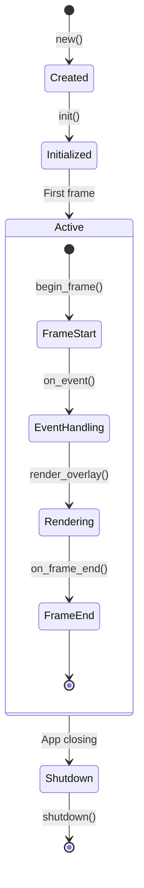

# Locust Plugins

Locust plugins extend the framework with new overlay behaviors. This document covers both built-in plugins and guidelines for creating custom plugins.

## Table of Contents

1. [Overview](#overview)
2. [Built-in Plugins](#built-in-plugins)
3. [Planned Plugins](#planned-plugins)
4. [Plugin Architecture](#plugin-architecture)
5. [Creating Custom Plugins](#creating-custom-plugins)
6. [Plugin Registry](#plugin-registry)
7. [Best Practices](#best-practices)

## Overview

Locust plugins are self-contained modules that extend the framework with overlay behaviors such as navigation hints, command palettes, tooltips, and more. Each plugin operates independently while sharing state through the `LocustContext`.

### Plugin Categories

- **Navigation**: Keyboard-driven UI navigation (NavPlugin)
- **Input Enhancement**: Command palettes, search interfaces (OmnibarPlugin)
- **Visual Overlays**: Tooltips, highlights, popovers
- **Utility**: Clipboard management, history, configuration

## Built-in Plugins

### 1. NavPlugin ✅ (Completed)

**Status**: Production-ready

The navigation plugin provides Vimium-style hint-based navigation for terminal UIs.

#### Features
- **Hint Generation**: Optimal hint assignment using home row keys
- **Progressive Matching**: Type partial hints to filter targets
- **Smart Prioritization**: Higher priority targets get shorter hints
- **Configurable**: Customizable activation key and hint charset
- **Performance**: < 1ms generation for 100+ targets

#### Configuration

```rust
use locust::plugins::nav::{NavPlugin, NavConfig};

let config = NavConfig::new()
    .with_hint_key('f')           // Activation key (default: 'f')
    .with_charset("asdfghjkl")    // Hint characters (default: home row)
    .with_max_hints(100)           // Maximum hints to display
    .with_priority_threshold(5);   // Priority cutoff for short hints

let nav_plugin = NavPlugin::with_config(config);
locust.register_plugin(nav_plugin);
```

#### Usage

1. Press `f` to activate hint mode
2. Hints appear on all navigable targets
3. Type hint characters to navigate
4. Target is activated when unique match found
5. Press `Esc` to cancel

#### API

```rust
impl NavPlugin {
    pub fn new() -> Self;
    pub fn with_config(config: NavConfig) -> Self;
    pub fn is_active(&self) -> bool;
    pub fn get_current_input(&self) -> &str;
}
```

### 2. OmnibarPlugin 🚧 (In Development)

**Status**: In active development (Phase 2)

Command palette plugin for fuzzy search and command execution.

#### Planned Features
- Fuzzy search with relevance scoring
- Command registration system
- Keyboard shortcut display
- History and frecency tracking
- Extensible action system

#### Planned Configuration

```rust
use locust::plugins::omnibar::{OmnibarPlugin, OmnibarConfig};

let config = OmnibarConfig::new()
    .with_activation_key(KeyCode::Char('p'), KeyModifiers::CONTROL)
    .with_max_results(10)
    .with_fuzzy_threshold(0.6)
    .with_show_shortcuts(true);

let omnibar = OmnibarPlugin::with_config(config);
```

## Planned Plugins

### Phase 3 Plugins (Q1 2025)

#### TooltipPlugin
- Context-sensitive tooltips on hover
- Markdown content support
- Smart positioning
- Delay configuration

#### HighlightPlugin
- Region highlighting for tours
- Animation support
- Multi-step sequences
- Customizable styles

#### ConfigPlugin
- Runtime configuration management
- Hot reload support
- User preferences
- Keybinding customization

#### ClipboardPlugin
- Cross-platform clipboard integration
- Copy/paste targets
- History management
- Format conversion

#### HistoryPlugin
- Command history
- Undo/redo support
- Session persistence
- Search through history

## Plugin Architecture

### The LocustPlugin Trait

Every plugin implements the `LocustPlugin<B>` trait:

```rust
pub trait LocustPlugin<B: Backend>: Send {
    /// Unique identifier for this plugin
    fn id(&self) -> &'static str;

    /// Priority for event handling (higher = earlier)
    fn priority(&self) -> i32 { 0 }

    /// One-time initialization
    fn init(&mut self, ctx: &mut LocustContext) {}

    /// Handle input events
    fn on_event(&mut self, event: &Event, ctx: &mut LocustContext) -> PluginEventResult;

    /// Called at the start of each frame
    fn on_frame_begin(&mut self, ctx: &mut LocustContext) {}

    /// Called at the end of each frame
    fn on_frame_end(&mut self, ctx: &LocustContext) {}

    /// Render overlay content
    fn render_overlay(&self, frame: &mut Frame<'_, B>, ctx: &LocustContext);

    /// Clean up resources
    fn shutdown(&mut self, ctx: &mut LocustContext) {}
}
```

### Event Result Types

```rust
pub enum PluginEventResult {
    /// Event not handled by this plugin
    NotHandled,

    /// Event handled and consumed (stop propagation)
    Consumed,

    /// Event handled but continue propagation
    Handled,

    /// Stop propagation with custom action
    StopPropagation(Box<dyn Any + Send>),
}
```

### Plugin Lifecycle



## Creating Custom Plugins

### Basic Template

```rust
use locust::prelude::*;
use crossterm::event::{Event, KeyCode};
use ratatui::{backend::Backend, Frame};

pub struct MyCustomPlugin {
    enabled: bool,
    state: PluginState,
}

impl MyCustomPlugin {
    pub fn new() -> Self {
        Self {
            enabled: false,
            state: PluginState::default(),
        }
    }
}

impl<B: Backend> LocustPlugin<B> for MyCustomPlugin {
    fn id(&self) -> &'static str {
        "my_custom_plugin"
    }

    fn priority(&self) -> i32 {
        50 // Medium priority
    }

    fn init(&mut self, ctx: &mut LocustContext) {
        // Initialize plugin state
        ctx.store_data("plugin_initialized", Box::new(true));
    }

    fn on_event(&mut self, event: &Event, ctx: &mut LocustContext) -> PluginEventResult {
        if let Event::Key(key) = event {
            if key.code == KeyCode::Char('m') && !self.enabled {
                self.enabled = true;
                return PluginEventResult::Consumed;
            }
        }
        PluginEventResult::NotHandled
    }

    fn render_overlay(&self, frame: &mut Frame<'_, B>, ctx: &LocustContext) {
        if self.enabled {
            // Render your overlay
            let area = centered_rect(50, 20, frame.size());
            let widget = Paragraph::new("Custom Plugin Active")
                .block(Block::default().borders(Borders::ALL));
            frame.render_widget(widget, area);
        }
    }
}
```

### Advanced Example: Search Plugin

```rust
pub struct SearchPlugin {
    active: bool,
    query: String,
    results: Vec<SearchResult>,
    selected: usize,
}

impl SearchPlugin {
    fn search(&mut self, ctx: &LocustContext) {
        self.results.clear();

        for target in ctx.targets() {
            if let Some(score) = self.fuzzy_match(&target.id, &self.query) {
                self.results.push(SearchResult {
                    target_id: target.id.clone(),
                    score,
                    preview: self.generate_preview(target),
                });
            }
        }

        self.results.sort_by(|a, b| b.score.cmp(&a.score));
    }
}

impl<B: Backend> LocustPlugin<B> for SearchPlugin {
    fn on_event(&mut self, event: &Event, ctx: &mut LocustContext) -> PluginEventResult {
        if !self.active {
            if let Event::Key(key) = event {
                if key.code == KeyCode::Char('/') {
                    self.active = true;
                    return PluginEventResult::Consumed;
                }
            }
            return PluginEventResult::NotHandled;
        }

        // Handle search input
        match event {
            Event::Key(key) => match key.code {
                KeyCode::Esc => {
                    self.active = false;
                    self.query.clear();
                    PluginEventResult::Consumed
                }
                KeyCode::Char(c) => {
                    self.query.push(c);
                    self.search(ctx);
                    PluginEventResult::Consumed
                }
                KeyCode::Enter => {
                    if let Some(result) = self.results.get(self.selected) {
                        ctx.store_data("navigate_to", Box::new(result.target_id.clone()));
                    }
                    self.active = false;
                    PluginEventResult::Consumed
                }
                _ => PluginEventResult::NotHandled,
            },
            _ => PluginEventResult::NotHandled,
        }
    }

    fn render_overlay(&self, frame: &mut Frame<'_, B>, _ctx: &LocustContext) {
        if self.active {
            // Render search interface
        }
    }
}
```

## Plugin Registry

### Registering Plugins

```rust
let mut locust = Locust::new(LocustConfig::default());

// Register built-in plugins
locust.register_plugin(NavPlugin::new());

// Register with configuration
locust.register_plugin(NavPlugin::with_config(
    NavConfig::new().with_hint_key('g')
));

// Register custom plugins
locust.register_plugin(MyCustomPlugin::new());

// Register with priority
locust.register_plugin_with_priority(CriticalPlugin::new(), 100);
```

### Plugin Discovery

```rust
// Get all registered plugins
let plugins = locust.plugins();

// Check if plugin is registered
if locust.has_plugin("nav") {
    // Plugin is available
}

// Get specific plugin
if let Some(nav) = locust.get_plugin::<NavPlugin>("nav") {
    let is_active = nav.is_active();
}
```

### Dynamic Plugin Management

```rust
// Unregister plugin
locust.unregister_plugin("my_custom_plugin");

// Disable plugin temporarily
locust.disable_plugin("nav");

// Re-enable plugin
locust.enable_plugin("nav");

// Replace plugin
locust.replace_plugin("nav", NewNavPlugin::new());
```

## Best Practices

### 1. Resource Management

```rust
impl<B: Backend> LocustPlugin<B> for ResourceAwarePlugin {
    fn init(&mut self, _ctx: &mut LocustContext) {
        // Pre-allocate resources
        self.buffer.reserve(1024);
    }

    fn on_frame_end(&mut self, _ctx: &LocustContext) {
        // Clean up per-frame resources
        self.temp_data.clear();
    }

    fn shutdown(&mut self, _ctx: &mut LocustContext) {
        // Final cleanup
        self.buffer.clear();
    }
}
```

### 2. Error Handling

```rust
impl<B: Backend> LocustPlugin<B> for RobustPlugin {
    fn on_event(&mut self, event: &Event, ctx: &mut LocustContext) -> PluginEventResult {
        match self.try_handle_event(event, ctx) {
            Ok(result) => result,
            Err(e) => {
                log::error!("Plugin error: {}", e);
                PluginEventResult::NotHandled
            }
        }
    }
}
```

### 3. Inter-Plugin Communication

```rust
impl<B: Backend> LocustPlugin<B> for CooperativePlugin {
    fn on_event(&mut self, _event: &Event, ctx: &mut LocustContext) -> PluginEventResult {
        // Store data for other plugins
        ctx.store_data("shared_state", Box::new(self.state.clone()));

        // Read data from other plugins
        if let Some(nav_state) = ctx.get_data::<NavState>("nav_state") {
            self.handle_nav_state(nav_state);
        }

        PluginEventResult::NotHandled
    }
}
```

### 4. Performance Optimization

```rust
impl<B: Backend> LocustPlugin<B> for OptimizedPlugin {
    fn render_overlay(&self, frame: &mut Frame<'_, B>, ctx: &LocustContext) {
        // Skip rendering if not visible
        if !self.is_visible(frame.size()) {
            return;
        }

        // Use cached render if available
        if let Some(cached) = &self.render_cache {
            if cached.is_valid() {
                frame.render_widget(cached, frame.size());
                return;
            }
        }

        // Render and cache
        let widget = self.create_widget();
        self.render_cache = Some(widget.clone());
        frame.render_widget(widget, frame.size());
    }
}
```

## Plugin Testing

### Unit Testing

```rust
#[cfg(test)]
mod tests {
    use super::*;
    use ratatui::backend::TestBackend;

    #[test]
    fn test_plugin_activation() {
        let mut plugin = MyPlugin::new();
        let mut ctx = LocustContext::default();

        let event = Event::Key(KeyCode::Char('m').into());
        let result = plugin.on_event(&event, &mut ctx);

        assert_eq!(result, PluginEventResult::Consumed);
        assert!(plugin.is_active());
    }
}
```

### Integration Testing

```rust
#[test]
fn test_plugin_integration() {
    let mut locust = Locust::<TestBackend>::new(LocustConfig::default());
    locust.register_plugin(MyPlugin::new());

    let event = Event::Key(KeyCode::Char('m').into());
    let outcome = locust.on_event(&event);

    assert!(outcome.consumed);
}
```

## Contributing Plugins

We welcome plugin contributions! See [CONTRIBUTING.md](../CONTRIBUTING.md) for guidelines.

### Submission Checklist

- [ ] Implements `LocustPlugin` trait
- [ ] Includes documentation
- [ ] Has unit tests
- [ ] Provides example usage
- [ ] Follows Rust conventions
- [ ] Performance benchmarks (if applicable)

---

*For detailed plugin development instructions, see the [Plugin Development Guide](PLUGIN_DEVELOPMENT_GUIDE.md).*
