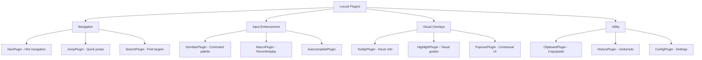
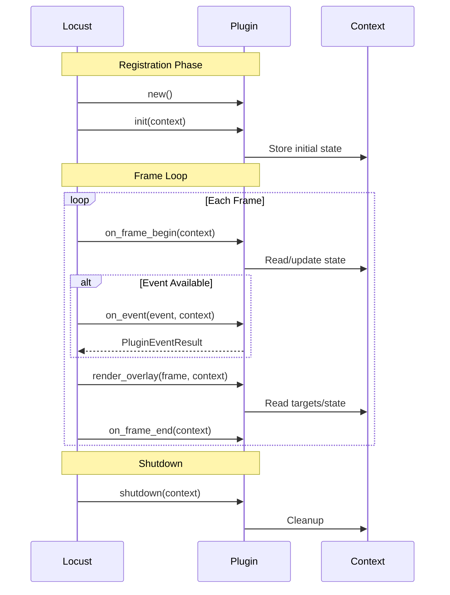

# Locust Plugin Development Guide

## Table of Contents

1. [Introduction](#introduction)
2. [Quick Start](#quick-start)
3. [Plugin Architecture](#plugin-architecture)
4. [Creating Your First Plugin](#creating-your-first-plugin)
5. [Advanced Plugin Concepts](#advanced-plugin-concepts)
6. [Best Practices](#best-practices)
7. [Common Patterns](#common-patterns)
8. [Performance Optimization](#performance-optimization)
9. [Testing Strategies](#testing-strategies)
10. [Real-World Examples](#real-world-examples)
11. [Troubleshooting](#troubleshooting)
12. [API Reference](#api-reference)

## Introduction

Locust plugins extend the framework with overlay behaviors like navigation hints, command palettes, tooltips, and more. This guide will teach you how to create powerful, performant plugins that integrate seamlessly with any ratatui application.

### What is a Plugin?

A plugin in Locust is a self-contained module that:
- Intercepts and handles events
- Renders overlays on top of the base UI
- Communicates with other plugins through shared context
- Manages its own state and lifecycle

### Plugin Categories



## Quick Start

### Minimal Plugin Template

```rust
use locust::core::{
    context::LocustContext,
    input::PluginEventResult,
    plugin::LocustPlugin,
};
use crossterm::event::Event;
use ratatui::{backend::Backend, Frame};

pub struct MyPlugin {
    // Your plugin state
    enabled: bool,
}

impl MyPlugin {
    pub fn new() -> Self {
        Self { enabled: false }
    }
}

impl<B: Backend> LocustPlugin<B> for MyPlugin {
    fn id(&self) -> &'static str {
        "my-plugin"
    }

    fn on_event(&mut self, event: &Event, _ctx: &mut LocustContext) -> PluginEventResult {
        // Handle events
        PluginEventResult::NotHandled
    }

    fn render_overlay(&self, _frame: &mut Frame<'_, B>, _ctx: &LocustContext) {
        // Render your overlay
    }
}
```

### Registration

```rust
let mut locust = Locust::new(LocustConfig::default());
locust.register_plugin(MyPlugin::new());
```

## Plugin Architecture

### The Plugin Trait

```rust
pub trait LocustPlugin<B: Backend>: Send {
    /// Unique identifier for this plugin
    fn id(&self) -> &'static str;

    /// Priority for event handling (higher = earlier)
    fn priority(&self) -> i32 { 0 }

    /// One-time initialization
    fn init(&mut self, ctx: &mut LocustContext) {}

    /// Handle input events
    fn on_event(&mut self, event: &Event, ctx: &mut LocustContext) -> PluginEventResult;

    /// Called at the start of each frame
    fn on_frame_begin(&mut self, ctx: &mut LocustContext) {}

    /// Called at the end of each frame
    fn on_frame_end(&mut self, ctx: &LocustContext) {}

    /// Render overlay content
    fn render_overlay(&self, frame: &mut Frame<'_, B>, ctx: &LocustContext);

    /// Clean up resources
    fn shutdown(&mut self, ctx: &mut LocustContext) {}
}
```

### Plugin Lifecycle



### Event Result Types

```rust
pub enum PluginEventResult {
    /// Event not handled, continue to next plugin
    NotHandled,

    /// Event consumed, stop propagation
    Consumed,

    /// Event handled but continue propagation
    Handled,

    /// Stop with custom action
    StopPropagation(Box<dyn Any + Send>),
}
```

## Creating Your First Plugin

### Step 1: Define Your Plugin Structure

```rust
use std::collections::HashMap;

pub struct TooltipPlugin {
    // Configuration
    config: TooltipConfig,

    // State
    active_tooltip: Option<Tooltip>,
    hover_timer: Instant,
    tooltip_cache: HashMap<String, String>,

    // Styling
    style: TooltipStyle,
}

struct Tooltip {
    target_id: String,
    content: String,
    position: Position,
}

struct TooltipConfig {
    delay_ms: u64,
    max_width: u16,
    follow_cursor: bool,
}

struct TooltipStyle {
    background: Color,
    foreground: Color,
    border: BorderType,
}
```

### Step 2: Implement Core Logic

```rust
impl TooltipPlugin {
    pub fn new() -> Self {
        Self {
            config: TooltipConfig {
                delay_ms: 500,
                max_width: 40,
                follow_cursor: true,
            },
            active_tooltip: None,
            hover_timer: Instant::now(),
            tooltip_cache: HashMap::new(),
            style: TooltipStyle::default(),
        }
    }

    fn check_hover(&mut self, ctx: &LocustContext) -> Option<NavTarget> {
        // Get mouse position from context
        if let Some(mouse_pos) = ctx.get_data::<(u16, u16)>("mouse_position") {
            // Find target at position
            ctx.targets()
                .iter()
                .find(|t| t.area.contains(*mouse_pos))
                .cloned()
        } else {
            None
        }
    }

    fn generate_tooltip_content(&mut self, target: &NavTarget) -> String {
        // Check cache first
        if let Some(cached) = self.tooltip_cache.get(&target.id) {
            return cached.clone();
        }

        // Generate content based on target type
        let content = match &target.kind {
            TargetKind::Button => format!("Click to {}", target.metadata.get("action").unwrap_or(&"activate".to_string())),
            TargetKind::ListItem => format!("Item: {}", target.metadata.get("label").unwrap_or(&target.id)),
            TargetKind::Link => format!("Navigate to {}", target.metadata.get("href").unwrap_or(&"#".to_string())),
            _ => "No description available".to_string(),
        };

        // Cache for future use
        self.tooltip_cache.insert(target.id.clone(), content.clone());
        content
    }
}
```

### Step 3: Handle Events

```rust
impl<B: Backend> LocustPlugin<B> for TooltipPlugin {
    fn id(&self) -> &'static str {
        "tooltip"
    }

    fn priority(&self) -> i32 {
        -10 // Low priority, doesn't consume events
    }

    fn on_event(&mut self, event: &Event, ctx: &mut LocustContext) -> PluginEventResult {
        match event {
            Event::Mouse(mouse) => {
                match mouse.kind {
                    MouseEventKind::Moved => {
                        // Store mouse position
                        ctx.store_data("mouse_position", Box::new((mouse.column, mouse.row)));

                        // Check for hover target
                        if let Some(target) = self.check_hover(ctx) {
                            if self.active_tooltip.as_ref().map(|t| t.target_id != target.id).unwrap_or(true) {
                                // New target, reset timer
                                self.hover_timer = Instant::now();
                                self.active_tooltip = None;
                            } else if self.hover_timer.elapsed().as_millis() >= self.config.delay_ms as u128 {
                                // Show tooltip after delay
                                let content = self.generate_tooltip_content(&target);
                                self.active_tooltip = Some(Tooltip {
                                    target_id: target.id,
                                    content,
                                    position: Position::Near(target.area),
                                });
                            }
                        } else {
                            // No target, hide tooltip
                            self.active_tooltip = None;
                        }
                    }
                    _ => {}
                }
            }
            Event::Key(_) => {
                // Hide tooltip on any key press
                self.active_tooltip = None;
            }
            _ => {}
        }

        PluginEventResult::NotHandled // Don't consume events
    }
}
```

### Step 4: Render Overlay

```rust
impl<B: Backend> LocustPlugin<B> for TooltipPlugin {
    fn render_overlay(&self, frame: &mut Frame<'_, B>, _ctx: &LocustContext) {
        if let Some(tooltip) = &self.active_tooltip {
            let content_lines: Vec<String> = tooltip.content
                .chars()
                .collect::<Vec<char>>()
                .chunks(self.config.max_width as usize)
                .map(|chunk| chunk.iter().collect())
                .collect();

            let width = content_lines.iter().map(|l| l.len()).max().unwrap_or(0) as u16 + 2;
            let height = content_lines.len() as u16 + 2;

            // Calculate position
            let area = match tooltip.position {
                Position::Near(target_area) => {
                    let x = target_area.x.saturating_add(target_area.width).min(frame.area().width.saturating_sub(width));
                    let y = target_area.y.min(frame.area().height.saturating_sub(height));
                    Rect::new(x, y, width, height)
                }
                Position::Absolute(x, y) => {
                    Rect::new(x, y, width, height)
                }
            };

            // Render tooltip box
            let tooltip_widget = Paragraph::new(content_lines.join("\n"))
                .block(Block::default()
                    .borders(Borders::ALL)
                    .border_type(self.style.border)
                    .border_style(Style::default().fg(self.style.foreground)))
                .style(Style::default()
                    .bg(self.style.background)
                    .fg(self.style.foreground))
                .wrap(Wrap { trim: true });

            frame.render_widget(tooltip_widget, area);
        }
    }
}
```

## Advanced Plugin Concepts

### Inter-Plugin Communication

```rust
// Plugin A: Store data
impl<B: Backend> LocustPlugin<B> for PluginA {
    fn on_event(&mut self, event: &Event, ctx: &mut LocustContext) -> PluginEventResult {
        if let Event::Key(key) = event {
            if key.code == KeyCode::Enter {
                // Store selected item for other plugins
                ctx.store_data("selected_item", Box::new(self.current_item.clone()));
                return PluginEventResult::Consumed;
            }
        }
        PluginEventResult::NotHandled
    }
}

// Plugin B: Read data
impl<B: Backend> LocustPlugin<B> for PluginB {
    fn on_frame_begin(&mut self, ctx: &mut LocustContext) {
        // Check for selected item from Plugin A
        if let Some(item) = ctx.get_data::<String>("selected_item") {
            self.process_selection(item);
            // Clear after processing
            ctx.remove_data("selected_item");
        }
    }
}
```

### State Management

```rust
pub struct StatefulPlugin {
    state: PluginState,
    state_history: VecDeque<PluginState>,
    max_history: usize,
}

#[derive(Clone)]
enum PluginState {
    Idle,
    Active { mode: Mode, data: StateData },
    Processing { task: String, progress: f32 },
    Error { message: String },
}

impl StatefulPlugin {
    fn transition(&mut self, new_state: PluginState) {
        // Save current state to history
        if self.state_history.len() >= self.max_history {
            self.state_history.pop_front();
        }
        self.state_history.push_back(self.state.clone());

        // Transition to new state
        log::debug!("State transition: {:?} -> {:?}", self.state, new_state);
        self.state = new_state;
    }

    fn undo(&mut self) {
        if let Some(prev_state) = self.state_history.pop_back() {
            self.state = prev_state;
        }
    }
}
```

### Custom Events

```rust
// Define custom event types
#[derive(Debug, Clone)]
pub enum CustomEvent {
    TargetSelected { id: String },
    CommandExecuted { command: String },
    OverlayToggled { overlay_id: String, visible: bool },
}

// Emit custom events
impl<B: Backend> LocustPlugin<B> for MyPlugin {
    fn on_event(&mut self, event: &Event, ctx: &mut LocustContext) -> PluginEventResult {
        if let Event::Key(key) = event {
            if key.code == KeyCode::Enter {
                // Emit custom event for other plugins
                ctx.emit_event(CustomEvent::TargetSelected {
                    id: self.current_target.clone(),
                });
                return PluginEventResult::Consumed;
            }
        }

        // Check for custom events from other plugins
        if let Some(custom) = ctx.poll_custom_event::<CustomEvent>() {
            match custom {
                CustomEvent::TargetSelected { id } => {
                    self.handle_target_selection(&id);
                }
                _ => {}
            }
        }

        PluginEventResult::NotHandled
    }
}
```

### Async Operations

```rust
use tokio::sync::mpsc;

pub struct AsyncPlugin {
    command_tx: mpsc::Sender<Command>,
    result_rx: mpsc::Receiver<Result>,
}

impl AsyncPlugin {
    pub fn new() -> Self {
        let (command_tx, mut command_rx) = mpsc::channel(100);
        let (result_tx, result_rx) = mpsc::channel(100);

        // Spawn async worker
        tokio::spawn(async move {
            while let Some(command) = command_rx.recv().await {
                let result = process_command_async(command).await;
                let _ = result_tx.send(result).await;
            }
        });

        Self { command_tx, result_rx }
    }
}

impl<B: Backend> LocustPlugin<B> for AsyncPlugin {
    fn on_frame_begin(&mut self, ctx: &mut LocustContext) {
        // Poll for async results
        while let Ok(result) = self.result_rx.try_recv() {
            self.handle_async_result(result, ctx);
        }
    }

    fn on_event(&mut self, event: &Event, _ctx: &mut LocustContext) -> PluginEventResult {
        if let Event::Key(key) = event {
            if key.code == KeyCode::Char('a') {
                // Send async command
                let _ = self.command_tx.try_send(Command::Process);
                return PluginEventResult::Consumed;
            }
        }
        PluginEventResult::NotHandled
    }
}
```

## Best Practices

### 1. Resource Management

```rust
impl<B: Backend> LocustPlugin<B> for ResourceAwarePlugin {
    fn init(&mut self, _ctx: &mut LocustContext) {
        // Pre-allocate resources
        self.buffer.reserve(1024);
        self.cache.reserve(100);
    }

    fn on_frame_end(&mut self, _ctx: &LocustContext) {
        // Clean up per-frame resources
        self.temp_buffer.clear();

        // Periodic cleanup
        if self.frame_count % 100 == 0 {
            self.cache.retain(|_, v| v.is_fresh());
            self.buffer.shrink_to_fit();
        }

        self.frame_count += 1;
    }

    fn shutdown(&mut self, _ctx: &mut LocustContext) {
        // Final cleanup
        self.cache.clear();
        self.buffer.clear();
    }
}
```

### 2. Error Handling

```rust
#[derive(Debug, thiserror::Error)]
pub enum PluginError {
    #[error("Configuration error: {0}")]
    Config(String),

    #[error("Runtime error: {0}")]
    Runtime(String),

    #[error("Resource not found: {0}")]
    ResourceNotFound(String),
}

impl<B: Backend> LocustPlugin<B> for RobustPlugin {
    fn on_event(&mut self, event: &Event, ctx: &mut LocustContext) -> PluginEventResult {
        match self.try_handle_event(event, ctx) {
            Ok(result) => result,
            Err(e) => {
                log::error!("Plugin error: {}", e);
                ctx.store_data("last_error", Box::new(e.to_string()));
                PluginEventResult::NotHandled
            }
        }
    }

    fn try_handle_event(&mut self, event: &Event, ctx: &mut LocustContext) -> Result<PluginEventResult, PluginError> {
        // Actual event handling with proper error propagation
        let config = self.load_config()
            .map_err(|e| PluginError::Config(e.to_string()))?;

        let resource = ctx.get_data::<Resource>("required_resource")
            .ok_or_else(|| PluginError::ResourceNotFound("required_resource".to_string()))?;

        // Process event
        Ok(PluginEventResult::NotHandled)
    }
}
```

### 3. Performance Guidelines

```rust
pub struct OptimizedPlugin {
    // Cache computed values
    hint_cache: HashMap<String, Vec<Hint>>,
    cache_generation: u64,

    // Batch updates
    pending_updates: Vec<Update>,

    // Lazy initialization
    heavy_resource: OnceCell<HeavyResource>,
}

impl<B: Backend> LocustPlugin<B> for OptimizedPlugin {
    fn on_event(&mut self, event: &Event, ctx: &mut LocustContext) -> PluginEventResult {
        // Early returns for unhandled events
        let Event::Key(key) = event else {
            return PluginEventResult::NotHandled;
        };

        // Cache invalidation check
        if ctx.generation() != self.cache_generation {
            self.hint_cache.clear();
            self.cache_generation = ctx.generation();
        }

        // Lazy initialization
        let resource = self.heavy_resource.get_or_init(|| {
            HeavyResource::new()
        });

        // Batch updates instead of immediate processing
        self.pending_updates.push(Update::from_event(event));

        if self.pending_updates.len() >= 10 {
            self.process_batch(ctx);
        }

        PluginEventResult::Handled
    }

    fn process_batch(&mut self, ctx: &mut LocustContext) {
        // Process all pending updates at once
        let updates = std::mem::take(&mut self.pending_updates);
        // ... batch processing logic
    }
}
```

## Common Patterns

### 1. Mode-Based Plugin

```rust
#[derive(Debug, Clone, PartialEq)]
enum PluginMode {
    Normal,
    Insert,
    Visual,
    Command,
}

pub struct ModalPlugin {
    mode: PluginMode,
    mode_stack: Vec<PluginMode>,
}

impl ModalPlugin {
    fn push_mode(&mut self, mode: PluginMode) {
        self.mode_stack.push(self.mode.clone());
        self.mode = mode;
    }

    fn pop_mode(&mut self) {
        if let Some(prev_mode) = self.mode_stack.pop() {
            self.mode = prev_mode;
        }
    }
}

impl<B: Backend> LocustPlugin<B> for ModalPlugin {
    fn on_event(&mut self, event: &Event, ctx: &mut LocustContext) -> PluginEventResult {
        match self.mode {
            PluginMode::Normal => self.handle_normal_mode(event, ctx),
            PluginMode::Insert => self.handle_insert_mode(event, ctx),
            PluginMode::Visual => self.handle_visual_mode(event, ctx),
            PluginMode::Command => self.handle_command_mode(event, ctx),
        }
    }

    fn render_overlay(&self, frame: &mut Frame<'_, B>, _ctx: &LocustContext) {
        // Render mode indicator
        let mode_text = format!(" {} ", self.mode);
        let mode_style = match self.mode {
            PluginMode::Normal => Style::default().bg(Color::Blue),
            PluginMode::Insert => Style::default().bg(Color::Green),
            PluginMode::Visual => Style::default().bg(Color::Yellow),
            PluginMode::Command => Style::default().bg(Color::Magenta),
        };

        let area = Rect::new(0, frame.area().height - 1, mode_text.len() as u16, 1);
        frame.render_widget(
            Paragraph::new(mode_text).style(mode_style),
            area
        );
    }
}
```

### 2. Filter Plugin Pattern

```rust
pub struct FilterPlugin<T: Clone> {
    items: Vec<T>,
    filtered_items: Vec<T>,
    filter_text: String,
    filter_fn: Box<dyn Fn(&T, &str) -> bool>,
}

impl<T: Clone + Display> FilterPlugin<T> {
    pub fn new(items: Vec<T>) -> Self {
        let filtered = items.clone();
        Self {
            items,
            filtered_items: filtered,
            filter_text: String::new(),
            filter_fn: Box::new(|item, filter| {
                item.to_string().to_lowercase().contains(&filter.to_lowercase())
            }),
        }
    }

    fn apply_filter(&mut self) {
        self.filtered_items = self.items
            .iter()
            .filter(|item| (self.filter_fn)(item, &self.filter_text))
            .cloned()
            .collect();
    }
}
```

### 3. Command Pattern Plugin

```rust
pub trait Command: Send {
    fn execute(&mut self, ctx: &mut LocustContext) -> Result<(), Box<dyn Error>>;
    fn undo(&mut self, ctx: &mut LocustContext) -> Result<(), Box<dyn Error>>;
    fn description(&self) -> String;
}

pub struct CommandPlugin {
    commands: HashMap<String, Box<dyn Command>>,
    history: VecDeque<Box<dyn Command>>,
    redo_stack: Vec<Box<dyn Command>>,
}

impl CommandPlugin {
    pub fn register_command(&mut self, name: String, command: Box<dyn Command>) {
        self.commands.insert(name, command);
    }

    pub fn execute_command(&mut self, name: &str, ctx: &mut LocustContext) -> Result<(), Box<dyn Error>> {
        if let Some(mut command) = self.commands.remove(name) {
            command.execute(ctx)?;
            self.history.push_back(command);
            self.redo_stack.clear(); // Clear redo stack on new command

            // Limit history size
            if self.history.len() > 100 {
                self.history.pop_front();
            }
            Ok(())
        } else {
            Err(format!("Command not found: {}", name).into())
        }
    }

    pub fn undo(&mut self, ctx: &mut LocustContext) -> Result<(), Box<dyn Error>> {
        if let Some(mut command) = self.history.pop_back() {
            command.undo(ctx)?;
            self.redo_stack.push(command);
            Ok(())
        } else {
            Err("Nothing to undo".into())
        }
    }
}
```

## Performance Optimization

### 1. Efficient Target Filtering

```rust
pub struct EfficientNavPlugin {
    // Spatial index for fast lookups
    spatial_index: RTree<NavTarget>,
    // Pre-sorted targets by priority
    priority_sorted: Vec<NavTarget>,
    // Category index
    category_index: HashMap<TargetKind, Vec<usize>>,
}

impl EfficientNavPlugin {
    fn build_indices(&mut self, targets: &[NavTarget]) {
        // Build spatial index
        self.spatial_index = RTree::bulk_load(targets.to_vec());

        // Sort by priority
        self.priority_sorted = targets.to_vec();
        self.priority_sorted.sort_by_key(|t| -t.priority);

        // Build category index
        self.category_index.clear();
        for (idx, target) in targets.iter().enumerate() {
            self.category_index
                .entry(target.kind.clone())
                .or_default()
                .push(idx);
        }
    }

    fn find_targets_in_area(&self, area: Rect) -> Vec<&NavTarget> {
        self.spatial_index
            .locate_in_envelope(&envelope_from_rect(area))
            .collect()
    }

    fn find_targets_by_kind(&self, kind: &TargetKind) -> Vec<&NavTarget> {
        self.category_index
            .get(kind)
            .map(|indices| {
                indices.iter()
                    .map(|&idx| &self.priority_sorted[idx])
                    .collect()
            })
            .unwrap_or_default()
    }
}
```

### 2. Render Optimization

```rust
pub struct OptimizedRenderPlugin {
    // Cache rendered content
    render_cache: Option<Buffer>,
    cache_valid: bool,

    // Dirty tracking
    dirty_regions: Vec<Rect>,

    // Layer composition
    layers: BTreeMap<u32, Layer>,
}

impl<B: Backend> LocustPlugin<B> for OptimizedRenderPlugin {
    fn render_overlay(&self, frame: &mut Frame<'_, B>, ctx: &LocustContext) {
        // Skip if nothing changed
        if self.cache_valid && self.dirty_regions.is_empty() {
            if let Some(cached) = &self.render_cache {
                frame.render_widget(cached.clone(), frame.area());
                return;
            }
        }

        // Render only dirty regions
        if !self.dirty_regions.is_empty() {
            for region in &self.dirty_regions {
                self.render_region(frame, *region, ctx);
            }
        } else {
            // Full render
            self.render_full(frame, ctx);
        }
    }

    fn render_region(&self, frame: &mut Frame<'_, B>, region: Rect, ctx: &LocustContext) {
        // Render only the specified region
        let mut local_buffer = Buffer::empty(region);

        // Composite layers for this region
        for layer in self.layers.values() {
            if layer.intersects(region) {
                layer.render_to_buffer(&mut local_buffer);
            }
        }

        frame.render_widget(local_buffer, region);
    }
}
```

### 3. Memory Optimization

```rust
use std::mem::size_of;

pub struct MemoryEfficientPlugin {
    // Use compact representations
    targets: Vec<CompactTarget>,
    // String interning
    string_pool: StringPool,
    // Bitflags instead of bools
    flags: PluginFlags,
}

#[repr(C)]
struct CompactTarget {
    id: u32,           // Interned string ID instead of String
    area: PackedRect,  // 8 bytes instead of 16
    kind: u8,          // Enum as u8
    priority: i8,      // Smaller range
}

#[repr(C)]
struct PackedRect {
    x_y: u32,      // x: u16, y: u16 packed
    w_h: u32,      // width: u16, height: u16 packed
}

bitflags! {
    struct PluginFlags: u32 {
        const ENABLED = 0b00000001;
        const VISIBLE = 0b00000010;
        const ACTIVE = 0b00000100;
        const DIRTY = 0b00001000;
    }
}

impl MemoryEfficientPlugin {
    fn add_target(&mut self, target: NavTarget) {
        let id = self.string_pool.intern(&target.id);
        let compact = CompactTarget {
            id,
            area: PackedRect::from(target.area),
            kind: target.kind as u8,
            priority: target.priority.clamp(-128, 127) as i8,
        };
        self.targets.push(compact);
    }
}
```

## Testing Strategies

### Unit Testing

```rust
#[cfg(test)]
mod tests {
    use super::*;
    use ratatui::backend::TestBackend;

    #[test]
    fn test_plugin_initialization() {
        let mut plugin = MyPlugin::new();
        let mut ctx = LocustContext::default();

        plugin.init(&mut ctx);

        assert_eq!(plugin.id(), "my-plugin");
        assert_eq!(plugin.priority(), 0);
    }

    #[test]
    fn test_event_handling() {
        let mut plugin = MyPlugin::new();
        let mut ctx = LocustContext::default();

        let event = Event::Key(KeyCode::Char('f').into());
        let result = plugin.on_event(&event, &mut ctx);

        assert_eq!(result, PluginEventResult::Consumed);
        assert!(plugin.is_active());
    }

    #[test]
    fn test_render_output() {
        let plugin = MyPlugin::new();
        let ctx = LocustContext::default();

        let backend = TestBackend::new(80, 24);
        let mut terminal = Terminal::new(backend).unwrap();

        terminal.draw(|f| {
            plugin.render_overlay(f, &ctx);
        }).unwrap();

        let buffer = terminal.backend().buffer();
        assert!(buffer.content().contains("expected content"));
    }
}
```

### Integration Testing

```rust
#[test]
fn test_plugin_interaction() {
    let mut locust = Locust::<TestBackend>::new(LocustConfig::default());
    let mut plugin_a = PluginA::new();
    let mut plugin_b = PluginB::new();

    locust.register_plugin(plugin_a);
    locust.register_plugin(plugin_b);

    // Simulate event that PluginA handles and stores data
    let event = Event::Key(KeyCode::Enter.into());
    let outcome = locust.on_event(&event);

    assert!(outcome.consumed);

    // Verify PluginB can read the data
    locust.begin_frame();
    let ctx = locust.context();
    assert!(ctx.get_data::<String>("shared_data").is_some());
}
```

### Property Testing

```rust
use proptest::prelude::*;

proptest! {
    #[test]
    fn test_filter_consistency(
        items in prop::collection::vec(any::<String>(), 0..100),
        filter in any::<String>()
    ) {
        let mut plugin = FilterPlugin::new(items.clone());
        plugin.set_filter(&filter);

        let filtered = plugin.get_filtered_items();

        // Property: filtered items are subset of original
        for item in filtered {
            prop_assert!(items.contains(item));
        }

        // Property: all items matching filter are included
        for item in &items {
            if item.contains(&filter) {
                prop_assert!(filtered.contains(item));
            }
        }
    }
}
```

### Benchmark Testing

```rust
#[bench]
fn bench_hint_generation(b: &mut Bencher) {
    let mut plugin = NavPlugin::new();
    let targets: Vec<NavTarget> = (0..100)
        .map(|i| NavTarget {
            id: format!("target_{}", i),
            area: Rect::new(i % 80, i / 80, 10, 1),
            kind: TargetKind::Button,
            priority: 0,
            ..Default::default()
        })
        .collect();

    b.iter(|| {
        plugin.generate_hints(&targets)
    });
}

#[bench]
fn bench_render_overlay(b: &mut Bencher) {
    let plugin = MyPlugin::new();
    let ctx = LocustContext::default();
    let backend = TestBackend::new(80, 24);
    let mut terminal = Terminal::new(backend).unwrap();

    b.iter(|| {
        terminal.draw(|f| {
            black_box(plugin.render_overlay(f, &ctx));
        }).unwrap();
    });
}
```

## Real-World Examples

### Example 1: Navigation Plugin (NavPlugin)

The NavPlugin provides Vimium-style keyboard navigation:

```rust
pub struct NavPlugin {
    mode: NavMode,
    config: NavConfig,
    hints: Vec<Hint>,
    input_buffer: String,
    matched_hints: Vec<usize>,
}

impl<B: Backend> LocustPlugin<B> for NavPlugin {
    fn on_event(&mut self, event: &Event, ctx: &mut LocustContext) -> PluginEventResult {
        match self.mode {
            NavMode::Normal => {
                if let Event::Key(key) = event {
                    if key.code == self.config.activation_key {
                        self.activate_hint_mode(ctx);
                        return PluginEventResult::Consumed;
                    }
                }
            }
            NavMode::Hint => {
                if let Event::Key(key) = event {
                    match key.code {
                        KeyCode::Esc => {
                            self.deactivate_hint_mode();
                            return PluginEventResult::Consumed;
                        }
                        KeyCode::Char(c) => {
                            self.input_buffer.push(c);
                            self.update_matches();

                            if self.matched_hints.len() == 1 {
                                self.activate_target(ctx);
                                self.deactivate_hint_mode();
                            }

                            return PluginEventResult::Consumed;
                        }
                        KeyCode::Backspace => {
                            self.input_buffer.pop();
                            self.update_matches();
                            return PluginEventResult::Consumed;
                        }
                        _ => {}
                    }
                }
            }
        }
        PluginEventResult::NotHandled
    }

    fn render_overlay(&self, frame: &mut Frame<'_, B>, ctx: &LocustContext) {
        if self.mode != NavMode::Hint {
            return;
        }

        // Render hints on targets
        for (hint, target) in self.hints.iter().zip(ctx.targets()) {
            if self.matched_hints.is_empty() || self.matched_hints.contains(&hint.index) {
                let style = if hint.text.starts_with(&self.input_buffer) {
                    Style::default().bg(Color::Yellow).fg(Color::Black)
                } else {
                    Style::default().bg(Color::Gray).fg(Color::Black)
                };

                let hint_area = Rect::new(
                    target.area.x,
                    target.area.y,
                    hint.text.len() as u16,
                    1,
                );

                frame.render_widget(
                    Paragraph::new(hint.text.clone()).style(style),
                    hint_area,
                );
            }
        }

        // Render input buffer
        let input_area = Rect::new(0, frame.area().height - 1, 20, 1);
        frame.render_widget(
            Paragraph::new(format!("Hint: {}", self.input_buffer))
                .style(Style::default().bg(Color::Blue).fg(Color::White)),
            input_area,
        );
    }
}
```

### Example 2: Omnibar Plugin

A command palette plugin:

```rust
pub struct OmnibarPlugin {
    active: bool,
    input: String,
    commands: Vec<Command>,
    filtered_commands: Vec<usize>,
    selected: usize,
    executor: CommandExecutor,
}

struct Command {
    name: String,
    description: String,
    shortcut: Option<String>,
    action: Box<dyn Fn(&mut LocustContext) + Send>,
}

impl<B: Backend> LocustPlugin<B> for OmnibarPlugin {
    fn priority(&self) -> i32 {
        100 // High priority when active
    }

    fn on_event(&mut self, event: &Event, ctx: &mut LocustContext) -> PluginEventResult {
        if !self.active {
            if let Event::Key(key) = event {
                if key.modifiers.contains(KeyModifiers::CONTROL) && key.code == KeyCode::Char('p') {
                    self.activate();
                    return PluginEventResult::Consumed;
                }
            }
            return PluginEventResult::NotHandled;
        }

        // Active mode - capture all input
        if let Event::Key(key) = event {
            match key.code {
                KeyCode::Esc => {
                    self.deactivate();
                }
                KeyCode::Enter => {
                    if let Some(&idx) = self.filtered_commands.get(self.selected) {
                        self.execute_command(idx, ctx);
                        self.deactivate();
                    }
                }
                KeyCode::Up => {
                    self.selected = self.selected.saturating_sub(1);
                }
                KeyCode::Down => {
                    if self.selected < self.filtered_commands.len() - 1 {
                        self.selected += 1;
                    }
                }
                KeyCode::Char(c) => {
                    self.input.push(c);
                    self.filter_commands();
                }
                KeyCode::Backspace => {
                    self.input.pop();
                    self.filter_commands();
                }
                _ => {}
            }
            return PluginEventResult::Consumed;
        }

        PluginEventResult::NotHandled
    }

    fn render_overlay(&self, frame: &mut Frame<'_, B>, _ctx: &LocustContext) {
        if !self.active {
            return;
        }

        let area = centered_rect(60, 40, frame.area());

        // Render background
        frame.render_widget(Clear, area);

        // Render omnibar
        let chunks = Layout::default()
            .direction(Direction::Vertical)
            .constraints([Constraint::Length(3), Constraint::Min(0)])
            .split(area);

        // Input field
        let input_widget = Paragraph::new(self.input.as_str())
            .block(Block::default()
                .title("Command Palette")
                .borders(Borders::ALL))
            .style(Style::default().fg(Color::Yellow));

        frame.render_widget(input_widget, chunks[0]);

        // Command list
        let items: Vec<ListItem> = self.filtered_commands
            .iter()
            .enumerate()
            .map(|(i, &cmd_idx)| {
                let cmd = &self.commands[cmd_idx];
                let content = if let Some(ref shortcut) = cmd.shortcut {
                    format!("{} - {} ({})", cmd.name, cmd.description, shortcut)
                } else {
                    format!("{} - {}", cmd.name, cmd.description)
                };

                let style = if i == self.selected {
                    Style::default().bg(Color::Gray)
                } else {
                    Style::default()
                };

                ListItem::new(content).style(style)
            })
            .collect();

        let list = List::new(items)
            .block(Block::default().borders(Borders::ALL));

        frame.render_widget(list, chunks[1]);
    }
}
```

## Troubleshooting

### Common Issues and Solutions

| Issue | Cause | Solution |
|-------|-------|----------|
| Plugin not receiving events | Low priority or consumed by other plugin | Increase priority or check event consumption |
| Overlay not visible | Not calling `render_overlay` or rendering outside visible area | Verify render call and check coordinates |
| Memory leak | Not cleaning up resources | Implement proper cleanup in `on_frame_end` and `shutdown` |
| Poor performance | Heavy computation in render or event loop | Cache results, use lazy evaluation |
| State inconsistency | Shared mutable state without synchronization | Use proper synchronization primitives |

### Debugging Techniques

```rust
// Enable debug logging
impl<B: Backend> LocustPlugin<B> for DebugPlugin {
    fn on_event(&mut self, event: &Event, ctx: &mut LocustContext) -> PluginEventResult {
        log::debug!("[{}] Received event: {:?}", self.id(), event);

        let result = self.handle_event(event, ctx);

        log::debug!("[{}] Event result: {:?}", self.id(), result);
        result
    }

    fn render_overlay(&self, frame: &mut Frame<'_, B>, ctx: &LocustContext) {
        #[cfg(debug_assertions)]
        {
            // Render debug info in debug builds
            let debug_info = format!(
                "Targets: {} | FPS: {} | Memory: {} KB",
                ctx.targets().len(),
                self.calculate_fps(),
                self.memory_usage() / 1024
            );

            let area = Rect::new(
                frame.area().width - debug_info.len() as u16 - 2,
                0,
                debug_info.len() as u16 + 2,
                1
            );

            frame.render_widget(
                Paragraph::new(debug_info).style(Style::default().fg(Color::Green)),
                area
            );
        }

        self.render_normal_overlay(frame, ctx);
    }
}
```

### Performance Profiling

```rust
use std::time::Instant;

struct ProfilingPlugin {
    timings: HashMap<&'static str, Duration>,
    last_frame: Instant,
}

impl<B: Backend> LocustPlugin<B> for ProfilingPlugin {
    fn on_event(&mut self, event: &Event, ctx: &mut LocustContext) -> PluginEventResult {
        let start = Instant::now();
        let result = self.handle_event(event, ctx);
        self.timings.insert("on_event", start.elapsed());
        result
    }

    fn render_overlay(&self, frame: &mut Frame<'_, B>, ctx: &LocustContext) {
        let start = Instant::now();
        self.render(frame, ctx);
        self.timings.insert("render", start.elapsed());

        // Log slow frames
        let frame_time = self.last_frame.elapsed();
        if frame_time > Duration::from_millis(16) {
            log::warn!("Slow frame: {:?}", frame_time);
            for (name, duration) in &self.timings {
                if *duration > Duration::from_millis(5) {
                    log::warn!("  {}: {:?}", name, duration);
                }
            }
        }
    }
}
```

## API Reference

### Core Types

```rust
// Event result types
pub enum PluginEventResult {
    NotHandled,
    Consumed,
    Handled,
    StopPropagation(Box<dyn Any + Send>),
}

// Target types
#[derive(Debug, Clone)]
pub struct NavTarget {
    pub id: String,
    pub kind: TargetKind,
    pub area: Rect,
    pub priority: i32,
    pub actions: Vec<TargetAction>,
    pub metadata: HashMap<String, String>,
}

#[derive(Debug, Clone)]
pub enum TargetKind {
    Button,
    Link,
    ListItem,
    TabHeader,
    MenuItem,
    TextInput,
    Custom(String),
}

#[derive(Debug, Clone)]
pub enum TargetAction {
    Click,
    Focus,
    Select,
    Expand,
    Custom(String),
}
```

### Context Methods

```rust
impl LocustContext {
    // Target management
    pub fn register_target(&mut self, target: NavTarget);
    pub fn targets(&self) -> &[NavTarget];
    pub fn get_target(&self, id: &str) -> Option<&NavTarget>;

    // Data sharing
    pub fn store_data<T>(&mut self, key: &str, value: T)
    where T: Any + Send + Sync + 'static;

    pub fn get_data<T>(&self, key: &str) -> Option<&T>
    where T: Any + Send + Sync + 'static;

    pub fn remove_data(&mut self, key: &str) -> Option<Box<dyn Any + Send + Sync>>;

    // Overlay management
    pub fn set_overlay_active(&mut self, id: &str, active: bool);
    pub fn is_overlay_active(&self, id: &str) -> bool;

    // Events
    pub fn emit_event<T>(&mut self, event: T)
    where T: Any + Send + Sync + 'static;

    pub fn poll_custom_event<T>(&mut self) -> Option<T>
    where T: Any + Send + Sync + 'static;
}
```

### Configuration

```rust
#[derive(Debug, Clone)]
pub struct LocustConfig {
    pub max_plugins: usize,
    pub max_targets: usize,
    pub enable_metrics: bool,
    pub log_level: LogLevel,
}

impl Default for LocustConfig {
    fn default() -> Self {
        Self {
            max_plugins: 50,
            max_targets: 1000,
            enable_metrics: false,
            log_level: LogLevel::Info,
        }
    }
}
```

## Related Documentation

This comprehensive plugin development guide connects with other Locust documentation:

### Essential Reading
- **[PLUGINS.md](PLUGINS.md)** - Built-in plugin reference and examples
- **[ARCHITECTURE.md](ARCHITECTURE.md#plugin-system-design)** - Plugin architecture deep dive
- **[API_PATTERNS.md](API_PATTERNS.md#plugin-patterns)** - Plugin design patterns

### Configuration & Testing
- **[CONFIGURATION.md](CONFIGURATION.md)** - Make plugins configurable
- **[CONTRIBUTING.md](../CONTRIBUTING.md#testing-guidelines)** - Plugin testing guidelines
- **[TROUBLESHOOTING.md](TROUBLESHOOTING.md#plugin-issues)** - Debug plugin issues

### Integration & Examples
- **[INTEGRATION_GUIDE.md](INTEGRATION_GUIDE.md)** - Integrate plugins into applications
- **[EXAMPLES.md](EXAMPLES.md)** - Plugin usage in working examples
- **[CASE_STUDIES.md](CASE_STUDIES.md)** - Real-world plugin implementations

### Customization
- **[THEMING.md](THEMING.md)** - Theme plugin overlays
- **[KEYBINDINGS.md](KEYBINDINGS.md)** - Plugin keybinding configuration
- **[WIDGET_ADAPTERS.md](WIDGET_ADAPTERS.md)** - Widget adapter patterns

### Project Documentation
- **[README.md](../README.md#plugin-development)** - Plugin development overview
- **[ROADMAP.md](ROADMAP.md)** - Plugin ecosystem roadmap

---

*This guide is part of the Locust documentation. For more information, see the [Architecture](ARCHITECTURE.md) and [API Documentation](https://docs.rs/locust).*