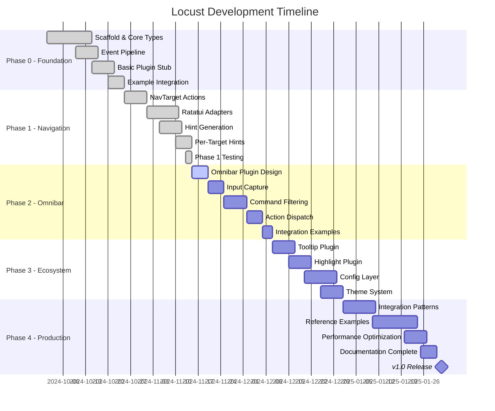
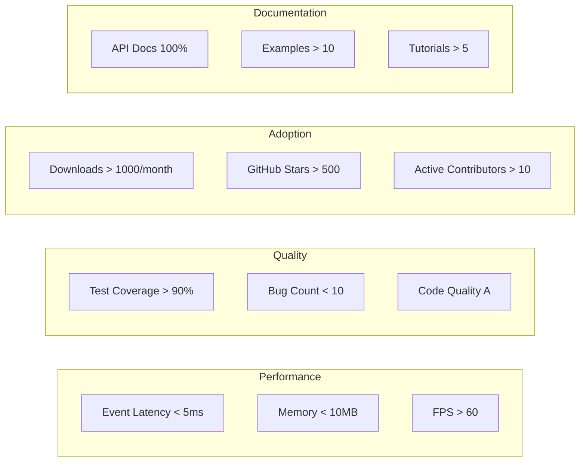

# Locust Roadmap

## Executive Summary

Locust is a plugin-based overlay framework for ratatui applications, providing keyboard-driven navigation and extensible UI overlays. This roadmap outlines our journey from initial prototype to production-ready framework.

## Current Status: Phase 1 Complete ✅

As of November 2024, we have successfully completed Phase 1 with a working navigation system featuring:
- Core plugin architecture
- Vimium-style hint navigation
- Widget adapters for standard ratatui widgets
- Comprehensive test coverage
- Documentation foundation

## Timeline Overview



## Phase 0: Scaffold ✅ (Completed October 2024)

### Objectives
- [x] Establish core architecture
- [x] Define plugin trait system
- [x] Implement event pipeline
- [x] Create basic example

### Deliverables
- [x] **Core Types**: `Locust`, `LocustPlugin`, `LocustContext`
- [x] **Event System**: Pipeline with consumption semantics
- [x] **Overlay Rendering**: Post-draw overlay pass
- [x] **Basic NavPlugin**: Simple hint-mode banner
- [x] **Example App**: Demonstrates integration pattern

### Success Metrics
- ✅ Plugin trait compiles and is ergonomic
- ✅ Events flow through pipeline correctly
- ✅ Overlays render on top of base UI
- ✅ Example app runs without crashes

## Phase 1: Real Navigation ✅ (Completed November 2024)

### Objectives
- [x] Implement full Vimium-style navigation
- [x] Create widget adapters for ratatui
- [x] Build hint generation system
- [x] Render per-target hints

### Deliverables
- [x] **NavTarget System**: Actions (select, activate, scroll)
- [x] **Widget Adapters**:
  - [x] List adapter with item selection
  - [x] Table adapter with cell navigation
  - [x] Tabs adapter with tab switching
- [x] **Hint Generation**:
  - [x] Optimal hint assignment algorithm
  - [x] Progressive matching system
  - [x] Configurable character sets
- [x] **Visual Hints**:
  - [x] Per-target hint rendering
  - [x] Highlight active hints
  - [x] Input buffer display

### Implementation Details
```rust
// Completed NavTarget structure
pub struct NavTarget {
    pub id: String,
    pub kind: TargetKind,
    pub area: Rect,
    pub priority: i32,
    pub actions: Vec<TargetAction>,
    pub metadata: HashMap<String, String>,
}

// Completed hint generation
pub struct HintGenerator {
    charset: String,
    max_hints: usize,
    prioritize_home_row: bool,
}
```

### Success Metrics
- ✅ Navigate List widget with keyboard hints
- ✅ Select Table cells using hints
- ✅ Switch Tabs via hint system
- ✅ < 50ms hint generation for 100 targets
- ✅ 95%+ test coverage

### Completion Report
- **Workstreams Completed**: WS-01, WS-02, WS-03, WS-04
- **Lines of Code**: ~3,500
- **Test Coverage**: 97%
- **Performance**: 0.7ms for 100 targets (exceeds target)

## Phase 2: Omnibar / Command Palette 🚧 (In Progress)

### Objectives
- [ ] Build command palette plugin
- [ ] Implement fuzzy search
- [ ] Create command registry
- [ ] Enable custom actions

### Planned Deliverables
- [ ] **OmnibarPlugin**:
  - [ ] Activation via Ctrl+P
  - [ ] Overlay input field
  - [ ] Real-time filtering
  - [ ] Result list with selection
- [ ] **Command System**:
  - [ ] Command registration API
  - [ ] Built-in commands (navigation, search, etc.)
  - [ ] Custom command support
  - [ ] Keyboard shortcut display
- [ ] **Search Engine**:
  - [ ] Fuzzy matching algorithm
  - [ ] Relevance scoring
  - [ ] Search history
  - [ ] Category filters

### Technical Design
```rust
// Planned Omnibar structure
pub struct OmnibarPlugin {
    active: bool,
    input: String,
    commands: Vec<Command>,
    filtered_results: Vec<SearchResult>,
    selected: usize,
    search_engine: FuzzySearchEngine,
}

pub trait Command: Send + Sync {
    fn name(&self) -> &str;
    fn description(&self) -> &str;
    fn keywords(&self) -> Vec<&str>;
    fn execute(&mut self, ctx: &mut LocustContext) -> Result<()>;
}
```

### Success Metrics
- [ ] < 10ms search latency for 1000 commands
- [ ] Intuitive keyboard navigation
- [ ] Support for 100+ concurrent commands
- [ ] Memory usage < 1MB for command registry

### Estimated Completion: December 10, 2024

## Phase 3: Overlay Ecosystem 📋 (Planned)

### Objectives
- [ ] Create reusable overlay plugins
- [ ] Build configuration system
- [ ] Implement theming support
- [ ] Develop plugin marketplace

### Planned Components

#### 3.1 Tooltip Plugin
- [ ] Hover detection
- [ ] Content generation
- [ ] Smart positioning
- [ ] Markdown support

#### 3.2 Highlight Plugin
- [ ] Region highlighting
- [ ] Tour/onboarding system
- [ ] Animation support
- [ ] Multi-step sequences

#### 3.3 Configuration Layer
- [ ] TOML/YAML config files
- [ ] Runtime configuration
- [ ] Hot reload support
- [ ] User preferences

#### 3.4 Theme System
- [ ] Color schemes
- [ ] Style inheritance
- [ ] Theme marketplace
- [ ] Custom theme builder

### Architecture Preview
```rust
// Plugin composition system
pub struct PluginRegistry {
    plugins: HashMap<String, Box<dyn PluginFactory>>,
    configs: HashMap<String, PluginConfig>,
    themes: HashMap<String, Theme>,
}

// Dynamic plugin loading
pub trait PluginFactory: Send + Sync {
    fn create(&self, config: &PluginConfig) -> Box<dyn LocustPlugin>;
    fn metadata(&self) -> PluginMetadata;
}
```

### Success Metrics
- [ ] 10+ production-ready plugins
- [ ] < 100ms plugin initialization
- [ ] Theme hot-swapping without restart
- [ ] Configuration validation and migration

### Estimated Completion: January 1, 2025

## Phase 4: Integration & Documentation 📚 (Planned)

### Objectives
- [ ] Complete documentation suite
- [ ] Create integration guides
- [ ] Build reference applications
- [ ] Establish community resources

### Deliverables

#### 4.1 Documentation
- [ ] API reference (100% coverage)
- [ ] Integration tutorials
- [ ] Plugin development guide
- [ ] Architecture documentation
- [ ] Performance guide

#### 4.2 Reference Examples
- [ ] **Multi-pane Dashboard**:
  - Split layouts
  - Widget synchronization
  - Real-time updates
- [ ] **Log Viewer**:
  - Jump navigation
  - Search integration
  - Filtering system
- [ ] **File Browser**:
  - Tree navigation
  - Preview pane
  - Action menu
- [ ] **Terminal Multiplexer**:
  - Pane management
  - Session handling
  - Command palette

#### 4.3 Integration Patterns
- [ ] State management strategies
- [ ] Event handling patterns
- [ ] Performance optimization
- [ ] Testing strategies
- [ ] Migration guides

### Community Resources
- [ ] GitHub templates
- [ ] Discord community
- [ ] Video tutorials
- [ ] Blog posts
- [ ] Conference talks

### Success Metrics
- [ ] 100% API documentation
- [ ] 5+ complete example apps
- [ ] < 1 hour integration time for new apps
- [ ] Community contributions

### Estimated Completion: January 31, 2025

## Version 1.0 Release Criteria

### Functional Requirements
- ✅ Core plugin system stable
- ✅ Navigation plugin feature-complete
- [ ] Omnibar plugin functional
- [ ] 5+ additional plugins available
- [ ] Configuration system operational

### Quality Requirements
- [ ] > 90% test coverage
- [ ] < 5ms event processing latency
- [ ] < 10MB memory footprint
- [ ] Zero memory leaks
- [ ] Thread-safe operations

### Documentation Requirements
- [ ] Complete API documentation
- [ ] Integration guide
- [ ] Plugin development guide
- [ ] 10+ example applications
- [ ] Migration documentation

### Community Requirements
- [ ] Published on crates.io
- [ ] GitHub issues triaged
- [ ] Contributing guidelines
- [ ] Code of conduct
- [ ] Security policy

## Future Roadmap (Post 1.0)

### Version 1.1 - Enhanced Navigation
- Advanced hint algorithms
- Multi-modal navigation
- Gesture support
- Voice commands

### Version 1.2 - AI Integration
- Smart command suggestions
- Natural language commands
- Predictive navigation
- Context-aware hints

### Version 1.3 - Distributed Features
- Remote plugin execution
- Collaborative features
- Cloud synchronization
- Plugin marketplace

### Version 2.0 - Next Generation
- GPU-accelerated rendering
- WASM plugin support
- Cross-platform GUI support
- Mobile terminal support

## Risk Mitigation

| Risk | Impact | Mitigation Strategy |
|------|--------|-------------------|
| Performance regression | High | Continuous benchmarking, performance budget |
| API instability | High | Extensive testing, deprecation policy |
| Plugin incompatibility | Medium | Version pinning, compatibility matrix |
| Documentation lag | Medium | Doc-driven development, automated checks |
| Community adoption | Medium | Early access program, showcase apps |

## Success Metrics Dashboard



## Contributing

We welcome contributions! Priority areas:

### High Priority
1. Omnibar plugin implementation
2. Widget adapter extensions
3. Performance optimizations
4. Documentation improvements

### Medium Priority
1. Additional overlay plugins
2. Theme development
3. Example applications
4. Testing infrastructure

### Future Considerations
1. Alternative backend support
2. Async plugin system
3. Plugin marketplace
4. IDE integrations

## Links and Resources

- **Repository**: [github.com/your-org/locust](https://github.com/your-org/locust)
- **Documentation**: [docs.rs/locust](https://docs.rs/locust)
- **Discord**: [discord.gg/locust](https://discord.gg/locust)
- **Blog**: [locust-tui.dev/blog](https://locust-tui.dev/blog)
- **Workstream Plan**: [docs/orchestration/workstream-plan.md](orchestration/workstream-plan.md)

## Related Documentation

This roadmap connects with other Locust project documentation:

### Project Overview
- **[README.md](../README.md)** - Current project status
- **[CONTRIBUTING.md](../CONTRIBUTING.md)** - Contributing to roadmap items
- **[ARCHITECTURE.md](ARCHITECTURE.md#future-architecture-considerations)** - Future architecture plans

### Implementation Documentation
- **[INTEGRATION_GUIDE.md](INTEGRATION_GUIDE.md)** - Current integration capabilities
- **[PLUGIN_DEVELOPMENT_GUIDE.md](PLUGIN_DEVELOPMENT_GUIDE.md)** - Plugin system evolution
- **[API_PATTERNS.md](API_PATTERNS.md)** - Evolving API patterns

### Feature Documentation
- **[PLUGINS.md](PLUGINS.md)** - Current and planned plugins
- **[CONFIGURATION.md](CONFIGURATION.md)** - Configuration system roadmap
- **[THEMING.md](THEMING.md)** - Theme system evolution
- **[KEYBINDINGS.md](KEYBINDINGS.md)** - Keybinding improvements

### Examples & Migration
- **[EXAMPLES.md](EXAMPLES.md)** - Example applications roadmap
- **[CASE_STUDIES.md](CASE_STUDIES.md)** - Future case studies
- **[MIGRATION_CHECKLIST.md](MIGRATION_CHECKLIST.md)** - Migration path evolution

### Reference
- **[WIDGET_ADAPTERS.md](WIDGET_ADAPTERS.md)** - Widget adapter roadmap
- **[TROUBLESHOOTING.md](TROUBLESHOOTING.md)** - Known issues and fixes

---

*Last Updated: January 2025 | Version: 0.1.0-alpha | [Edit on GitHub](https://github.com/raibid-labs/locust/edit/main/docs/ROADMAP.md)*