# Locust Meta-Orchestrator

## Overview

The Locust Meta-Orchestrator is the top-level coordination system that manages the entire development lifecycle of the Locust plugin framework for ratatui. It coordinates three domain orchestrators and 15 workstreams across an 8-12 week timeline, ensuring efficient parallel development while maintaining architectural integrity.

## Architecture

```mermaid
graph TB
    MO[Meta-Orchestrator<br/>Locust-Meta]

    subgraph "Domain Orchestrators"
        CF[Core Framework<br/>Orchestrator]
        PD[Plugin Development<br/>Orchestrator]
        INT[Integration<br/>Orchestrator]
    end

    subgraph "Phase 1 Workstreams"
        WS01[WS-01: Core Types]
        WS02[WS-02: Navigation System]
        WS03[WS-03: Ratatui Adapters]
        WS04[WS-04: Hint Generation]
    end

    subgraph "Phase 2-3 Workstreams"
        WS05[WS-05: Omnibar Core]
        WS06[WS-06: Command System]
        WS07[WS-07: Tooltip Plugin]
        WS08[WS-08: Highlight Plugin]
        WS09[WS-09: Configuration Layer]
        WS10[WS-10: Theme System]
        WS11[WS-11: Keybinding System]
    end

    subgraph "Phase 4 Workstreams"
        WS12[WS-12: Integration Patterns]
        WS13[WS-13: Example Apps]
        WS14[WS-14: Documentation]
        WS15[WS-15: Testing & CI/CD]
    end

    MO --> CF
    MO --> PD
    MO --> INT

    CF --> WS01
    CF --> WS02
    CF --> WS03
    CF --> WS04

    PD --> WS05
    PD --> WS06
    PD --> WS07
    PD --> WS08
    PD --> WS09
    PD --> WS10
    PD --> WS11

    INT --> WS12
    INT --> WS13
    INT --> WS14
    INT --> WS15
```



## Responsibilities

### Primary Functions
1. **Strategic Coordination**: Manage high-level project timeline and dependencies
2. **Resource Allocation**: Distribute agent resources across domain orchestrators
3. **Phase Management**: Control phase gates and transition criteria
4. **Risk Management**: Monitor and mitigate cross-domain risks
5. **Quality Assurance**: Ensure architectural consistency across all workstreams

### Key Metrics
- Overall project progress (weighted by workstream complexity)
- Cross-domain dependency resolution rate
- Phase completion status
- Resource utilization efficiency
- Quality gate pass rates

## Domain Orchestrators

### 1. Core Framework Orchestrator
- **Scope**: Phase 1 (Real Navigation) - Weeks 1-4
- **Workstreams**: WS-01 to WS-04
- **Focus**: Establishing the foundational plugin architecture and navigation system
- **Key Deliverables**: Core types, event pipeline, navigation targets, ratatui adapters

### 2. Plugin Development Orchestrator
- **Scope**: Phase 2-3 (Omnibar & Overlay Ecosystem) - Weeks 3-8
- **Workstreams**: WS-05 to WS-11
- **Focus**: Building the plugin ecosystem and user interaction components
- **Key Deliverables**: Omnibar, tooltips, highlights, configuration system

### 3. Integration Orchestrator
- **Scope**: Phase 4 (Integration & Documentation) - Weeks 7-12
- **Workstreams**: WS-12 to WS-15
- **Focus**: Examples, documentation, testing infrastructure
- **Key Deliverables**: Reference implementations, comprehensive docs, CI/CD pipeline

## Phase Gates

### Phase 1 → Phase 2 Gate (Week 4)
**Acceptance Criteria:**
- [ ] Core types (`Locust`, `LocustPlugin`, `LocustContext`) fully implemented
- [ ] Event pipeline functioning with proper consumption patterns
- [ ] Navigation targets discoverable and actionable
- [ ] Basic ratatui adapters for List, Table, Tabs working
- [ ] Hint generation producing valid keyboard shortcuts
- [ ] Unit test coverage > 80% for core modules

### Phase 2 → Phase 3 Gate (Week 6)
**Acceptance Criteria:**
- [ ] Omnibar plugin fully functional with input capture
- [ ] Command filtering and execution working
- [ ] Integration with navigation system complete
- [ ] Performance benchmarks passing (< 10ms overlay render)
- [ ] API stability achieved for plugin interfaces

### Phase 3 → Phase 4 Gate (Week 8)
**Acceptance Criteria:**
- [ ] All overlay plugins (tooltip, highlight) implemented
- [ ] Configuration system supporting keymaps and themes
- [ ] Plugin interoperability verified
- [ ] Memory usage within bounds (< 10MB for plugin system)
- [ ] Developer documentation for plugin creation complete

### Phase 4 Completion Gate (Week 12)
**Acceptance Criteria:**
- [ ] Three reference applications demonstrating all features
- [ ] Complete API documentation with examples
- [ ] CI/CD pipeline with automated testing
- [ ] Performance regression tests in place
- [ ] Published to crates.io as v0.1.0

## Spawn Commands

### Initialize Meta-Orchestrator
```bash
# Initialize the meta-orchestrator with swarm topology
npx claude-flow@alpha swarm init --topology hierarchical --max-agents 20

# Spawn the meta-orchestrator agent
npx claude-flow@alpha agent spawn \
  --type orchestrator \
  --name locust-meta \
  --role "Meta-orchestrator for Locust plugin framework development" \
  --instructions "Coordinate three domain orchestrators across 15 workstreams. Monitor phase gates, manage dependencies, ensure architectural consistency. Weekly status reports required."

# Create coordination memory
npx claude-flow@alpha memory store \
  --key "locust/meta/config" \
  --value '{
    "project": "Locust Plugin Framework",
    "timeline": "8-12 weeks",
    "phases": 4,
    "workstreams": 15,
    "domain_orchestrators": 3
  }'
```

### Spawn Domain Orchestrators
```bash
# Core Framework Orchestrator
npx claude-flow@alpha task orchestrate \
  --task "spawn-core-framework" \
  --orchestrator "locust-meta" \
  --config '{
    "agent": "rust-pro",
    "name": "locust-core-orchestrator",
    "workstreams": ["WS-01", "WS-02", "WS-03", "WS-04"],
    "phase": 1,
    "timeline": "weeks 1-4"
  }'

# Plugin Development Orchestrator
npx claude-flow@alpha task orchestrate \
  --task "spawn-plugin-dev" \
  --orchestrator "locust-meta" \
  --config '{
    "agent": "coder",
    "name": "locust-plugin-orchestrator",
    "workstreams": ["WS-05", "WS-06", "WS-07", "WS-08", "WS-09", "WS-10", "WS-11"],
    "phase": "2-3",
    "timeline": "weeks 3-8"
  }'

# Integration Orchestrator
npx claude-flow@alpha task orchestrate \
  --task "spawn-integration" \
  --orchestrator "locust-meta" \
  --config '{
    "agent": "docs-architect",
    "name": "locust-integration-orchestrator",
    "workstreams": ["WS-12", "WS-13", "WS-14", "WS-15"],
    "phase": 4,
    "timeline": "weeks 7-12"
  }'
```

## Weekly Reporting Structure

### Status Report Template
```markdown
# Locust Development Status - Week [X]

## Overall Progress
- Phase: [Current Phase]
- Completion: [XX]%
- On Track: [Yes/No/At Risk]

## Domain Status
### Core Framework (Phase 1)
- Progress: [XX]%
- Blockers: [List]
- Next Week: [Goals]

### Plugin Development (Phase 2-3)
- Progress: [XX]%
- Blockers: [List]
- Next Week: [Goals]

### Integration (Phase 4)
- Progress: [XX]%
- Blockers: [List]
- Next Week: [Goals]

## Risk Register
1. [Risk]: [Mitigation]

## Decisions Required
1. [Decision]: [Context]

## Resource Adjustments
- [Adjustments needed]
```

## Communication Protocols

### Inter-Orchestrator Communication
```bash
# Store status updates in shared memory
npx claude-flow@alpha memory store \
  --key "locust/status/week-{n}" \
  --value "{status_json}"

# Notify on critical dependencies
npx claude-flow@alpha hooks notify \
  --message "Core types API finalized, ready for plugin development" \
  --target "locust-plugin-orchestrator"

# Request resources
npx claude-flow@alpha task orchestrate \
  --task "request-agents" \
  --orchestrator "locust-meta" \
  --config '{"type": "rust-pro", "count": 2, "for": "performance-optimization"}'
```

### Escalation Path
1. **Workstream Issues** → Domain Orchestrator
2. **Cross-Domain Issues** → Meta-Orchestrator
3. **Architecture Decisions** → Meta-Orchestrator + Technical Review
4. **Timeline/Resource Issues** → Meta-Orchestrator → Project Stakeholders

## Monitoring & Metrics

### Key Performance Indicators
```yaml
kpis:
  velocity:
    target: "2-3 workstreams completed per week"
    measure: "workstreams_completed / week"

  quality:
    target: "> 80% first-pass acceptance"
    measure: "passed_reviews / total_reviews"

  efficiency:
    target: "< 20% rework"
    measure: "rework_hours / total_hours"

  predictability:
    target: "90% milestone accuracy"
    measure: "milestones_hit_on_time / total_milestones"
```

### Dashboard Queries
```bash
# Get overall progress
npx claude-flow@alpha swarm status --format detailed

# Check workstream health
npx claude-flow@alpha task status --pattern "WS-*"

# Resource utilization
npx claude-flow@alpha agent metrics --group-by orchestrator

# Dependency analysis
npx claude-flow@alpha memory get --pattern "locust/dependencies/*"
```

## Contingency Planning

### Schedule Compression Strategies
1. **Parallel Acceleration**: Increase agent allocation to critical path
2. **Scope Adjustment**: Defer nice-to-have features to v0.2
3. **Quality Trade-offs**: Accept technical debt for non-critical components
4. **External Resources**: Bring in specialized Rust consultants

### Risk Mitigation
```yaml
risks:
  - risk: "Ratatui API changes"
    probability: "Low"
    impact: "High"
    mitigation: "Pin ratatui version, monitor changelog"

  - risk: "Performance regression"
    probability: "Medium"
    impact: "Medium"
    mitigation: "Continuous benchmarking, early optimization"

  - risk: "Plugin API instability"
    probability: "Medium"
    impact: "High"
    mitigation: "Extensive testing, gradual API evolution"

  - risk: "Documentation lag"
    probability: "High"
    impact: "Low"
    mitigation: "Parallel documentation team from week 1"
```

## Success Criteria

### Project Success Metrics
1. **Functional Completeness**: All Phase 1-4 features implemented
2. **Performance**: Overlay render < 10ms, memory < 10MB
3. **Quality**: > 80% test coverage, zero critical bugs
4. **Documentation**: 100% public API documented
5. **Adoption Ready**: Published to crates.io, 3+ example apps

### Long-term Success Indicators
- Community contributions within first month
- Integration into 5+ ratatui projects within 3 months
- Feature requests indicating real-world usage
- Performance maintained across version updates

## Appendix: Tool Integration

### Claude Flow Integration
```bash
# Enable advanced features
npx claude-flow@alpha features enable neural-training
npx claude-flow@alpha features enable performance-tracking
npx claude-flow@alpha features enable github-integration

# Configure GitHub integration
npx claude-flow@alpha github config \
  --repo "raibid-labs/locust" \
  --branch "main" \
  --pr-prefix "locust-"
```

### Monitoring Setup
```bash
# Create monitoring dashboard
npx claude-flow@alpha monitor create \
  --name "locust-development" \
  --refresh 300 \
  --metrics "progress,quality,velocity,blockers"

# Set up alerts
npx claude-flow@alpha alert create \
  --name "phase-gate" \
  --condition "phase_progress < expected_progress - 10" \
  --action "notify:locust-meta"
```