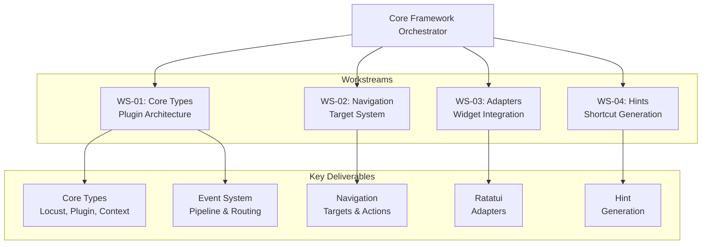
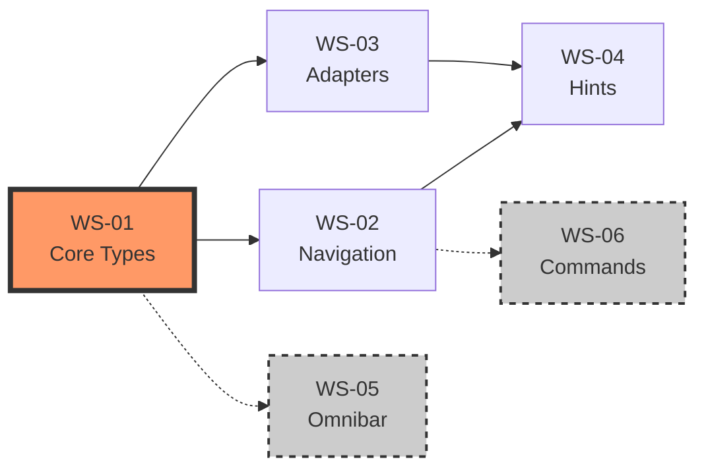

# Core Framework Orchestrator

## Overview

The Core Framework Orchestrator is responsible for establishing the foundational architecture of the Locust plugin framework. This orchestrator manages Phase 1 of the project, overseeing four critical workstreams (WS-01 through WS-04) that create the core types, navigation system, ratatui adapters, and hint generation engine. Operating during weeks 1-4, this orchestrator ensures a solid, performant foundation upon which all other features will be built.

## Architectural Responsibility



## Mission Statement

To architect and implement a robust, extensible, and performant foundation for the Locust plugin framework that enables seamless integration with ratatui applications while maintaining sub-millisecond overhead and providing an intuitive developer experience.

## Scope & Boundaries

### In Scope
- Core type system design and implementation
- Event pipeline architecture
- Navigation target discovery and management
- Widget adapter framework
- Hint generation algorithms
- Performance optimization for core paths
- API design for plugin developers
- Foundation documentation

### Out of Scope
- User-facing plugins (omnibar, tooltips)
- Configuration systems
- Theme and styling
- Example applications
- End-user documentation

## Workstream Management

### WS-01: Core Types & Architecture
**Lead Agent**: rust-pro-senior
**Timeline**: Week 1-2
**Status**: Planning

#### Objectives
1. Design zero-cost abstraction layer for plugins
2. Implement thread-safe context sharing
3. Create efficient event routing system
4. Establish plugin lifecycle management

#### Key Decisions Required
- Lifetime management strategy for plugins
- Event priority and consumption model
- State synchronization approach
- Memory allocation strategy

#### Integration Points
- Must provide stable API for WS-02, WS-03, WS-05
- Defines plugin trait used by all future plugins
- Establishes performance baseline

### WS-02: Navigation System
**Lead Agent**: rust-pro-nav
**Timeline**: Week 2-3
**Status**: Blocked (awaiting WS-01)

#### Objectives
1. Implement discoverable navigation targets
2. Create action dispatch system
3. Build focus management
4. Design keyboard input decoder

#### Key Decisions Required
- Navigation target identification scheme
- Focus traversal algorithm
- Keyboard shortcut allocation strategy
- Action priority system

#### Integration Points
- Depends on WS-01 core types
- Provides targets for WS-04 hint generation
- Enables WS-06 command dispatch

### WS-03: Ratatui Adapters
**Lead Agent**: coder-ratatui
**Timeline**: Week 2-4
**Status**: Blocked (awaiting WS-01)

#### Objectives
1. Create adapter trait system
2. Implement standard widget adapters
3. Build custom widget framework
4. Optimize rendering pipeline

#### Key Decisions Required
- Adapter trait design
- Widget introspection approach
- Rendering integration strategy
- Performance optimization techniques

#### Integration Points
- Uses WS-01 plugin interface
- Provides widget info to WS-02 navigation
- Enables target discovery for WS-04

### WS-04: Hint Generation
**Lead Agent**: coder-algorithms
**Timeline**: Week 3-4
**Status**: Blocked (awaiting WS-02, WS-03)

#### Objectives
1. Design hint assignment algorithm
2. Implement collision detection
3. Create customizable hint renderer
4. Build hint caching system

#### Key Decisions Required
- Hint assignment algorithm (sequential, spatial, semantic)
- Collision resolution strategy
- Rendering overlay approach
- Caching and invalidation policy

#### Integration Points
- Requires WS-02 navigation targets
- Uses WS-03 widget information
- Critical for user experience

## Orchestration Strategy

### Parallelization Opportunities
```yaml
week_1:
  parallel:
    - WS-01: Start core types design
    - Research: Investigate ratatui internals
    - Planning: Define adapter requirements

week_2:
  parallel:
    - WS-01: Complete implementation
    - WS-02: Begin navigation system
    - WS-03: Start adapter framework

week_3:
  parallel:
    - WS-02: Complete navigation
    - WS-03: Implement adapters
    - WS-04: Begin hint generation
    - Testing: Integration tests for WS-01

week_4:
  parallel:
    - WS-03: Finalize adapters
    - WS-04: Complete hints
    - Testing: Full integration testing
    - Docs: API documentation
```

### Dependency Management


## Spawn Commands

### Initialize Orchestrator
```bash
# Create orchestrator agent
npx claude-flow@alpha agent spawn \
  --type orchestrator \
  --name "locust-core-framework" \
  --role "Core Framework Orchestrator for Locust Phase 1" \
  --instructions "Manage WS-01 through WS-04. Focus on foundation architecture, performance, and API stability. Ensure clean abstractions and zero-cost overhead. Coordinate with Plugin Development Orchestrator for API handoff."

# Initialize orchestrator memory
npx claude-flow@alpha memory store \
  --key "locust/orchestrators/core-framework/config" \
  --value '{
    "phase": 1,
    "weeks": "1-4",
    "workstreams": ["WS-01", "WS-02", "WS-03", "WS-04"],
    "priority": "foundation_quality",
    "agents": 4
  }'
```

### Spawn Workstream Agents
```bash
# WS-01: Core Types Agent
npx claude-flow@alpha task orchestrate \
  --task "implement-core-types" \
  --orchestrator "locust-core-framework" \
  --agent-config '{
    "type": "rust-pro",
    "name": "ws01-core-types",
    "expertise": ["type-systems", "lifetimes", "zero-cost-abstractions"],
    "memory_key": "locust/ws01/status"
  }'

# WS-02: Navigation Agent
npx claude-flow@alpha task orchestrate \
  --task "build-navigation-system" \
  --orchestrator "locust-core-framework" \
  --agent-config '{
    "type": "rust-pro",
    "name": "ws02-navigation",
    "expertise": ["state-machines", "event-handling", "focus-management"],
    "memory_key": "locust/ws02/status"
  }'

# WS-03: Adapter Agent
npx claude-flow@alpha task orchestrate \
  --task "create-ratatui-adapters" \
  --orchestrator "locust-core-framework" \
  --agent-config '{
    "type": "coder",
    "name": "ws03-adapters",
    "expertise": ["ratatui", "trait-design", "widget-systems"],
    "memory_key": "locust/ws03/status"
  }'

# WS-04: Hint Generation Agent
npx claude-flow@alpha task orchestrate \
  --task "implement-hint-generation" \
  --orchestrator "locust-core-framework" \
  --agent-config '{
    "type": "coder",
    "name": "ws04-hints",
    "expertise": ["algorithms", "ui-rendering", "collision-detection"],
    "memory_key": "locust/ws04/status"
  }'
```

## Communication Protocols

### Internal Communication
```bash
# Daily status updates
npx claude-flow@alpha hooks schedule \
  --cron "0 9 * * *" \
  --task "daily-status" \
  --script "
    memory get locust/ws*/status |
    summarize |
    memory store locust/core-framework/daily/$(date +%Y%m%d)
  "

# Blocker escalation
npx claude-flow@alpha hooks on-event \
  --event "blocker-detected" \
  --action "
    notify --to locust-meta --priority high
    memory store locust/blockers/$(date +%s)
  "
```

### External Communication
```bash
# Weekly report to Meta-Orchestrator
npx claude-flow@alpha memory store \
  --key "locust/reports/week-$(date +%U)" \
  --value '{
    "orchestrator": "core-framework",
    "progress": {
      "WS-01": 100,
      "WS-02": 75,
      "WS-03": 50,
      "WS-04": 25
    },
    "risks": [],
    "decisions_needed": [],
    "next_week_focus": "Complete WS-03, WS-04"
  }'

# API handoff to Plugin Development
npx claude-flow@alpha hooks notify \
  --to "locust-plugin-orchestrator" \
  --subject "Core API v1.0 Ready" \
  --body "Plugin trait finalized. Documentation at /docs/api/plugin.md"
```

## Quality Assurance

### Code Quality Standards
```yaml
standards:
  rust:
    clippy: "deny all warnings"
    fmt: "enforce standard style"
    unsafe: "prohibited in public API"

  testing:
    unit_coverage: ">= 90%"
    integration_coverage: ">= 80%"
    doc_tests: "required for all public items"

  performance:
    event_overhead: "< 1ms"
    memory_baseline: "< 1MB"
    zero_allocations: "in hot paths"

  documentation:
    public_api: "100% documented"
    examples: "required for traits"
    architecture: "decision records maintained"
```

### Review Process
1. **Self-review**: Agent validates against standards
2. **Peer review**: Another workstream agent reviews
3. **Orchestrator review**: Architecture and integration check
4. **Performance review**: Benchmarks and profiling

## Performance Management

### Benchmarking Suite
```rust
// Core benchmarks to maintain
benchmarks! {
    bench_event_dispatch: "< 100ns per event"
    bench_plugin_register: "< 1μs per plugin"
    bench_context_access: "< 10ns per access"
    bench_target_discovery: "< 1ms for 1000 targets"
    bench_hint_generation: "< 10ms for 100 targets"
}
```

### Optimization Strategy
1. **Profile First**: Identify actual bottlenecks
2. **Algorithmic**: Better algorithms over micro-optimizations
3. **Memory Layout**: Cache-friendly data structures
4. **Zero-Cost**: Abstractions compile to optimal code
5. **Lazy Evaluation**: Defer work until necessary

## Risk Management

### Technical Risks
| Risk | Impact | Probability | Mitigation | Owner |
|------|--------|------------|------------|-------|
| API instability | High | Medium | Extensive prototyping, early feedback | WS-01 |
| Performance regression | High | Low | Continuous benchmarking, profiling | All |
| Ratatui breaking changes | Medium | Low | Version pinning, compatibility layer | WS-03 |
| Complex lifetime management | Medium | Medium | Simplified ownership model | WS-01 |

### Schedule Risks
| Risk | Impact | Probability | Mitigation | Owner |
|------|--------|------------|------------|-------|
| WS-01 delays | High | Low | Extra rust-pro resources ready | Orchestrator |
| Integration issues | Medium | Medium | Early integration testing | WS-03, WS-04 |
| Documentation lag | Low | High | Parallel documentation effort | All |

## Success Criteria

### Phase 1 Completion Checklist
- [ ] **Core Types**: Stable API, zero unsafe, < 1MB memory
- [ ] **Event System**: < 1ms overhead, proper consumption
- [ ] **Navigation**: All target types supported, < 100μs dispatch
- [ ] **Adapters**: List, Table, Tabs working, extensible framework
- [ ] **Hints**: Unique shortcuts, < 10ms generation, customizable
- [ ] **Testing**: > 90% unit coverage, integration tests passing
- [ ] **Performance**: All benchmarks passing, no regressions
- [ ] **Documentation**: Complete API docs, architecture guide

### Handoff Criteria to Phase 2
1. Stable plugin trait with examples
2. Working navigation with basic widgets
3. Performance baselines established
4. Zero critical bugs
5. API documentation complete
6. Integration guide for plugin developers

## Monitoring & Metrics

### Dashboard Metrics
```yaml
metrics:
  velocity:
    measure: "story_points_completed / week"
    target: 20

  quality:
    measure: "bugs_found / kloc"
    target: "< 1"

  coverage:
    measure: "test_coverage_percentage"
    target: "> 85%"

  performance:
    measure: "benchmark_pass_rate"
    target: "100%"

  progress:
    measure: "deliverables_completed / total"
    target: "on_schedule"
```

### Health Indicators
```bash
# Check orchestrator health
npx claude-flow@alpha monitor health \
  --orchestrator "locust-core-framework" \
  --checks "workstream-status,blocker-count,velocity,quality"

# Get detailed metrics
npx claude-flow@alpha metrics get \
  --orchestrator "locust-core-framework" \
  --period "last-7-days" \
  --format "dashboard"
```

## Appendix: Technical Decisions

### Decision: Plugin Lifetime Management
**Context**: Plugins need to outlive frame renders but not application lifetime
**Decision**: Use `Arc<RwLock<dyn Plugin>>` for shared ownership
**Rationale**: Allows multiple readers, controlled mutation, automatic cleanup
**Consequences**: Small overhead, but acceptable for plugin count

### Decision: Event Consumption Model
**Context**: Need to prevent multiple plugins handling same event
**Decision**: First plugin to return `Consumed` stops propagation
**Rationale**: Simple, predictable, efficient
**Consequences**: Plugin order matters, documented clearly

### Decision: Navigation Target Identification
**Context**: Need unique, stable IDs for navigation targets
**Decision**: Use widget-type + position + content hash
**Rationale**: Stable across renders, unique within frame
**Consequences**: Requires widget cooperation, documented in adapters

## Conclusion

The Core Framework Orchestrator is responsible for the most critical phase of the Locust project - establishing a solid, performant foundation. Through careful coordination of four specialized workstreams, aggressive parallelization where possible, and unwavering focus on quality and performance, this orchestrator will deliver the architectural bedrock upon which the entire plugin ecosystem will be built.

Success in this phase directly determines the success of the entire project. The decisions made here regarding API design, performance characteristics, and architectural patterns will have lasting impact throughout the framework's lifetime.