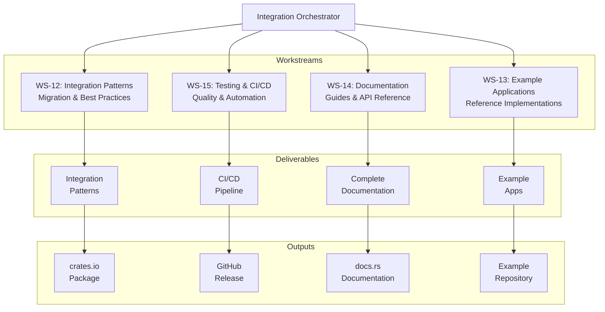
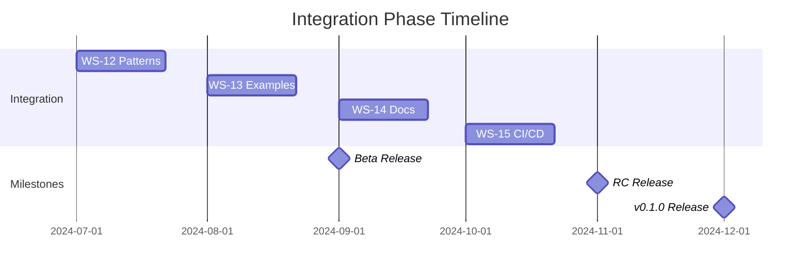

# Integration Orchestrator

## Overview

The Integration Orchestrator manages the final phase of the Locust project, ensuring the framework is production-ready with comprehensive documentation, example applications, and robust testing infrastructure. This orchestrator oversees Phase 4 of the project, coordinating four critical workstreams (WS-12 through WS-15) that deliver integration patterns, reference implementations, documentation, and CI/CD infrastructure. Operating during weeks 7-12, this orchestrator transforms the feature-complete framework into a polished, deployable product ready for community adoption.

## Architectural Responsibility



## Mission Statement

To ensure the Locust framework achieves production readiness through comprehensive documentation, exemplary reference implementations, robust testing, and seamless integration capabilities, establishing it as the definitive overlay framework for the ratatui ecosystem with a clear path to community adoption and long-term success.

## Scope & Boundaries

### In Scope
- Integration strategies and patterns
- Migration guides for existing apps
- Example application development
- Comprehensive documentation suite
- Testing infrastructure and coverage
- CI/CD pipeline implementation
- Publishing and release management
- Performance validation
- Community onboarding materials

### Out of Scope
- Core framework changes (except critical bugs)
- New plugin development
- Feature additions beyond v0.1.0
- Long-term maintenance planning
- Community management infrastructure

## Workstream Management

### WS-12: Integration Patterns
**Lead Agent**: docs-architect
**Timeline**: Week 7-9
**Status**: Planning
**Priority**: High

#### Objectives
1. Document integration strategies for different app types
2. Create migration guides from vanilla ratatui
3. Develop best practices and anti-patterns
4. Build integration testing framework

#### Key Deliverables
```markdown
## Integration Guide Structure
1. Quick Start (5-minute integration)
2. Integration Strategies
   - New applications
   - Existing applications
   - Complex architectures
3. Migration Guides
   - From vanilla ratatui
   - From other overlay systems
4. Patterns & Best Practices
   - Event handling patterns
   - State management
   - Performance optimization
5. Troubleshooting Guide
   - Common issues
   - Debug techniques
   - Performance profiling
```

#### Integration Patterns
```rust
// Pattern 1: Simple Integration
pub fn integrate_basic(app: &mut App) {
    let mut locust = Locust::new();
    locust.register_plugin(Box::new(NavigationPlugin::default()));

    // In event loop
    let outcome = locust.on_event(&event);
    if !outcome.consumed {
        app.handle_event(event);
    }

    // In draw loop
    terminal.draw(|f| {
        app.draw(f);
        locust.render_overlay(f);
    })?;
}

// Pattern 2: Advanced Integration
pub struct LocustIntegration<B: Backend> {
    locust: Locust<B>,
    config: LocustConfig,
    plugins: Vec<Box<dyn LocustPlugin<B>>>,
}

impl<B: Backend> LocustIntegration<B> {
    pub fn builder() -> IntegrationBuilder<B> {
        IntegrationBuilder::default()
    }

    pub fn with_default_plugins(mut self) -> Self {
        self.add_navigation()
            .add_omnibar()
            .add_tooltips()
    }
}
```

### WS-13: Example Applications
**Lead Agent**: coder-examples
**Timeline**: Week 8-10
**Status**: Blocked (awaiting WS-12)
**Priority**: High

#### Objectives
1. Build three showcase applications
2. Create tutorial examples
3. Develop benchmark applications
4. Implement real-world use cases

#### Example Applications

##### 1. Multi-Pane Dashboard
```yaml
name: "Analytics Dashboard"
features:
  - Multiple synchronized panes
  - Real-time data updates
  - Navigation between widgets
  - Command palette for actions
  - Tooltips for data points
  - Keyboard-driven interface

structure:
  - Top bar with tabs
  - Left sidebar with menu
  - Main area with charts
  - Bottom status bar

demonstrates:
  - Complex layout integration
  - Multiple plugin coordination
  - Performance with updates
  - Custom widget adapters
```

##### 2. Log Viewer
```yaml
name: "Advanced Log Viewer"
features:
  - Streaming log display
  - Jump-to-line navigation
  - Search with highlighting
  - Filter command palette
  - Tooltip log details
  - Bookmarks and markers

demonstrates:
  - Large data handling
  - Efficient navigation
  - Search integration
  - Performance optimization
  - Custom commands
```

##### 3. File Browser
```yaml
name: "Terminal File Manager"
features:
  - Tree view navigation
  - Hint-based jumping
  - Command operations
  - Preview tooltips
  - Batch operations
  - Theme customization

demonstrates:
  - Tree widget adapter
  - File system integration
  - Batch command execution
  - Configuration system
  - Theme application
```

#### Tutorial Examples
```bash
examples/
├── 01-basic-integration/     # Minimal setup
├── 02-navigation/            # Navigation plugin
├── 03-omnibar/              # Command palette
├── 04-custom-plugin/        # Plugin development
├── 05-configuration/        # Config and themes
├── 06-performance/          # Optimization tips
└── 07-advanced/            # Complex scenarios
```

### WS-14: Documentation
**Lead Agent**: docs-architect-senior
**Timeline**: Week 9-11
**Status**: Planning
**Priority**: Critical

#### Objectives
1. Write comprehensive user documentation
2. Create complete API reference
3. Develop tutorial series
4. Build architecture documentation

#### Documentation Structure
```yaml
documentation:
  user_guide:
    - getting_started:
        - installation
        - quick_start
        - first_app
    - core_concepts:
        - architecture_overview
        - plugin_system
        - event_handling
    - plugins:
        - navigation
        - omnibar
        - overlays
        - configuration
    - customization:
        - themes
        - keybindings
        - custom_plugins

  api_reference:
    - core:
        - locust
        - plugin_trait
        - context
        - events
    - plugins:
        - navigation_api
        - omnibar_api
        - overlay_api
    - utilities:
        - helpers
        - builders
        - testing

  tutorials:
    - "Build a Dashboard in 30 Minutes"
    - "Creating Your First Plugin"
    - "Advanced Navigation Techniques"
    - "Performance Optimization Guide"
    - "Testing Locust Applications"

  architecture:
    - design_decisions
    - performance_characteristics
    - security_considerations
    - future_roadmap
```

#### Documentation Standards
```yaml
standards:
  coverage:
    public_api: "100%"
    examples: "all non-trivial functions"
    tutorials: "common use cases"

  quality:
    grammar: "professional"
    code_examples: "tested and runnable"
    diagrams: "where helpful"
    cross_references: "comprehensive"

  formats:
    - Markdown (repository)
    - Rustdoc (API)
    - mdBook (user guide)
    - Video tutorials (optional)
```

### WS-15: Testing & CI/CD
**Lead Agent**: tester-automation
**Timeline**: Week 10-12
**Status**: Planning
**Priority**: Critical

#### Objectives
1. Build comprehensive test suite
2. Setup CI/CD pipeline
3. Create release automation
4. Implement quality gates

#### Testing Infrastructure
```yaml
test_suite:
  unit_tests:
    coverage_target: 85%
    categories:
      - core_functionality
      - plugin_systems
      - event_handling
      - rendering

  integration_tests:
    coverage_target: 75%
    scenarios:
      - plugin_interactions
      - full_app_integration
      - configuration_loading
      - theme_application

  performance_tests:
    benchmarks:
      - event_processing_speed
      - render_overhead
      - memory_usage
      - startup_time
    regression_threshold: 5%

  example_tests:
    - all_examples_compile
    - all_examples_run
    - no_panics
    - performance_acceptable

  doc_tests:
    - all_examples_in_docs_run
    - all_code_snippets_compile
```

#### CI/CD Pipeline
```yaml
name: Locust CI/CD

on:
  push:
    branches: [main, develop]
  pull_request:
    branches: [main]
  release:
    types: [created]

jobs:
  test:
    strategy:
      matrix:
        os: [ubuntu-latest, macos-latest, windows-latest]
        rust: [stable, beta, nightly]

    steps:
      - uses: actions/checkout@v3
      - uses: dtolnay/rust-toolchain@stable
      - run: cargo build --all-features
      - run: cargo test --all-features
      - run: cargo bench --no-run

  coverage:
    runs-on: ubuntu-latest
    steps:
      - uses: actions/checkout@v3
      - uses: taiki-e/install-action@cargo-tarpaulin
      - run: cargo tarpaulin --out Xml
      - uses: codecov/codecov-action@v3

  lint:
    runs-on: ubuntu-latest
    steps:
      - uses: actions/checkout@v3
      - run: cargo clippy -- -D warnings
      - run: cargo fmt -- --check

  publish:
    if: github.event_name == 'release'
    runs-on: ubuntu-latest
    steps:
      - uses: actions/checkout@v3
      - run: cargo publish --token ${{ secrets.CRATES_TOKEN }}
```

#### Release Process
```bash
# Release automation script
#!/bin/bash

# Version bump
cargo bump $VERSION_TYPE  # major, minor, patch

# Update CHANGELOG
git cliff --tag v$NEW_VERSION > CHANGELOG.md

# Run full test suite
cargo test --all-features
cargo bench

# Build documentation
cargo doc --all-features --no-deps

# Create git tag
git tag -a v$NEW_VERSION -m "Release v$NEW_VERSION"

# Push and trigger CI/CD
git push origin main --tags

# Publish to crates.io
cargo publish
```

## Orchestration Strategy

### Timeline Coordination


### Parallel Execution
```yaml
week_7-8:
  parallel:
    - WS-12: Integration patterns design
    - WS-13: Example app planning
    - WS-14: Documentation outline
    - WS-15: CI/CD setup

week_9-10:
  parallel:
    - WS-12: Pattern implementation
    - WS-13: Building examples
    - WS-14: Writing documentation
    - WS-15: Test suite development

week_11-12:
  parallel:
    - WS-13: Example polishing
    - WS-14: Documentation review
    - WS-15: Release preparation
    - All: Final integration testing
```

## Spawn Commands

### Initialize Orchestrator
```bash
# Create orchestrator agent
npx claude-flow@alpha agent spawn \
  --type orchestrator \
  --name "locust-integration" \
  --role "Integration Orchestrator for Locust Phase 4" \
  --instructions "Manage WS-12 through WS-15. Focus on production readiness, documentation quality, and smooth developer experience. Ensure comprehensive testing and reliable CI/CD."

# Initialize orchestrator memory
npx claude-flow@alpha memory store \
  --key "locust/orchestrators/integration/config" \
  --value '{
    "phase": 4,
    "weeks": "7-12",
    "workstreams": ["WS-12", "WS-13", "WS-14", "WS-15"],
    "priority": "production_readiness",
    "agents": 4
  }'
```

### Spawn Workstream Agents
```bash
# WS-12: Integration Patterns Agent
npx claude-flow@alpha task orchestrate \
  --task "create-integration-patterns" \
  --orchestrator "locust-integration" \
  --agent-config '{
    "type": "docs-architect",
    "name": "ws12-patterns",
    "expertise": ["system-design", "best-practices", "migration"],
    "memory_key": "locust/ws12/status"
  }'

# WS-13: Examples Agent
npx claude-flow@alpha task orchestrate \
  --task "build-example-apps" \
  --orchestrator "locust-integration" \
  --agent-config '{
    "type": "coder",
    "name": "ws13-examples",
    "expertise": ["ratatui", "rust", "ui-development"],
    "memory_key": "locust/ws13/status"
  }'

# WS-14: Documentation Agent
npx claude-flow@alpha task orchestrate \
  --task "write-documentation" \
  --orchestrator "locust-integration" \
  --agent-config '{
    "type": "docs-architect",
    "name": "ws14-documentation",
    "expertise": ["technical-writing", "api-docs", "tutorials"],
    "memory_key": "locust/ws14/status"
  }'

# WS-15: Testing/CI Agent
npx claude-flow@alpha task orchestrate \
  --task "setup-testing-ci" \
  --orchestrator "locust-integration" \
  --agent-config '{
    "type": "tester",
    "name": "ws15-testing",
    "expertise": ["test-automation", "ci-cd", "github-actions"],
    "memory_key": "locust/ws15/status"
  }'
```

## Quality Assurance

### Documentation Quality
```yaml
documentation_qa:
  completeness:
    - All public APIs documented
    - All features explained
    - All examples runnable

  clarity:
    - Technical but accessible
    - Progressive complexity
    - Clear examples

  accuracy:
    - Code examples tested
    - API docs generated
    - Version synchronized

  usability:
    - Quick start under 5 minutes
    - Common tasks documented
    - Troubleshooting guide
```

### Example Quality
```yaml
example_qa:
  functionality:
    - All features demonstrated
    - No runtime errors
    - Performance acceptable

  code_quality:
    - Clean, idiomatic Rust
    - Well-commented
    - Best practices followed

  educational:
    - Progressive complexity
    - Clear structure
    - Inline explanations
```

### Release Criteria
```yaml
release_gates:
  beta:
    - Core features complete
    - Basic documentation
    - Examples compile
    - CI/CD operational

  release_candidate:
    - All features complete
    - Documentation complete
    - All examples working
    - Test coverage met
    - Performance validated

  v0.1.0:
    - All RC criteria
    - Zero critical bugs
    - Published to crates.io
    - Documentation on docs.rs
    - Examples in separate repo
```

## Communication Protocols

### Status Reporting
```bash
# Daily status updates
npx claude-flow@alpha memory store \
  --key "locust/integration/daily/$(date +%Y%m%d)" \
  --value '{
    "WS-12": {"progress": 75, "blockers": []},
    "WS-13": {"progress": 50, "blockers": []},
    "WS-14": {"progress": 40, "blockers": []},
    "WS-15": {"progress": 60, "blockers": []},
    "overall": "on-track"
  }'

# Release readiness report
npx claude-flow@alpha hooks notify \
  --to "locust-meta" \
  --subject "Release Readiness Report" \
  --body '{
    "features": "100%",
    "documentation": "85%",
    "testing": "90%",
    "examples": "100%",
    "ready_for_beta": true
  }'
```

### Coordination with Other Orchestrators
```bash
# Request bug fixes from Core Framework
npx claude-flow@alpha task create \
  --title "Critical bug in navigation" \
  --assigned-to "locust-core-framework" \
  --priority "high" \
  --description "Navigation fails with custom widgets"

# Request documentation from Plugin Development
npx claude-flow@alpha memory get \
  --key "locust/plugin-dev/api-changes" \
  --callback "update-documentation"
```

## Performance Validation

### Benchmark Suite
```rust
#[bench]
fn bench_minimal_integration(b: &mut Bencher) {
    // Overhead of adding Locust to app
    b.iter(|| {
        let mut locust = Locust::new();
        let event = KeyEvent::new(KeyCode::Char('a'), KeyModifiers::NONE);
        locust.on_event(&event);
    });
}

#[bench]
fn bench_full_stack(b: &mut Bencher) {
    // Full plugin stack performance
    b.iter(|| {
        let mut locust = create_full_locust();
        render_frame(&mut locust);
    });
}
```

### Performance Targets
```yaml
performance_targets:
  integration_overhead:
    event_processing: "< 1ms"
    render_overlay: "< 10ms"
    memory_footprint: "< 10MB"

  example_apps:
    dashboard_fps: "> 30"
    log_viewer_scroll: "smooth"
    file_browser_nav: "< 50ms"

  startup:
    plugin_init: "< 100ms"
    config_load: "< 50ms"
    first_render: "< 200ms"
```

## Risk Management

### Integration Risks
| Risk | Impact | Probability | Mitigation | Owner |
|------|--------|------------|------------|-------|
| Breaking changes discovered | High | Medium | Early integration testing | WS-12 |
| Example quality issues | Medium | Low | Code reviews, testing | WS-13 |
| Documentation incomplete | High | Medium | Parallel writing, automation | WS-14 |
| CI/CD failures | High | Low | Multiple platforms, fallbacks | WS-15 |
| Performance regression | High | Low | Continuous benchmarking | All |

### Schedule Risks
| Risk | Impact | Probability | Mitigation | Owner |
|------|--------|------------|------------|-------|
| Documentation lag | Medium | High | Start early, automate | WS-14 |
| Example complexity | Medium | Medium | MVP first, iterate | WS-13 |
| Test flakiness | Low | Medium | Robust test design | WS-15 |
| Release delays | High | Low | Buffer time built in | Orchestrator |

## Success Metrics

### Quantitative Metrics
```yaml
metrics:
  test_coverage:
    unit: "> 85%"
    integration: "> 75%"
    documentation: "100%"

  performance:
    benchmarks_passing: "100%"
    example_fps: "> 30"
    startup_time: "< 200ms"

  quality:
    clippy_warnings: 0
    security_issues: 0
    broken_links: 0

  adoption:
    crates_io_ready: true
    examples_working: "100%"
    quick_start_time: "< 5 minutes"
```

### Qualitative Metrics
```yaml
goals:
  developer_experience:
    - Intuitive API
    - Clear documentation
    - Helpful examples
    - Easy integration

  production_readiness:
    - Stable API
    - Reliable performance
    - Comprehensive testing
    - Professional polish

  community_ready:
    - Welcoming documentation
    - Contribution guidelines
    - Issue templates
    - Support channels
```

## Deployment Strategy

### Release Phases
```yaml
releases:
  alpha:
    version: "0.1.0-alpha"
    date: "Week 6"
    features: "Core functionality"
    audience: "Early testers"

  beta:
    version: "0.1.0-beta"
    date: "Week 9"
    features: "All features, limited docs"
    audience: "Beta testers"

  release_candidate:
    version: "0.1.0-rc.1"
    date: "Week 11"
    features: "Feature complete"
    audience: "Production testing"

  stable:
    version: "0.1.0"
    date: "Week 12"
    features: "Production ready"
    audience: "General availability"
```

### Publishing Checklist
```markdown
## Pre-Release Checklist
- [ ] All tests passing
- [ ] Benchmarks acceptable
- [ ] Documentation complete
- [ ] Examples working
- [ ] CHANGELOG updated
- [ ] Version bumped
- [ ] Security audit passed
- [ ] License verified

## Release Process
- [ ] Create release branch
- [ ] Run full test suite
- [ ] Build and test on all platforms
- [ ] Generate documentation
- [ ] Create git tag
- [ ] Publish to crates.io
- [ ] Update docs.rs
- [ ] Create GitHub release
- [ ] Announce on channels

## Post-Release
- [ ] Monitor for issues
- [ ] Respond to feedback
- [ ] Plan patch releases
- [ ] Update roadmap
```

## Community Preparation

### Launch Materials
```yaml
materials:
  announcement:
    - Blog post
    - Reddit/HN post
    - Twitter thread
    - Discord announcement

  documentation:
    - README
    - Getting started guide
    - API documentation
    - Example repository

  support:
    - GitHub issues
    - Discord channel
    - Stack Overflow tag
    - Email list

  marketing:
    - Demo video
    - Feature highlights
    - Comparison chart
    - Use cases
```

### Community Engagement Plan
1. **Soft Launch** (Week 11): Beta testers, early feedback
2. **Public Beta** (Week 12): Wider testing, bug fixes
3. **Official Launch** (Week 12+): Full announcement, promotion
4. **Follow-up** (Week 13+): Address feedback, plan v0.2.0

## Conclusion

The Integration Orchestrator ensures that the Locust framework transitions from a collection of features to a production-ready, well-documented, thoroughly tested product ready for community adoption. Through careful coordination of integration patterns, example applications, comprehensive documentation, and robust testing infrastructure, this orchestrator delivers the final critical phase that determines the project's long-term success.

The work of this orchestrator directly impacts developer adoption and satisfaction. By prioritizing documentation quality, example clarity, and testing reliability, the Integration Orchestrator ensures that Locust launches as a professional, polished framework that developers will trust and enjoy using in their production applications.