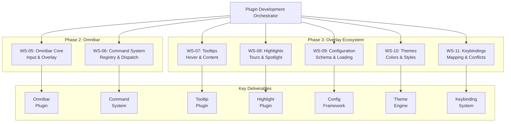
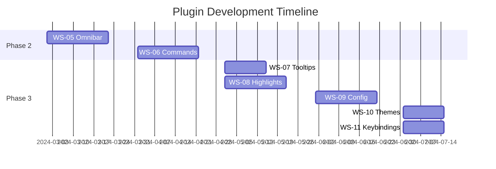

# Plugin Development Orchestrator

## Overview

The Plugin Development Orchestrator manages the creation of user-facing plugins and interaction systems for the Locust framework. This orchestrator oversees Phases 2 and 3 of the project, coordinating seven workstreams (WS-05 through WS-11) that deliver the omnibar, command system, overlay plugins, and configuration infrastructure. Operating during weeks 3-8, this orchestrator transforms the core foundation into a rich, extensible ecosystem of user interaction components.

## Architectural Responsibility



## Mission Statement

To create a comprehensive suite of user interaction plugins that transform Locust from a navigation framework into a complete overlay ecosystem, providing developers with powerful, customizable, and performant tools for enhancing terminal user interfaces while maintaining exceptional user experience and developer ergonomics.

## Scope & Boundaries

### In Scope
- Omnibar plugin implementation
- Command registration and execution system
- Tooltip and highlight overlay plugins
- Configuration management framework
- Theme and styling system
- Keybinding customization
- Plugin interoperability protocols
- Plugin-specific documentation

### Out of Scope
- Core framework modifications
- Ratatui adapter changes
- Example applications (handled by Integration)
- Performance optimization of core
- CI/CD infrastructure

## Workstream Management

### WS-05: Omnibar Core
**Lead Agent**: coder-ui-specialist
**Timeline**: Week 3-5
**Status**: Starting
**Priority**: Critical Path

#### Objectives
1. Design omnibar overlay architecture
2. Implement input capture and editing
3. Create result display system
4. Build provider interface

#### Key Features
- Instant input response (< 16ms)
- Fuzzy search capability
- Extensible provider system
- Smooth animations
- Keyboard navigation
- History tracking

#### Integration Requirements
- Uses WS-01 plugin interface
- Coordinates with WS-06 for commands
- Shares overlay space with WS-07, WS-08
- Configurable via WS-09

#### Success Metrics
```yaml
performance:
  input_latency: "< 16ms"
  search_time: "< 5ms for 1000 items"
  render_time: "< 10ms"
  memory_usage: "< 5MB"

functionality:
  providers: "3+ built-in"
  search_algorithm: "fuzzy matching"
  history: "persistent across sessions"
  animations: "60fps smooth"
```

### WS-06: Command System
**Lead Agent**: coder-architecture
**Timeline**: Week 4-6
**Status**: Blocked (awaiting WS-05)
**Priority**: High

#### Objectives
1. Create command registry architecture
2. Implement command providers
3. Build action dispatch system
4. Add undo/redo support

#### Key Features
- Hierarchical command organization
- Context-aware filtering
- Async command execution
- Command chaining
- Keyboard shortcut binding
- Command history with undo

#### Integration Requirements
- Integrates with WS-05 omnibar
- Uses WS-02 navigation actions
- Configurable via WS-09
- Shortcuts via WS-11

#### Command Categories
```yaml
categories:
  navigation:
    - jump_to_widget
    - focus_next/previous
    - activate_target

  application:
    - quit
    - save
    - reload_config

  view:
    - toggle_overlay
    - zoom_in/out
    - switch_theme

  plugins:
    - enable/disable_plugin
    - plugin_settings
    - plugin_commands
```

### WS-07: Tooltip Plugin
**Lead Agent**: coder-ux
**Timeline**: Week 5-6
**Status**: Planning
**Priority**: Medium

#### Objectives
1. Implement hover detection system
2. Create tooltip rendering engine
3. Build content provider interface
4. Add positioning algorithms

#### Key Features
- Smart positioning (avoid overlaps)
- Rich content support (markdown)
- Delayed show/hide
- Follow cursor option
- Multi-line support
- Theme integration

#### Technical Challenges
- Hover detection without native mouse events
- Position calculation in terminal grid
- Content sizing and wrapping
- Z-order management with other overlays

### WS-08: Highlight Plugin
**Lead Agent**: coder-graphics
**Timeline**: Week 5-7
**Status**: Planning
**Priority**: Medium

#### Objectives
1. Create region highlighting system
2. Implement tour step manager
3. Build spotlight effects
4. Add transition animations

#### Key Features
- Multiple highlight regions
- Spotlight with dimming
- Tour/onboarding system
- Animated transitions
- Pulsing effects
- Arrow indicators

#### Tour System Design
```yaml
tour:
  structure:
    - id: "getting-started"
      steps:
        - target: "navigation-hint"
          title: "Navigation System"
          description: "Use hints to jump anywhere"
          highlight: "pulse"

        - target: "omnibar-trigger"
          title: "Command Palette"
          description: "Press Ctrl+P for commands"
          highlight: "spotlight"
```

### WS-09: Configuration Layer
**Lead Agent**: coder-systems
**Timeline**: Week 6-8
**Status**: Planning
**Priority**: High

#### Objectives
1. Design configuration schema
2. Implement file loading/saving
3. Create validation system
4. Build hot-reload capability

#### Configuration Structure
```toml
# locust.toml
[core]
enable_animations = true
overlay_opacity = 0.9

[navigation]
hint_style = "bold"
hint_prefix = ">"
focus_indicator = "border"

[omnibar]
position = "center"
width = "50%"
max_results = 10

[plugins.tooltip]
delay_ms = 500
max_width = 40

[theme]
name = "dark"
override_colors = { hint = "#ff6b6b" }

[keybindings]
"ctrl+p" = "omnibar:toggle"
"alt+/" = "navigation:activate"
```

#### Features
- Multiple format support (TOML, YAML, JSON)
- Schema validation with helpful errors
- Live configuration reload
- Per-plugin configuration sections
- Environment variable expansion
- Configuration migration system

### WS-10: Theme System
**Lead Agent**: coder-design
**Timeline**: Week 7-8
**Status**: Planning
**Priority**: Medium

#### Objectives
1. Design theme architecture
2. Create built-in themes
3. Implement theme inheritance
4. Build runtime switching

#### Theme Components
```yaml
theme_elements:
  colors:
    - foreground/background
    - overlay_bg/overlay_fg
    - hint_active/hint_inactive
    - selection/highlight
    - error/warning/success

  styles:
    - borders (single, double, rounded)
    - shadows (none, light, heavy)
    - animations (enabled, reduced, none)

  overlays:
    - opacity levels
    - blur effects
    - positioning rules
```

#### Built-in Themes
1. **Default**: Balanced light theme
2. **Dark**: High contrast dark theme
3. **Solarized**: Popular color scheme
4. **High Contrast**: Accessibility focused
5. **Minimal**: Reduced visual noise

### WS-11: Keybinding System
**Lead Agent**: coder-input
**Timeline**: Week 7-8
**Status**: Planning
**Priority**: Medium

#### Objectives
1. Create keybinding definition format
2. Implement conflict detection
3. Build customization interface
4. Add preset modes

#### Keybinding Architecture
```rust
pub struct Keybinding {
    pub key: KeyEvent,
    pub modifiers: Modifiers,
    pub action: Action,
    pub context: Option<Context>,
    pub mode: Option<Mode>,
}

pub enum Mode {
    Normal,
    Insert,
    Visual,
    Command,
}

pub enum Context {
    Global,
    Plugin(PluginId),
    Widget(WidgetType),
    Custom(String),
}
```

#### Preset Modes
- **Default**: Intuitive modern bindings
- **Vim**: Vi-style modal bindings
- **Emacs**: Emacs-style sequences
- **VS Code**: Familiar IDE bindings

## Orchestration Strategy

### Parallel Development Plan


### Dependency Management
```yaml
dependencies:
  WS-05:
    requires: ["WS-01:core-types"]
    enables: ["WS-06:commands", "WS-09:config"]

  WS-06:
    requires: ["WS-05:omnibar", "WS-02:navigation"]
    enables: ["WS-12:integration"]

  WS-07:
    requires: ["WS-01:core-types"]
    parallel_with: ["WS-08"]

  WS-08:
    requires: ["WS-01:core-types"]
    parallel_with: ["WS-07"]

  WS-09:
    requires: ["WS-05:omnibar-config-needs"]
    enables: ["WS-10", "WS-11"]

  WS-10:
    requires: ["WS-09:config-system"]
    parallel_with: ["WS-11"]

  WS-11:
    requires: ["WS-09:config-system"]
    parallel_with: ["WS-10"]
```

## Spawn Commands

### Initialize Orchestrator
```bash
# Create orchestrator agent
npx claude-flow@alpha agent spawn \
  --type orchestrator \
  --name "locust-plugin-development" \
  --role "Plugin Development Orchestrator for Locust Phases 2-3" \
  --instructions "Manage WS-05 through WS-11. Focus on user experience, extensibility, and plugin interoperability. Ensure smooth animations, responsive interactions, and intuitive configuration."

# Initialize orchestrator memory
npx claude-flow@alpha memory store \
  --key "locust/orchestrators/plugin-dev/config" \
  --value '{
    "phases": [2, 3],
    "weeks": "3-8",
    "workstreams": ["WS-05", "WS-06", "WS-07", "WS-08", "WS-09", "WS-10", "WS-11"],
    "priority": "user_experience",
    "agents": 7
  }'
```

### Spawn Workstream Agents
```bash
# WS-05: Omnibar Agent
npx claude-flow@alpha task orchestrate \
  --task "implement-omnibar" \
  --orchestrator "locust-plugin-development" \
  --agent-config '{
    "type": "coder",
    "name": "ws05-omnibar",
    "expertise": ["ui-development", "async-rust", "animations"],
    "memory_key": "locust/ws05/status"
  }'

# WS-06: Command System Agent
npx claude-flow@alpha task orchestrate \
  --task "build-command-system" \
  --orchestrator "locust-plugin-development" \
  --agent-config '{
    "type": "coder",
    "name": "ws06-commands",
    "expertise": ["registry-patterns", "dispatch-systems", "undo-redo"],
    "memory_key": "locust/ws06/status"
  }'

# WS-07: Tooltip Agent
npx claude-flow@alpha task orchestrate \
  --task "create-tooltip-plugin" \
  --orchestrator "locust-plugin-development" \
  --agent-config '{
    "type": "coder",
    "name": "ws07-tooltips",
    "expertise": ["hover-detection", "positioning", "content-rendering"],
    "memory_key": "locust/ws07/status"
  }'

# Additional agents for WS-08 through WS-11...
```

## Communication Protocols

### Inter-Plugin Communication
```rust
// Plugin message bus for coordination
pub enum PluginMessage {
    OmnibarOpened,
    OmnibarClosed,
    TooltipShow { target: TargetId },
    TooltipHide,
    HighlightRegion { region: Rect },
    ThemeChanged { theme: ThemeId },
}

// Shared state for plugin coordination
pub struct PluginCoordinator {
    active_overlays: HashSet<PluginId>,
    z_order: Vec<PluginId>,
    exclusive_mode: Option<PluginId>,
}
```

### Status Reporting
```bash
# Daily workstream sync
npx claude-flow@alpha memory store \
  --key "locust/plugin-dev/daily/$(date +%Y%m%d)" \
  --value '{
    "WS-05": {"progress": 60, "blockers": []},
    "WS-06": {"progress": 40, "blockers": ["awaiting-omnibar-api"]},
    "WS-07": {"progress": 20, "blockers": []},
    "status": "on-track"
  }'

# Weekly rollup to meta-orchestrator
npx claude-flow@alpha hooks notify \
  --to "locust-meta" \
  --subject "Plugin Dev Week $(date +%U) Status" \
  --metrics '{
    "plugins_completed": 2,
    "integration_tests": 45,
    "performance": "meeting targets",
    "risks": "none"
  }'
```

## Quality Assurance

### Plugin Standards
```yaml
standards:
  api:
    stability: "no breaking changes after alpha"
    documentation: "100% public API coverage"
    examples: "2+ per plugin"

  performance:
    render_overhead: "< 5ms per plugin"
    memory_per_plugin: "< 2MB"
    startup_time: "< 100ms"

  ux:
    animation_fps: ">= 30"
    input_latency: "< 50ms"
    visual_consistency: "follow theme"

  testing:
    unit_coverage: ">= 80%"
    integration_tests: "required"
    user_acceptance: "required"
```

### Review Checkpoints
1. **API Design Review**: Before implementation
2. **UX Review**: Mockups and interactions
3. **Performance Review**: Benchmarks required
4. **Integration Review**: Cross-plugin testing
5. **Documentation Review**: Before completion

## Performance Optimization

### Key Metrics
```yaml
benchmarks:
  omnibar:
    open_time: "< 50ms"
    search_latency: "< 10ms"
    render_fps: ">= 60"

  tooltips:
    show_delay: "configurable 0-1000ms"
    position_calc: "< 1ms"
    render_time: "< 5ms"

  highlights:
    region_calc: "< 1ms"
    animation_fps: ">= 30"
    transition_smooth: "true"

  config:
    load_time: "< 100ms"
    hot_reload: "< 50ms"
    validation: "< 10ms"
```

### Optimization Strategies
1. **Lazy Loading**: Plugins load on demand
2. **Render Caching**: Cache unchanged overlays
3. **Event Debouncing**: Reduce update frequency
4. **Memory Pooling**: Reuse allocations
5. **Async Operations**: Non-blocking I/O

## Risk Management

### Technical Risks
| Risk | Impact | Probability | Mitigation | Owner |
|------|--------|------------|------------|-------|
| Overlay conflicts | High | Medium | Z-order system, exclusive modes | WS-05 |
| Performance degradation | High | Medium | Continuous profiling, optimization | All |
| Config complexity | Medium | High | Sensible defaults, validation | WS-09 |
| Theme conflicts | Low | Medium | Inheritance system, overrides | WS-10 |
| Keybinding conflicts | Medium | High | Conflict detection, modes | WS-11 |

### Schedule Risks
| Risk | Impact | Probability | Mitigation | Owner |
|------|--------|------------|------------|-------|
| Omnibar complexity | High | Medium | MVP first, iterate | WS-05 |
| Command explosion | Medium | Medium | Categorization, filtering | WS-06 |
| Animation performance | Medium | Low | Graceful degradation | WS-07, WS-08 |
| Config migration | Low | Medium | Versioning system | WS-09 |

## Success Criteria

### Phase 2 Completion (Week 6)
- [ ] Omnibar fully functional with 3+ providers
- [ ] Command system with 20+ built-in commands
- [ ] Smooth animations at 60fps
- [ ] < 50ms input latency
- [ ] Integration tests passing

### Phase 3 Completion (Week 8)
- [ ] All overlay plugins implemented
- [ ] Configuration system with hot-reload
- [ ] 5 built-in themes
- [ ] Keybinding modes (default, vim, emacs)
- [ ] Zero overlay conflicts
- [ ] Complete plugin documentation

### User Experience Goals
```yaml
goals:
  discoverability:
    - Intuitive default keybindings
    - Helpful command names
    - Clear visual feedback

  responsiveness:
    - Instant feedback on input
    - Smooth animations
    - No perceivable lag

  customization:
    - Everything configurable
    - Multiple preset modes
    - Easy theme creation

  integration:
    - Works with any ratatui app
    - Minimal integration code
    - No breaking changes
```

## Plugin Interoperability

### Coordination Matrix
| Plugin | Omnibar | Tooltip | Highlight | Config | Theme | Keybinding |
|--------|---------|---------|-----------|--------|-------|------------|
| Omnibar | - | Hide on open | Dim regions | Settings | Style | Triggers |
| Tooltip | Auto-hide | - | Above highlight | Delay | Colors | Show/Hide |
| Highlight | Behind | Below | - | Tours | Effects | Navigation |
| Config | Configure | Configure | Configure | - | Load | Load |
| Theme | Style | Style | Style | Colors | - | Display |
| Keybinding | Open/Close | Show/Hide | Navigate | Reload | Switch | - |

### Shared Resources
```rust
// Shared overlay context
pub struct OverlayContext {
    pub active_overlays: Vec<PluginId>,
    pub exclusive_plugin: Option<PluginId>,
    pub theme: ThemeId,
    pub animation_enabled: bool,
    pub z_order: HashMap<PluginId, u32>,
}

// Plugin coordination events
pub trait PluginCoordination {
    fn on_plugin_activated(&mut self, id: PluginId);
    fn on_plugin_deactivated(&mut self, id: PluginId);
    fn request_exclusive_mode(&mut self) -> bool;
    fn release_exclusive_mode(&mut self);
}
```

## Documentation Strategy

### Documentation Deliverables
1. **Plugin Developer Guide**: How to create custom plugins
2. **User Configuration Guide**: Complete configuration reference
3. **Theme Creation Guide**: Custom theme development
4. **API Reference**: Full rustdoc documentation
5. **Integration Examples**: Real-world usage patterns

### Documentation Timeline
- Week 5: Draft plugin APIs
- Week 6: Omnibar/Command guides
- Week 7: Overlay plugin guides
- Week 8: Complete documentation

## Conclusion

The Plugin Development Orchestrator transforms the solid foundation from Phase 1 into a rich ecosystem of user interaction components. Through careful coordination of seven specialized workstreams, focus on user experience, and commitment to extensibility, this orchestrator delivers the features that make Locust compelling for developers and end-users alike.

The success of these plugins determines Locust's adoption and usability. By prioritizing performance, customization, and seamless integration, the Plugin Development Orchestrator ensures that Locust becomes the definitive overlay framework for ratatui applications.