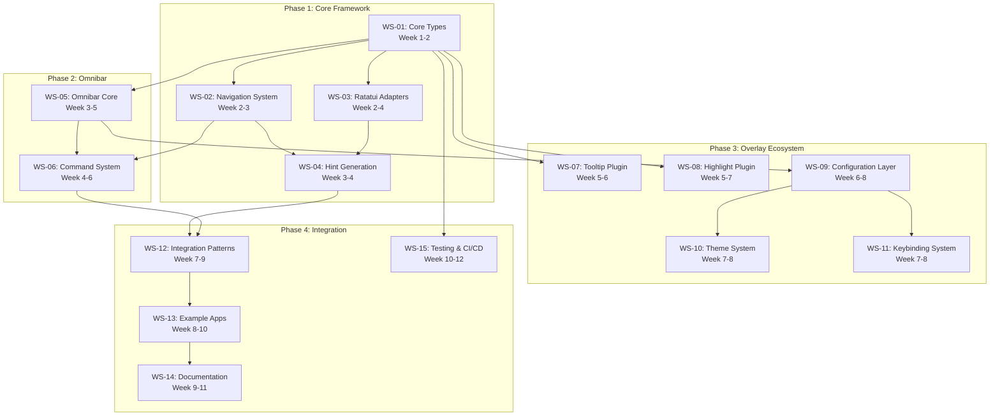

# Locust Workstream Plan

## Overview

This document details the 15 workstreams that comprise the Locust plugin framework development project. Each workstream is designed to be semi-autonomous while maintaining clear dependencies and integration points with related streams. The workstreams are organized into four phases aligned with the project roadmap, with strategic overlaps to maximize parallelization.

## Workstream Dependency Graph



## Phase 1: Core Framework (Weeks 1-4)

### WS-01: Core Types & Architecture
**Timeline**: Week 1-2
**Orchestrator**: Core Framework
**Priority**: Critical Path
**Agent Type**: rust-pro

#### Objectives
- Design and implement core types: `Locust<B>`, `LocustPlugin<B>`, `LocustContext`
- Establish plugin trait system with proper lifetimes and generics
- Create event pipeline with consumption patterns
- Implement target registry and overlay state management

#### Deliverables
- [ ] Core type definitions with full trait implementations
- [ ] Event routing system with priority handling
- [ ] Plugin registration and lifecycle management
- [ ] Memory-efficient context sharing mechanism
- [ ] Comprehensive unit tests (>90% coverage)

#### Dependencies
- None (foundation workstream)

#### Success Criteria
- Clean API surface with zero unsafe code in public interface
- Event handling < 1ms overhead
- Plugin registration < 100μs
- Memory footprint < 1MB base

#### Spawn Command
```bash
npx claude-flow@alpha agent spawn \
  --type rust-pro \
  --name "ws-01-core-types" \
  --workstream "WS-01" \
  --instructions "Implement Locust core types with focus on performance and safety. Design plugin trait system with proper lifetime management. Create efficient event pipeline."
```

### WS-02: Navigation System
**Timeline**: Week 2-3
**Orchestrator**: Core Framework
**Priority**: Critical Path
**Agent Type**: rust-pro

#### Objectives
- Implement `NavTarget` trait and actions (select, activate, scroll)
- Create navigation state management
- Build keyboard input decoder
- Implement focus management system

#### Deliverables
- [ ] NavTarget trait with standard implementations
- [ ] Navigation action dispatch system
- [ ] Keyboard shortcut generator
- [ ] Focus tracking and management
- [ ] Navigation event tests

#### Dependencies
- WS-01: Core Types (must complete first)

#### Success Criteria
- Navigation actions < 100μs dispatch time
- Support for 100+ simultaneous targets
- Intuitive hint generation algorithm
- Zero-allocation navigation in hot path

#### Spawn Command
```bash
npx claude-flow@alpha agent spawn \
  --type rust-pro \
  --name "ws-02-navigation" \
  --workstream "WS-02" \
  --instructions "Build navigation system with NavTarget trait. Implement efficient focus management and keyboard input decoding. Optimize for large target counts."
```

### WS-03: Ratatui Adapters
**Timeline**: Week 2-4
**Orchestrator**: Core Framework
**Priority**: High
**Agent Type**: coder

#### Objectives
- Create adapters for ratatui widgets: List, Table, Tabs, Tree
- Implement trait bridges for custom widgets
- Build rendering integration layer
- Create widget introspection system

#### Deliverables
- [ ] List adapter with item navigation
- [ ] Table adapter with cell/row/column navigation
- [ ] Tabs adapter with tab switching
- [ ] Tree adapter with expand/collapse
- [ ] Custom widget adapter framework

#### Dependencies
- WS-01: Core Types (traits and interfaces)

#### Success Criteria
- All standard ratatui widgets supported
- Adapter overhead < 1% render time
- Seamless integration with existing code
- Custom widget support without core changes

#### Spawn Command
```bash
npx claude-flow@alpha agent spawn \
  --type coder \
  --name "ws-03-adapters" \
  --workstream "WS-03" \
  --instructions "Create ratatui widget adapters for List, Table, Tabs, Tree. Build extensible adapter framework for custom widgets. Focus on zero-cost abstractions."
```

### WS-04: Hint Generation
**Timeline**: Week 3-4
**Orchestrator**: Core Framework
**Priority**: High
**Agent Type**: coder

#### Objectives
- Design hint generation algorithm
- Implement keyboard shortcut assignment
- Create hint rendering system
- Build collision detection and resolution

#### Deliverables
- [ ] Hint generation engine
- [ ] Shortcut assignment algorithm
- [ ] Hint overlay renderer
- [ ] Collision resolution system
- [ ] Customizable hint styles

#### Dependencies
- WS-02: Navigation System (target discovery)
- WS-03: Ratatui Adapters (widget information)

#### Success Criteria
- Unique hints for up to 1000 targets
- Hint generation < 10ms for 100 targets
- Readable, non-conflicting shortcuts
- Configurable hint display styles

#### Spawn Command
```bash
npx claude-flow@alpha agent spawn \
  --type coder \
  --name "ws-04-hints" \
  --workstream "WS-04" \
  --instructions "Implement hint generation with intelligent shortcut assignment. Create efficient collision resolution. Build customizable hint rendering."
```

## Phase 2: Omnibar (Weeks 3-6)

### WS-05: Omnibar Core
**Timeline**: Week 3-5
**Orchestrator**: Plugin Development
**Priority**: Critical Path
**Agent Type**: coder

#### Objectives
- Design omnibar plugin architecture
- Implement input capture system
- Create rendering overlay
- Build state management

#### Deliverables
- [ ] Omnibar plugin implementation
- [ ] Input field with editing capabilities
- [ ] Overlay rendering system
- [ ] Result display area
- [ ] Keyboard navigation

#### Dependencies
- WS-01: Core Types (plugin interface)

#### Success Criteria
- Instant input response (< 16ms)
- Smooth overlay animation
- Memory-efficient result caching
- Extensible provider system

#### Spawn Command
```bash
npx claude-flow@alpha agent spawn \
  --type coder \
  --name "ws-05-omnibar" \
  --workstream "WS-05" \
  --instructions "Build omnibar plugin with input capture and overlay rendering. Create extensible provider system. Focus on responsive user experience."
```

### WS-06: Command System
**Timeline**: Week 4-6
**Orchestrator**: Plugin Development
**Priority**: High
**Agent Type**: coder

#### Objectives
- Create command registration system
- Implement command filtering/searching
- Build action dispatch mechanism
- Create command provider interface

#### Deliverables
- [ ] Command registry with categories
- [ ] Fuzzy search implementation
- [ ] Action dispatch system
- [ ] Built-in command providers
- [ ] Command history tracking

#### Dependencies
- WS-05: Omnibar Core (UI foundation)
- WS-02: Navigation System (action dispatch)

#### Success Criteria
- Sub-millisecond search for 1000+ commands
- Extensible command providers
- Undo/redo support for commands
- Persistent command history

#### Spawn Command
```bash
npx claude-flow@alpha agent spawn \
  --type coder \
  --name "ws-06-commands" \
  --workstream "WS-06" \
  --instructions "Implement command system with fuzzy search and action dispatch. Create provider interface for extensibility. Add history and undo support."
```

## Phase 3: Overlay Ecosystem (Weeks 5-8)

### WS-07: Tooltip Plugin
**Timeline**: Week 5-6
**Orchestrator**: Plugin Development
**Priority**: Medium
**Agent Type**: coder

#### Objectives
- Design tooltip plugin system
- Implement hover detection
- Create tooltip rendering
- Build content provider interface

#### Deliverables
- [ ] Tooltip plugin implementation
- [ ] Hover event detection
- [ ] Smart positioning algorithm
- [ ] Rich content support (markdown)
- [ ] Animation system

#### Dependencies
- WS-01: Core Types (plugin interface)

#### Success Criteria
- Instant tooltip display (< 100ms)
- No overlap with UI elements
- Support for async content loading
- Smooth fade animations

#### Spawn Command
```bash
npx claude-flow@alpha agent spawn \
  --type coder \
  --name "ws-07-tooltips" \
  --workstream "WS-07" \
  --instructions "Create tooltip plugin with smart positioning and rich content support. Implement hover detection and smooth animations."
```

### WS-08: Highlight Plugin
**Timeline**: Week 5-7
**Orchestrator**: Plugin Development
**Priority**: Medium
**Agent Type**: coder

#### Objectives
- Create region highlighting system
- Implement tour/onboarding support
- Build spotlight effects
- Create animation framework

#### Deliverables
- [ ] Highlight plugin implementation
- [ ] Region selection system
- [ ] Tour step management
- [ ] Spotlight and dim effects
- [ ] Transition animations

#### Dependencies
- WS-01: Core Types (plugin interface)

#### Success Criteria
- Smooth highlight transitions
- Multiple simultaneous highlights
- Tour state persistence
- Customizable highlight styles

#### Spawn Command
```bash
npx claude-flow@alpha agent spawn \
  --type coder \
  --name "ws-08-highlights" \
  --workstream "WS-08" \
  --instructions "Build highlight plugin for tours and onboarding. Create spotlight effects and region highlighting. Implement smooth transitions."
```

### WS-09: Configuration Layer
**Timeline**: Week 6-8
**Orchestrator**: Plugin Development
**Priority**: High
**Agent Type**: coder

#### Objectives
- Design configuration schema
- Implement config loading/saving
- Create runtime config updates
- Build validation system

#### Deliverables
- [ ] Configuration schema definition
- [ ] TOML/YAML/JSON support
- [ ] Hot-reload capability
- [ ] Schema validation
- [ ] Migration system

#### Dependencies
- WS-05: Omnibar Core (command integration)

#### Success Criteria
- Type-safe configuration
- Zero-downtime config updates
- Backward compatibility
- Comprehensive validation

#### Spawn Command
```bash
npx claude-flow@alpha agent spawn \
  --type coder \
  --name "ws-09-config" \
  --workstream "WS-09" \
  --instructions "Create configuration layer with schema validation and hot-reload. Support multiple formats. Build migration system."
```

### WS-10: Theme System
**Timeline**: Week 7-8
**Orchestrator**: Plugin Development
**Priority**: Medium
**Agent Type**: coder

#### Objectives
- Design theme architecture
- Implement color scheme system
- Create theme inheritance
- Build theme hot-swapping

#### Deliverables
- [ ] Theme definition format
- [ ] Built-in themes (light, dark, high-contrast)
- [ ] Theme inheritance system
- [ ] Runtime theme switching
- [ ] Color palette generator

#### Dependencies
- WS-09: Configuration Layer (storage and loading)

#### Success Criteria
- Instant theme switching
- Accessible color schemes
- Theme customization without rebuilding
- Support for color blindness modes

#### Spawn Command
```bash
npx claude-flow@alpha agent spawn \
  --type coder \
  --name "ws-10-themes" \
  --workstream "WS-10" \
  --instructions "Build theme system with inheritance and hot-swapping. Create accessible built-in themes. Implement color palette generation."
```

### WS-11: Keybinding System
**Timeline**: Week 7-8
**Orchestrator**: Plugin Development
**Priority**: Medium
**Agent Type**: coder

#### Objectives
- Create keybinding definition system
- Implement conflict detection
- Build customization interface
- Create preset management

#### Deliverables
- [ ] Keybinding configuration schema
- [ ] Conflict detection and resolution
- [ ] Vi/Emacs preset modes
- [ ] Runtime rebinding
- [ ] Cheatsheet generator

#### Dependencies
- WS-09: Configuration Layer (storage and validation)

#### Success Criteria
- Zero keybinding conflicts
- Intuitive customization
- Multiple preset support
- Auto-generated documentation

#### Spawn Command
```bash
npx claude-flow@alpha agent spawn \
  --type coder \
  --name "ws-11-keybindings" \
  --workstream "WS-11" \
  --instructions "Create keybinding system with conflict detection. Build preset management for Vi/Emacs modes. Generate cheatsheets automatically."
```

## Phase 4: Integration & Documentation (Weeks 7-12)

### WS-12: Integration Patterns
**Timeline**: Week 7-9
**Orchestrator**: Integration
**Priority**: High
**Agent Type**: docs-architect

#### Objectives
- Document integration strategies
- Create migration guides
- Build integration testing suite
- Develop best practices

#### Deliverables
- [ ] Integration guide for existing apps
- [ ] Migration strategies document
- [ ] Integration test suite
- [ ] Best practices guide
- [ ] Troubleshooting guide

#### Dependencies
- WS-04: Hint Generation (complete navigation)
- WS-06: Command System (full feature set)

#### Success Criteria
- Clear integration path
- < 1 hour integration time
- Comprehensive test coverage
- Real-world examples

#### Spawn Command
```bash
npx claude-flow@alpha agent spawn \
  --type docs-architect \
  --name "ws-12-integration" \
  --workstream "WS-12" \
  --instructions "Document integration patterns and create migration guides. Build comprehensive test suite. Develop best practices from real examples."
```

### WS-13: Example Applications
**Timeline**: Week 8-10
**Orchestrator**: Integration
**Priority**: High
**Agent Type**: coder

#### Objectives
- Build showcase applications
- Create tutorial examples
- Develop real-world demos
- Build performance benchmarks

#### Deliverables
- [ ] Multi-pane dashboard example
- [ ] Log viewer with navigation
- [ ] File browser with hints
- [ ] Command palette showcase
- [ ] Performance benchmark app

#### Dependencies
- WS-12: Integration Patterns (guidelines)

#### Success Criteria
- Fully functional examples
- Clear code organization
- Performance targets met
- Educational value

#### Spawn Command
```bash
npx claude-flow@alpha agent spawn \
  --type coder \
  --name "ws-13-examples" \
  --workstream "WS-13" \
  --instructions "Build three showcase applications demonstrating all Locust features. Create educational examples with clear code. Include performance benchmarks."
```

### WS-14: Documentation
**Timeline**: Week 9-11
**Orchestrator**: Integration
**Priority**: Critical
**Agent Type**: docs-architect

#### Objectives
- Write comprehensive documentation
- Create API reference
- Build tutorial series
- Develop architecture guide

#### Deliverables
- [ ] Complete API documentation
- [ ] Getting started guide
- [ ] Tutorial series (5+ tutorials)
- [ ] Architecture documentation
- [ ] Plugin development guide

#### Dependencies
- WS-13: Example Applications (reference code)

#### Success Criteria
- 100% API coverage
- Clear, concise writing
- Runnable code examples
- Multiple learning paths

#### Spawn Command
```bash
npx claude-flow@alpha agent spawn \
  --type docs-architect \
  --name "ws-14-documentation" \
  --workstream "WS-14" \
  --instructions "Write comprehensive documentation including API reference, tutorials, and architecture guide. Ensure 100% coverage with runnable examples."
```

### WS-15: Testing & CI/CD
**Timeline**: Week 10-12
**Orchestrator**: Integration
**Priority**: Critical
**Agent Type**: tester

#### Objectives
- Build comprehensive test suite
- Setup CI/CD pipeline
- Create release automation
- Implement quality gates

#### Deliverables
- [ ] Unit test suite (>80% coverage)
- [ ] Integration test suite
- [ ] Performance test suite
- [ ] CI/CD pipeline (GitHub Actions)
- [ ] Release automation scripts

#### Dependencies
- WS-01: Core Types (throughout development)

#### Success Criteria
- All tests passing
- Automated releases
- Performance regression detection
- Security scanning enabled

#### Spawn Command
```bash
npx claude-flow@alpha agent spawn \
  --type tester \
  --name "ws-15-testing" \
  --workstream "WS-15" \
  --instructions "Build comprehensive test suite with >80% coverage. Setup CI/CD pipeline with GitHub Actions. Create release automation."
```

## Workstream Coordination

### Communication Protocol
```bash
# Each workstream maintains status in shared memory
npx claude-flow@alpha memory store \
  --key "locust/workstream/WS-{XX}/status" \
  --value '{"progress": 0.75, "blockers": [], "next": "..."}'

# Cross-workstream notifications
npx claude-flow@alpha hooks notify \
  --from "WS-01" \
  --to "WS-02,WS-03,WS-05" \
  --message "Core types API finalized v1.0"
```

### Progress Tracking
```yaml
tracking:
  daily:
    - Status update to memory
    - Blocker identification
    - Dependency checks

  weekly:
    - Progress percentage update
    - Deliverable completion
    - Risk assessment

  phase-gate:
    - Formal review
    - Acceptance testing
    - Sign-off process
```

### Resource Sharing
```bash
# Request additional resources
npx claude-flow@alpha task orchestrate \
  --task "request-support" \
  --from "WS-04" \
  --type "performance-optimization" \
  --urgency "high"

# Share learnings
npx claude-flow@alpha memory store \
  --key "locust/learnings/pattern/{name}" \
  --value '{"pattern": "...", "benefits": "...", "usage": "..."}'
```

## Risk Management

### Workstream-Specific Risks

| Workstream | Risk | Mitigation |
|------------|------|------------|
| WS-01 | API instability | Extensive design review, prototyping |
| WS-02 | Performance issues | Early benchmarking, profiling |
| WS-03 | Widget compatibility | Incremental adapter development |
| WS-04 | Hint conflicts | Advanced collision algorithms |
| WS-05 | Input lag | Event debouncing, async rendering |
| WS-06 | Command explosion | Categorization, smart filtering |
| WS-07 | Tooltip overlap | Smart positioning algorithms |
| WS-08 | Animation performance | GPU acceleration where available |
| WS-09 | Config complexity | Schema validation, defaults |
| WS-10 | Theme conflicts | Inheritance system, validation |
| WS-11 | Keybinding chaos | Conflict detection, presets |
| WS-12 | Integration difficulty | Step-by-step guides, support |
| WS-13 | Example quality | Code review, user testing |
| WS-14 | Documentation lag | Parallel writing, automation |
| WS-15 | Test brittleness | Robust test design, mocking |

## Success Metrics

### Per-Workstream KPIs
```yaml
metrics:
  completion:
    target: "100% deliverables"
    measure: "completed / total"

  quality:
    target: "> 90% review pass rate"
    measure: "passed / submitted"

  schedule:
    target: "+/- 2 days variance"
    measure: "actual - planned"

  dependencies:
    target: "Zero blocking delays"
    measure: "delay_days_caused"
```

## Conclusion

The 15 workstreams of the Locust project are designed for maximum parallelization while maintaining architectural coherence. Through careful dependency management, clear communication protocols, and robust risk mitigation, the project can achieve its ambitious 12-week timeline while delivering a high-quality, production-ready plugin framework for the ratatui ecosystem.